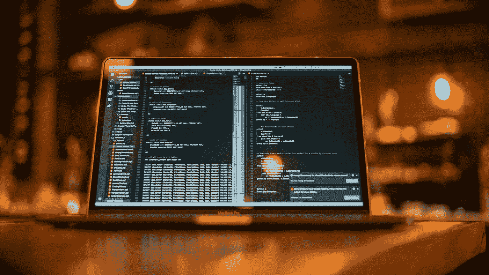

# 7 天学会一门编程语言

> 原文：<https://javascript.plainenglish.io/learn-a-programming-language-in-7-days-df4e85ab9676?source=collection_archive---------13----------------------->

## 包含黄金法则的终极路线图



Photo by [James Harrison](https://unsplash.com/@jstrippa?utm_source=medium&utm_medium=referral) on [Unsplash](https://unsplash.com?utm_source=medium&utm_medium=referral)

这篇微型文章将涵盖 3 点，即路线图、合适的资源和方法，你可以在 7 天内学会一门编程语言。

我不会专注于一种编程语言。因此，你可以将这种方法应用到任何你想学的编程语言中。如果你是一个完全的新手，我会建议你从 Python 或 C++开始。如果您已经选择了一种特定的编程语言，就不必担心了。

以下是一个完整的路线图，你可以遵循它来提高你的学习技能，并在仅仅 **7 天**内学会一门特定的编程语言

## 初始阶段— 2 天

初始阶段是这个时间线上最重要也是最短的阶段。在初始阶段，你需要选择一种编程语言，然后阅读为什么以及在哪里使用这种编程语言。

在阅读了关于编程语言的一些基本细节之后，你可以直接跳到学习这种特定语言的基本语法。我建议你给你的**每天 1.5 小时**来做这件事，持续 2 天**。也就是说，您需要在两天内总共完成 **3 小时**的活动。**

## **关于初始阶段的快速总结—**

*   **[**选择一种编程语言(20 分钟)**](https://blog.devgenius.io/how-i-went-from-noob-to-expert-in-python-programming-8c4e141a0be1)**
*   **[**阅读关于它的用途(20 分钟)**](/3-books-every-programmer-should-read-97ac12422cfb)**
*   **[**学习编程语言中使用的语法(2.2 小时)**](https://blog.devgenius.io/c-tutorial-for-complete-beginners-3d090ca8dd5f)**

## **学习阶段— 3 天**

**此时，您已经选择了您的编程语言，并了解了它的用途。您还学习了该特定编程语言的基本语法。现在下一步很简单——在 YouTube 上观看视频。**

**当我告诉你在 YouTube 上看视频时，我是认真的…**

**例如，如果你决定学习 Python，只需在 YouTube 的搜索框中输入**完整的 Python 教程**，点击最相关的视频，你就可以开始学习了。**

**你已经在过去的两天里学习了它的语法，所以对于一个完全的新手来说，这个教程看起来不会太难。现在用下面的公式来计算你每天的手表时间。**

```
Selected YouTube video- x hours Daily time to watch and grasp knowledge- x divided by 3
```

**例如，如果您选择了一个 4 小时长的视频，那么除以 3 后，您将得到 **1.3 小时**。因此，你需要每天学习 1.3 小时才能在 3 天内完成 YouTube 教程。**

**这也被称为**改良番茄工作法**，让你的大脑放松一整天。**

**如果你无法找到任何相关的 YouTube 视频，那么你可以阅读这篇文章“ [**编程 YouTube 频道**](/3-youtube-channels-every-programmer-should-follow-66952f1f24e4) ”，以获得任何编程语言的最佳视频。**

## **最终阶段——实践阶段**

**现在，在初始阶段和学习阶段之后，您一定已经非常熟悉一种特定的编程语言了。这是将您的编程知识发展到下一个水平的最后一步。**

**如果你只是为了个人使用或者完成一个相关的项目而瞄准了一门特定的编程语言，那么 2 天的时间对于强化你从观看 YouTube 教程中学到的知识来说是绰绰有余的。**

## **第一步—(选择以下任一网站)**

*   **[**黑客排名**](https://www.hackerrank.com/)**
*   **[**LeetCode**](https://leetcode.com/)**

**现在，在选择了上面的任何一个网站之后，选择你的编程语言，开始尽可能多地练习。**

**如果你被困在一个特定的编程问题上，那么也有社论包含了解决这个问题的策略。**

**还有两个高级编码网站，像 [**CodeChef**](https://www.codechef.com/) 和 [**CodeForces**](https://codeforces.com/) ，在那里你可以练习你的编程技巧。**

**这是这篇文章的结尾，我希望你喜欢阅读这篇文章，并且你会执行这篇文章中提到的策略。坚持编程，坚持练习。祝你编程之旅好运。**

## **[点击这里购买中等会员](http://aniketz.medium.com/membership)(我从这个链接得到一小笔佣金)**

## **免责声明—本文仅涉及与编程相关的概念，如 for 循环、while 循环或声明函数。编程中的一些概念，如数据结构和全栈开发，需要 3-5 个月才能掌握。**

***更多内容请看*[***plain English . io***](http://plainenglish.io/)**