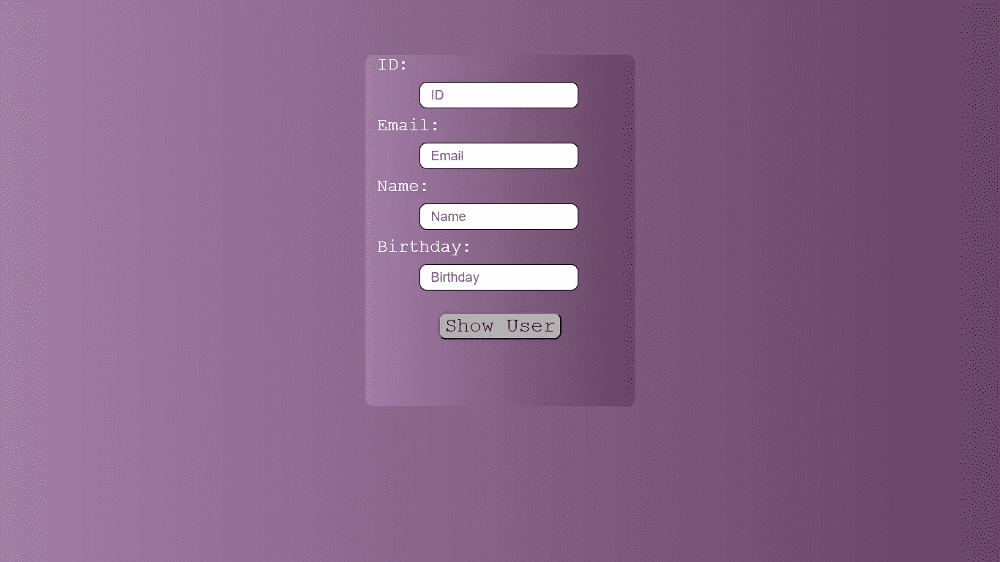
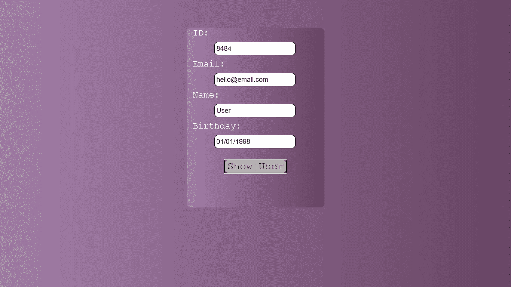

# 了解 Ajax 以及如何用 JavaScript 发出第一个服务器请求

> 原文：<https://javascript.plainenglish.io/learn-about-ajax-and-how-to-make-your-first-server-request-in-javascript-dc332f406d39?source=collection_archive---------18----------------------->

## JavaScript 中的获取方法。

Photo by [Arnold Francisca](https://unsplash.com/@clark_fransa?utm_source=medium&utm_medium=referral) on [Unsplash](https://unsplash.com?utm_source=medium&utm_medium=referral)

# Ajax 历史

创建动态网站而不刷新整个页面和弹出窗口是 JavaScript 成名之门。创建动态页面背后的基本概念最早是由 Microsoft 于 1998 年在 Outlook 中引入 XMLHttpRequest 对象时开发的。

2004 年和 2005 年，谷歌通过引入 Gmail 和谷歌地图将动态网站推向了一个新的高度，这一次他们使用了 Ajax。杰西·詹姆斯·加勒特创造了术语 Ajax，它代表异步 JavaScript 和 XML。

Ajax 的主要目标是将数据从服务器加载到浏览器，而不需要进行可见的刷新。要使用 Ajax，您需要使用以下技术:JavaScript、XMLHttpRequest、DOM 和可能是 XML、HTML 或 JSON 格式的文本数据。

# **JavaScript 中的 Fetch 方法**

在 jQuery 库或 fetch 方法出现之前，使用 Ajax 中的 XMLHttpRequest 对象向开发人员发出 Ajax 请求并不容易，你可以看看 Mozilla 开发人员网络的**来了解我在说什么。**

**jQuery 库通过引入$,解决了 XMLHttpRequest 对象的问题。ajax()全局函数。然而，对于许多开发人员来说，使用外部库并不愉快。**

**为了解决所有这些令人头痛的问题，web 超文本应用技术工作组(WHATWG)提出了一个跨 Web 平台的解决方案:[**fetch()方法**](https://fetch.spec.whatwg.org/) 。**

**fetch 方法接受一个必需的参数，它是您要从中获取数据的 URL 或路径，提供更多参数是可选的。当您使用 URL 调用 fetch 时，它将返回一个承诺，因此，我们需要通过将调用传递回 then()方法来处理响应。**

**有许多 URL 或资源可以从中获取数据，但是我们将在本地构建一个包含一些数据的端点，因此，我们需要一个 JSON 文件。**

**我们将构建一个简单的 Html 接口，用 JavaScript 从 JSON 文件中获取用户信息。我们的 JSON 文件将继续下面的信息，一个内部有一些属性的对象，我们的目标是获取每个属性内部的值。**

**显示用户数据的 UI 如下所示:**

****

**上面示例的 HTML 标记:**

**在文章的最后，我将包含一个到 GitHub 库的直接链接，该库包含所有使用过的文件。**

**本着这种精神，再一次回到我们的 HTML 文件，在 script 标签中，我们已经定义了一些常量，第一个常量包含对显示提取数据的按钮的引用，其他常量包含对我们在文档中使用的每个输入字段的引用。**

**click 事件的事件处理程序或回调函数将通过 preventDefault()方法使用事件对象来防止任何默认行为，最后，我们有 fetch 方法。**

**fetch 方法将前一个 JSON 文件的名称作为参数。向 fetch 传递一个参数意味着我们正在发出一个 GET 请求，如果我们发出一个 POST 请求，我们将需要提供更多的参数以及关于请求的指定选项。**

**在我们的示例中调用 fetch 方法，我们将返回一个解析响应的承诺，因此，我们需要使用 then()方法来处理响应，在前面的示例中，如果您仔细观察 fetch()方法，您会发现我们使用了两个 then()方法。**

**fetch 返回的结果将继续一些额外的信息，如主体、头、指示请求是否成功的状态代码，在我们的情况下，我们只需要主体内的信息，为此我们将使用 json()方法，该方法也返回一个承诺。**

**第二个 then()方法将处理 json()方法返回的响应，结果将是我们的 JSON 文件中的主要信息，它是一个包含一些属性的对象，我们将每个属性分配给所需输入字段的值，如下所示。**

****

# **最后**

**fetch 方法减轻了 JavaScript 开发人员的负担，为他们提供了一种不使用外部库或直接与 XMLHttpRequest 对象交互就能发出 Ajax 请求的合适方法。**

**Fetch 不仅仅服务于向服务器发出 GET 请求，我们还可以用它来发出 POST 请求，但是，这样做我们将需要更多带有指定选项的参数。**

***更多内容尽在*[*plain English . io*](http://plainenglish.io/)**