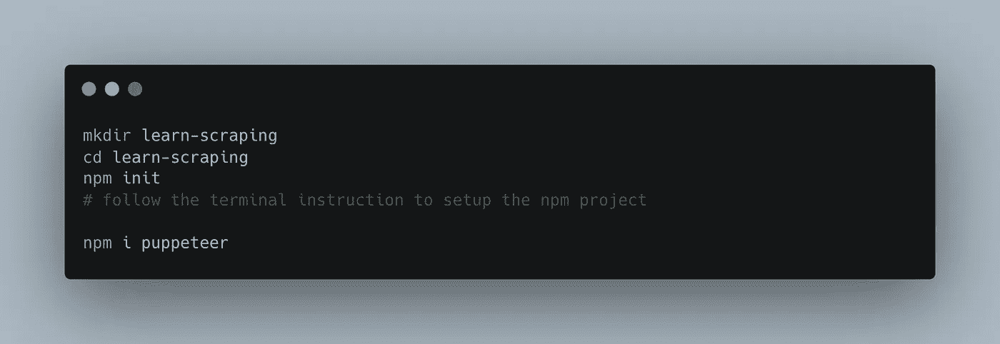
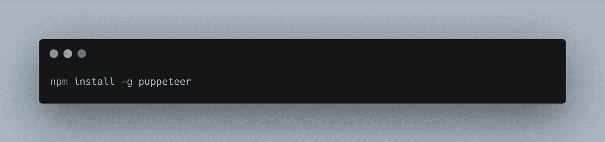
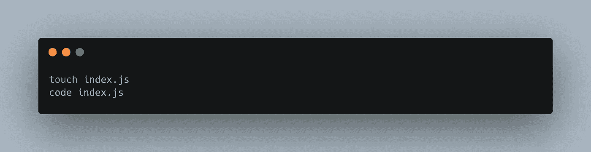
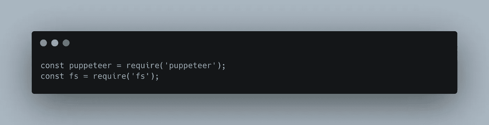
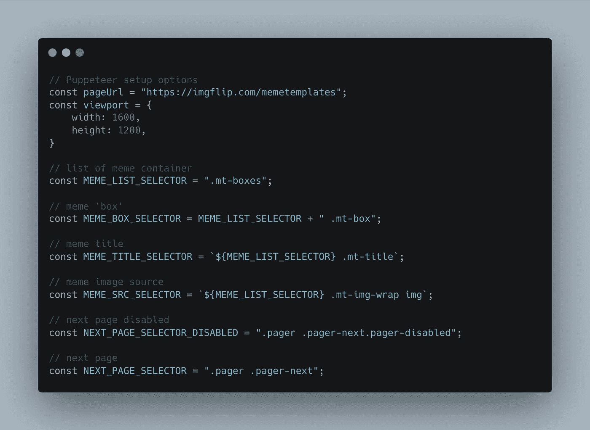
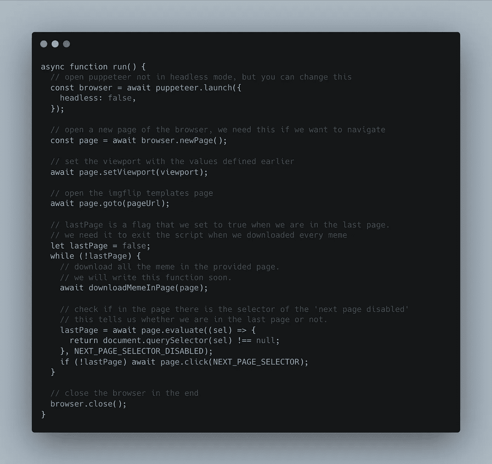
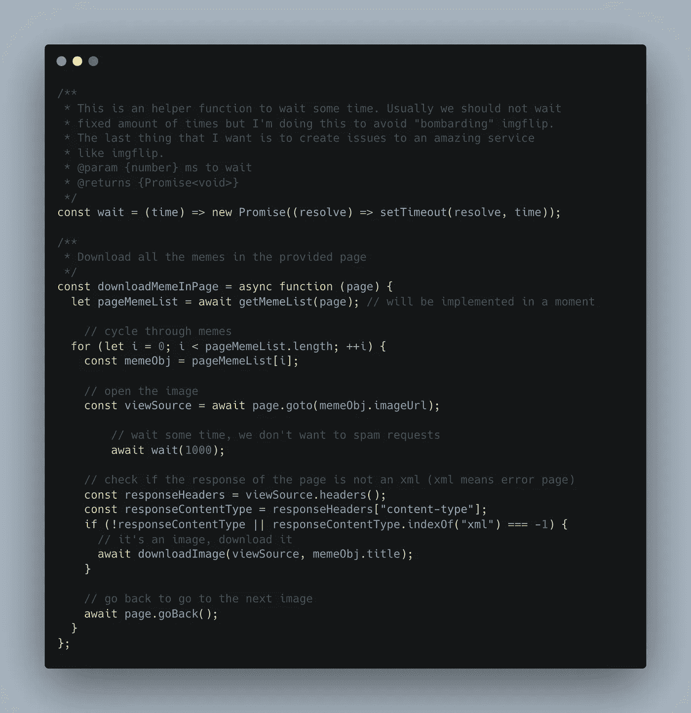
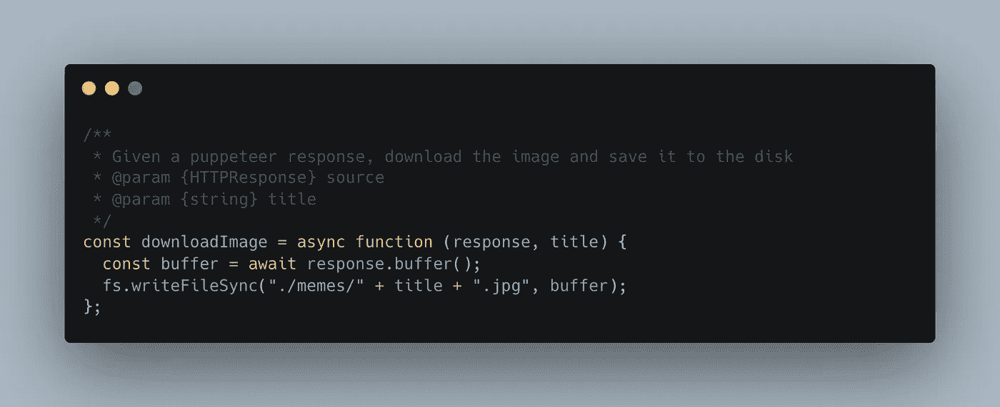
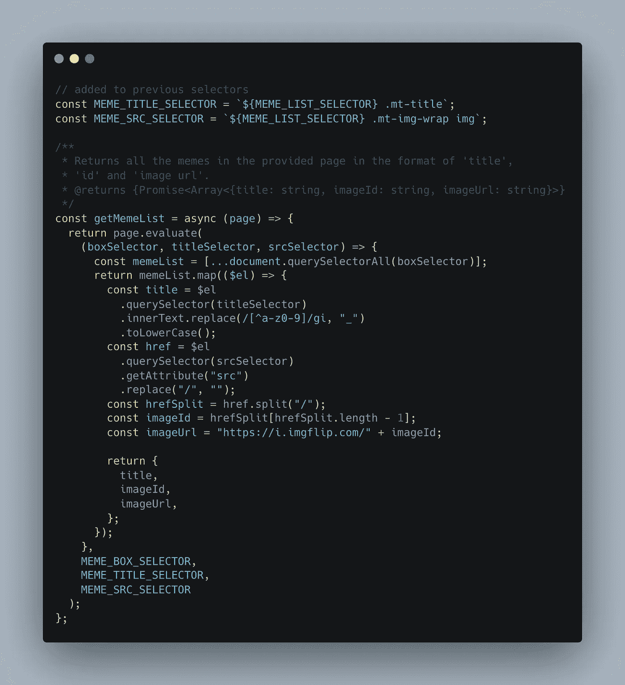

# 用木偶师学习基本刮削

> 原文：<https://javascript.plainenglish.io/learn-basic-scraping-with-puppeteer-50af3077e16e?source=collection_archive---------14----------------------->

## 通过下载迷因模板

> ⚠️我们将创建一个脚本来从 [imgflip](https://imgflip.com/) 下载 meme 模板。在使用来自他们的内容之前，请仔细阅读他们的[条款](https://imgflip.com/terms)。⚠️

# 介绍

不久前，我想和一些朋友做一个迷因比赛，所以我上网搜索了一个迷因模板包来下载。令我*非常惊讶的是*，我发现了很少的结果，我非常自信我会获得大量的材料，相反，我只发现了一些包，我真的不满意…所以我决定看看网络抓取来下载其中一些。

*很有可能实际上有很多材料，但是经过一些令人失望的研究后，这个想法出现在我的脑海中，于是我停止了搜索*

今天我想写下我做的一个小脚本来尝试基本的刮擦并解释它。我将使用[木偶师](https://pptr.dev/)，但是这些概念也与其他库相关(如果您使用不同的库，这可能只是语法问题)。

我是一个[边做边学](https://en.wikipedia.org/wiki/Learning-by-doing)的人，因此，为了学习基本的抓取，我决定创建一个脚本，从伟大的 imgflip 网站下载 meme 模板(我无意伤害他们，这是一个我经常使用的网站，如果你需要[创建 meme](https://imgflip.com/memegenerator)，我强烈推荐使用它)。

*这个脚本中的代码利用了一些‘现代’JavaScript 特性，比如 async/await。我不会在本文中涉及语言细节。*

## 什么是刮痧

在网络生态系统中,`scraping`指的是一种技术，在这种技术中(通常)自动化过程从网站获取并复制一些数据。在我们的例子中，我们想要创建一个脚本来打开[img lip meme 模板页面](https://imgflip.com/memetemplates)，下载页面上的每个模板，导航到下一个页面，下载页面上的每个模板，导航到下一个页面，等等...

## 什么是木偶师

Puppeteer 是一个库，可以让你通过一些高级 API 控制 Chrome(浏览器)。如果你想读更多，没有比它的知识库更好的来源了。我发现它非常直观且易于使用，所以我认为它非常适合我的用例。

# 密码

要使用 puppeteer，您要么需要创建一个 npm 项目并将其作为一个依赖项安装，要么您可以全局安装它并在您想要的地方使用它。

a)建立国家预防机制项目

code to create an npm project with puppeteer

b)在全球范围内安装，并在您需要的地方使用

code to install puppeteer globally

现在我们已经准备好写下一些代码，因为这个小项目不需要任何其他的依赖。

在你的项目中创建一个 JavaScript 文件，用你最喜欢的编辑器/IDE 打开它(如果你还没有的话，我建议你使用 VSCode)

code to create an index.js file

现在让我们写一些代码:

首先，我们导入依赖项

code to import dependencies

出于显而易见的原因，我们导入了 puppeteer 和 fs，因为我们需要访问文件系统来保存图像。

还要创建一个文件夹，我们将在其中存储下载的图像，我将调用`memes.`

我们要做的下一件事可能是最重要的，也是最无聊的:获取我们在网站中导航和获取图像所需的所有选择器。我们需要选择器用于:

*   导航到下一页
*   检测我们何时在最后一页
*   获得迷因图像
*   获取迷因标题(我们将用它来命名图片)

为此，我用 chrome 开发工具检查了页面，我将省去这一部分，直接向您展示代码

code to setup constants

现在让我们编写代码来设置木偶师并处理页面之间的导航

code of the main function

评论应该是不言自明的，基本上，我们设置了木偶师，打开 imgflip 模板页面，当我们还有“下一页”时，下载我们在当前页面找到的所有模因。最后关闭浏览器。

让我们看看如何在一个页面上下载所有的迷因

code to handle the list of meme

所以这有点复杂。首先，我们定义一个函数让脚本等待。正如评论中写的那样，那是为了避免对 imgflip 提出太多要求。然后，在函数中，我们使用 getMemeList 函数检索迷因列表，我们将很快实现该函数，对于每个迷因，我们打开与图像相关的页面(迷因的图像 URL)，等待 1 秒钟(因为我们很好)，然后我们检查响应的标题。

> Puppeteer 允许您检查页面请求的不同部分，我们可以使用 headers 方法访问标头，或者通过调用 buffer 方法查看响应。在[文档页面](https://pptr.dev/#?product=Puppeteer&version=v13.0.1&show=api-class-httpresponse)查看更多信息。

响应的头将包含 content-type 属性，并且它应该以某种方式与一个图像相关(我们打开了 meme 图像的 URL)，但是通过这样做，我发现一些图像(全尺寸，我们稍后将讨论这一点)在任何地方都找不到(或者更有可能的是，我在错误的地方寻找它们)，而是返回一个 XML 错误页面。这就是为什么它在那里，如果我们有一个 XML 响应，图像不在那里，所以我们忽略它。如果没有，我们调用“下载图像”函数来处理下载。在我们通过调用“page.goBack”返回到上一页之后。

code to download the image from the response

这很简单，我们通过调用`buffer`方法获得响应体，然后将它写在文件系统上，没什么特别的。

我们只需要实现检索页面上所有模因的功能。

code to get the list of memes in the page

让我们试着更好地理解这个:

我们声明了一些我们在这个函数中需要的新的选择器。在函数中，首先我们运行' [page.evaluate](https://pptr.dev/#?product=Puppeteer&version=v13.0.1&show=api-pageevaluatepagefunction-args) '。这是一个由 puppeteer 提供的 API，它允许您在页面上下文中运行一个函数，这意味着我们提供的回调不是由 Puppeteer 在 node.js 环境中运行的，而是由 puppeteer 为我们操纵的浏览器执行的。这是获取网页内部信息的唯一方法。为了传递我们在外面定义的选择器，我们需要将它们作为参数添加，它们将作为我们定义的回调的参数注入，所以在我们的例子中`MEME_BOX_SELECTOR`将变成`boxSelector`(见这篇[小文章](https://medium.com/@mariorodriguezan/puppeteer-pass-variable-in-evaluate-6eeba76b4153))。

函数内部的代码非常简单，我们在 DOM 中查询指定类的所有元素，并为每个元素获取标题(我将所有空格替换为下划线，并将其转换为小写)和来自“href”的 imageId，让我们深入了解一下:

Imgflip 似乎有一个服务来提供裁剪成不同大小的图像(这是一个给用户最好的体验和减少服务负载的常用方法)，如果我们检查页面中某个图像的 URL，我们会得到类似于`https://i.imgflip.com/4/1ur9b0.jpg`、[、](http://i.imgflip.com)是域名、4 是裁剪(如果你尝试`[https://i.imgflip.com/2/1ur9b0.jpg](http://i.imgflip.com/2/1ur9b0.jpg)`也可以，但它会返回一个不同的图像，一个更小的图像)和`1ur9b0`的信息，我想这是 meme 的 id。

我们获取 Id，并将 imageUrl 设置为`https://i.imgflip.com/<imageId>"`(不设置裁剪是，**我想是**，要求全尺寸图像。

然后，我们返回这些对象的列表，其中包含 imageUrl、id 和经过清理的标题。

# 结论

请注意，这只是一个脚本，我已经创建了一些基本的刮，它不是什么“生产就绪”或任何你应该依赖的东西。有很多事情可以改进，但我可以用这个下载所有的模因模板(并通过这样做来学习新的东西)和我的朋友们一起玩。

你可以在[这个要点](https://gist.github.com/albertodeago/cd200a937ac04143f082d53d0639f4b0#file-index-js)中找到整个脚本

*更多内容看* [*说白了。报名参加我们的*](http://plainenglish.io/) [*免费每周简讯*](http://newsletter.plainenglish.io/) *。在我们的* [*社区*](https://discord.gg/GtDtUAvyhW) *获得独家写作机会和建议。*