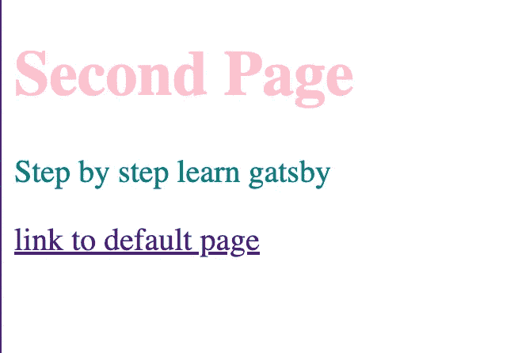

# 边做边学——使用 Gatsby 创建您的第一个网站

> 原文：<https://javascript.plainenglish.io/learn-by-doing-use-gatsby-to-create-your-first-site-af7bfb7a8a6f?source=collection_archive---------15----------------------->

## 一步一步来，是的。


Life-long learning — — 学无止境

上周，我们公司启动了一个新项目，它是由 Gatsby 建立的— React(前端)、Laravel(后端)、SQL(数据库)。

一开始，我认为我会感到头疼，因为在我一年的编程经验中，我只听说过盖茨比，但从未真正与**深入合作过。但是耐心看完官方文档，发现并没有想象中那么复杂。**

我想分享这篇文章中的基本步骤，因为一切都必须从建立一个坚实的基础开始。

*从技术角度来看，GatsbyJS 是 React、react-router、webpack、babel 和 GraphQL 的混合系统，实现了数据层和 UI 层的完全分离，以创建一个快速的网站，而又不失 SEO 的现代前端开发模式。*

1.  **通过运行**经由 *npm* 全局安装 Gatsby CLI

```
*npm install -g gatsby-cli*
```

**2。从一个初学者创建一个 Gatsby 网站**

```
*gatsby new hello-world* [*https://github.com/gatsbyjs/gatsby-starter-hello-world*](https://github.com/gatsbyjs/gatsby-starter-hello-world)
```

**3。转到 director 并启动开发模式**

命令`***gatsby develop***` 启动开发服务器。

打开浏览器，导航至`[http://localhost:8000/](http://localhost:8000/)`


Yup!

在您的代码编辑器中，查看“HELLO-WORLD”目录中包含的不同目录和文件(抱歉我的半隐藏文本截图)。它应该是这样的:


VS code screenshot

现在去 **pages/index.js** 和改“Hello world！”来"**你好！**”，保存文件，你应该会看到更改几乎立即反映在浏览器中。

*盖茨比用* ***热重装*** *来加快你的开发进程。本质上，当您运行 Gatsby 开发服务器时，Gatsby 站点文件在后台被“监视”——任何时候您保存一个文件，您的更改将立即反映在浏览器中。*

让我们添加一个图像，这个页面太无聊了🌨


In this case, a random image from Unsplash

保存文件:


This is what you should see ⭐️

耶！小有成就！🌸

现在，让我们使用**页面组件(🌈**前提是你熟悉 **React** 的基本结构。

*任何在* ***src/pages/*中定义的 React 组件。js*** *会自动成为页面，在我们的例子中* ***页面/index.js*** *是* ***的默认页面。***

**4。在 src/pages 创建一个新文件“secondPage.js ”,并编写一些简单的代码，如下所示，保存它。**


This is our second page

假设默认页面和第二个页面都变得很大，你重写了很多东西。您可以使用**子组件**将 UI 分成可重用的部分。您的两个页面都可能包含一个**标题**——创建一个描述`Header`的组件。👇

**5。在/src 创建一个“components”文件夹，然后在其中创建一个“Header”文件夹，其中包含一个“Header.js”文件**

*(我习惯在每个文件夹中创建相同名称的文件，这样简单明了，比如 Header 文件夹里面的 Header.js 和 Header . module . scss……)*

**6。给标题一些文本**


A very simple Header Component

**7。从页面(/secondPage.js)导入此标题，如下图**


Import Header Component from page

现在我们的第二页更新了！💫

*这里请忽略内联样式，我一般不建议使用。相反，* *使用****scss*******模块*** *对于每个文件来说会好得多，但在这种情况下，只要保持简单的内联样式就行了。⭐️**

**

*Second page contains Header component which we created and imported*

*🌹耶！又一个小小的成功！现在让我们用**道具**反应一下。*

***8。在 pages/secondPage.js 内给标题一个“标题”道具，如下图***

**忽略* ***链接*** *暂且不提。**

**

*Give a title prop to Child Header*

***9。以 React 基本方式更新标题组件***

**

*Using title prop from Parent secondPage*

*保存并查看🍭*

**

*那很容易！现在，您可以创建更多的页面和子组件，并使用道具进行游戏！🔍⏱⏳ …*

*还记得我们有一个 **<链接/ >** 组件，我们之前在第 8 步忽略了它吗？那就是我们现在要发现的，它是用来链接页面的。*

*👉 ***重要！****Gatsby*`*<Link />*`*组件是用于站点内页面之间的链接。对于非 Gatsby 站点处理的页面的外部链接，请使用常规的 HTML* `***<a>***` *标签，或者您也可以尝试在控制台中查看错误。**

***10。打开索引页面组件(** `**src/pages/index.js**` **)，从 Gatsby 导入** `**<Link />**` **组件，给它一个“to”属性，值为** `**"/secondPage"**` **作为路径名。***

**

*Import Link from Gatsby*

*现在**默认页面**看起来应该是这样的(我给了**标题**另一个**标题** **属性**，它包含了“**默认页面**”和粉色以使其更加清晰)。*

**

*Click on the link at the bottom, you will be linked to your second page which we created before*

*🎢你可以在你的第二页添加链接，它可能链接到默认页面，见第 8 步截图。*

**

*Click on the link at bottom, you will be linked to default page*

***💎就是这样！我们创建了两个可以相互链接的简单页面，没有太多的样式，但这超出了本文的范围。***

*但是等等……记住，一个网站有四个部分:HTML、CSS、JavaScript 和**数据 *—*** *“存在于 React 组件之外的一切”。**

*通常，我们希望将数据 ***存储在*** 组件之外，然后根据需要将数据*带入*组件。数据可以存在于文件类型中，如 **Markdown** 、 **CSV** 等。以及各种各样的**数据库**和**API**。*

*📝将数据加载到 React 组件有许多选项，其中最流行和最强大的是我目前正在学习的**[**graph QL**](https://graphql.org/)**。*****

*****以下是我在当前深入学习中的一些思考。下面只是简单介绍一下。我将在下一篇文章中介绍它们的用法。*****

*****有两种常用的配置文件:*****

*******📍/gatsby-config.js** *基本上用来配置两个东西:******

*   *****siteMetadata 在每个页面上放置一些全局信息，这些信息可以通过 GraphQL 获得，就像 consent title…*****
*   *******插件**配置插件，这可以在使用时根据插件文档获取*****

*******📍/gatsby-node.js** 可以调用 [Gatsby 节点 API](https://www.gatsbyjs.com/docs/reference/config-files/gatsby-node/)做一些自动化。*****

*****通常有两种常见情况:*****

*   *****添加附加配置，例如为降价商品生成自定义路径。*****
*   *****生成除 **/src/pages** 以外的页面文件，比如为每篇 Markdown 文章生成页面文件。*****

*****分享那些步骤的目的是让我的思路更清晰，了解盖茨比的基本用法，我还在继续学习。*****

*****非常感谢您花时间阅读这篇文章！*****

*****如果有需要改正的地方，请联系我，我将非常乐意改进它们！*****

******更多内容尽在*[plain English . io](http://plainenglish.io/)*****