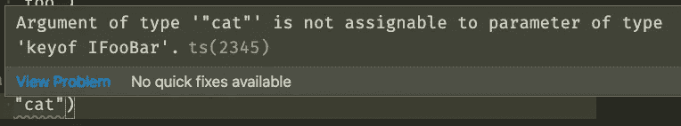

# 用 TypeScript 学习泛型:初学者指南

> 原文：<https://javascript.plainenglish.io/learn-generics-with-typescript-a-beginners-guide-6d1eba83ce8b?source=collection_archive---------10----------------------->

## 不要忽视他们！不要觉得他们对你来说太高级了！


Image courtesy of me :)

# 回到基础

我认为我关于简洁的泛型类型脚本函数的指南会受到软件世界的喜爱。像我的[泛型搜索、排序和过滤](/react-and-typescript-generic-search-sort-and-filter-879c5c3e2f0e)，或者我的[泛型函数合并对象数组](/advanced-typescript-a-generic-function-to-merge-object-arrays-cb0bd9a5c382)，或者我的[泛型函数更新和操作对象数组](/advanced-typescript-a-generic-function-to-update-and-manipulate-object-arrays-caacd601cedf)，都是在 TypeScript 中，都是泛型的，而且(我以为！)都超级酷。

但是……也许我需要给初学者一个循序渐进的教程来真正理解类型脚本泛型的概念。然后就会对这些超级干净的函数式打字稿技术产生更多的兴趣！这是我试图(第四次)说服你！

# 为什么使用泛型？

当在 React 中编写前端 ui 时，我们经常听到设计可重用的组件很重要，无论是通过保持组件较小还是以一种良好的方式组合它们，或者，例如，使用 props 来提取可以针对任何用例进行修改的任何部分。

但对于我们代码库中的非组件代码来说也是如此:像我们在 React 组件旁边或外部构建的*函数*和*类*。如果您曾经构建过大型应用程序，那么您经常会在应用程序的多个页面、多个区域中使用类似的功能(例如，排序，我们很快就会看到)，最重要的是，针对各种不同的数据类型。在这篇文章中，我将强调泛型如何帮助我们解决这些有价值的功能在应用中的可重用性问题。

# 界面工具栏

我将从定义一个简单的接口`**IFooBar**`开始:

```
***interface* IFooBar {****foo: string;****bar: string;****}**
```

这个基本接口只有两个属性，`**foo**`和`**bar**`，都是类型`**string**`。

为了获得与此类型相关的一些具体数据，我将定义一个`**const fooBars**`，它将是`**IFooBar**`的一个`**Array**`:

```
***const* fooBars: Array<IFooBar> = [****{****foo: "foo1",****bar: "bar1"****},****{****foo: "i am foo two",****bar: "i am bar two"****},****{****foo: "foo three",****bar: "bar three"****}****]**
```

让我们想象一下，在我们应用程序的某个地方，由于某种原因，我们想要像这样对数据类型进行排序。我们可以想象我们从一个 API 端点接收到一个数组`**IFooBar**`。我们可以编写一个`**sortByFoo**`函数来完成这个任务:

```
***function* sortByFoo(fooBars: Array<IFooBar>) {****fooBars.sort((a, b) => {*****if* (a.foo > b.foo) {*****return* 1;****}*****if* (a.foo < b.foo) {*****return* -1;****}*****return* 0;****})****}**
```

如果我们想按另一个属性`**bar**`排序，就会遵循相同的逻辑，创建一个函数`**sortByBar**`:

```
***function* sortByBar(fooBars: Array<IFooBar>) {****fooBars.sort((a, b) => {*****if* (a.bar > b.bar) {*****return* 1;****}*****if* (a.bar < b.bar) {*****return* -1;****}*****return* 0;****})****}**
```

这些解决方案对于只有属性`**foo**`和`**bar**`的数据非常有效，但是很容易想象出更复杂的具有几十个属性的类型。很明显，我们不能把所有的时间都花在为所有的属性编写显式排序函数上！😄这是有问题的，原因有二:

1.  这要花很多时间
2.  它会引入大量重复的代码来完成几乎相同的任务(排序)

# 输入泛型

这是 TypeScript 通用功能的一个完美用例。我们可以创建一个通用函数`**sortByKey**`,它将能够替换`**sortByFoo**`和`**sortByBar**`,并且以后还可以很容易地扩展，例如，如果添加了一个额外的属性`**hello**``**IFooBar**`:

```
***interface* IFooBar {****foo: string;****bar: string;****hello: string;****}**
```

让我们看看如何编写这个通用函数！

# 入门:您的第一个通用函数

为了表示类型脚本代码中使用了泛型，使用了尖括号(即`**<**`和`**>**`)语法。泛型的一个常见模式是以大写字母`**T**`开始，表示需要提供的泛型“类型”。因此，为了开始我们的排序函数，我们将在函数名后面添加一个`**<T>**`:

```
***function* sortByKey<T>() {****}**
```

> *注意:在需要多个泛型类型的情况下，最常见的模式是继续使用大写字母`**U**`、`**V**`等等，用逗号分隔。例如，如果我们需要三种通用类型的`**sortByKey**`，函数签名应该是这样的:`**sortByKey<T, U, V>**`。例如，在 React 中创建类组件时会出现这种情况。您可能已经注意到 react 组件的类型如下:`**class React.Component<P = {}, S = {}, SS = any>**`在本例中，`**P**`用于表示`**props**`类型，`**S**`表示`**state**`，而`**SS**`很少使用，表示`**snapshot**`类型。

按照我们编写`**sortByFoo**`和`**sortByBar**`的方式，我们需要给我们的函数添加参数。而在`**sortByFoo**`和`**sortByBar**`的情况下，我们明确地提供了`**Array<IFooBar>**`，我们希望使用我们的泛型类型`**T**`作为参数类型。换句话说，我们的函数应该能够处理任何类型的数组`**T**`，或者用 TypeScript 符号来说，`**Array<T>**`。由于这个数组可以是任何类型，我认为合适的变量名应该是`**data**`。因此，我们可以将`**data**`添加到我们的`**sortByKey**`函数的签名中:

```
***function* sortByKey<T>(data: Array<T>) {****}**
```

嗯……还是少了点什么🤔…我们需要添加传递关键字名称进行排序的功能！我将再次依靠 TypeScript 的强大功能，使用 TypeScript 的`**keyof**`类型操作符。`**keyof**`类型接受类型键的文字联合。但是我们要带什么类型的呢？啊，对了，我们的通用型`**T**`！TypeScript 足够智能，我们甚至可以在泛型类型上使用`**keyof**`类型操作符。那么让我们完成我们的函数`**sortByKey**`的签名:

```
***function* sortByKey<T>(data: Array<T>, key: *keyof* T) {****}**
```

现在就写正文吧！

# 编写 sortByKey 的主体

`**sortByKey**`的主体与`**sortByFoo**`或`**sortByBar**`不会有太大的不同，除了我们需要用`**bar**`或`**foo**`的显式使用的键来替换我们的`**key**`变量。因为我们已经使用了`**keyof T**`，所以当我们使用像`**a[key]**`或`**b[key]**`这样的语法时，Typescript 不会反对，因为`**key**`就是字面上的`**key of T**`:

```
***function* sortByKey<T>(data: Array<T>, key: *keyof* T) {****data.sort((a, b) => {*****if* (a[key] > b[key]) {*****return* 1;****}*****if* (a[key] < b[key]) {*****return* -1;****}*****return* 0;****})****}**
```

就是这样！我们现在可以在应用程序中的任何地方对任何数据类型进行排序！

# 双重好处

我们不仅编写了一个可在整个应用程序中重用的函数，还编写了一个在我们尝试和排序数据时帮助我们避免运行时错误的函数。

下面这两个示例行都很好。TypeScript 不会抱怨，因为`**foo**`和`**bar**`是`**IFooBar**`接口的键:

```
**// Both fine: foo and bar are properties of IFooBar!****sortByKey<IFooBar>(fooBars, "foo")****sortByKey<IFooBar>(fooBars, "bar")**
```

但是如果我试着按属性`**cat**`对`**fooBars**`排序:

```
**// TypeScript complains: cat is not a property of IFooBar!****sortByKey<IFooBar>(fooBars, "cat")**
```

TypeScript 会立即用红色下划线标出`**cat**`，将鼠标悬停在错误上方会显示以下警告:



The official TypeScript error we see when hovering over `cat`: Argument of type ‘“cat”’ is not assignable to parameter of type ‘keyof IFooBar’. ts(2345)

这是一个你在 Javascript 中看不到的警告，只会在运行时遇到，很可能会让你的应用崩溃。

# 仿制药太棒了！

很棒，对吧？最棒的部分？这只是 TypeScript 泛型的冰山一角！🔌**栓塞区警报**🔌如果您对此着迷，请查看我利用 TypeScript 泛型整理的其他精彩帖子和课程:

[](https://www.udemy.com/course/advanced-typescript-generic-search-sorting-and-filtering/?referralCode=22441D8B6B06045473D2) [## 高级类型脚本:通用搜索、排序和过滤

### 大家好。我已经成为一名专业的全堆栈软件工程师 7 年多了，我已经编程很多年了…

www.udemy.com](https://www.udemy.com/course/advanced-typescript-generic-search-sorting-and-filtering/?referralCode=22441D8B6B06045473D2) [](/advanced-typescript-a-generic-function-to-merge-object-arrays-cb0bd9a5c382) [## 高级类型脚本:合并对象数组的通用函数

### 另一个强大的通用功能来自 SaaS 产品档案。

javascript.plainenglish.io](/advanced-typescript-a-generic-function-to-merge-object-arrays-cb0bd9a5c382) [](/advanced-typescript-a-generic-function-to-update-and-manipulate-object-arrays-caacd601cedf) [## 高级类型脚本:更新和操作对象数组的通用函数

### 终极力量的另一个奇特的通用功能！

javascript.plainenglish.io](/advanced-typescript-a-generic-function-to-update-and-manipulate-object-arrays-caacd601cedf) [](/react-and-typescript-generic-search-sort-and-filter-879c5c3e2f0e) [## 反应和类型脚本:通用搜索、排序和筛选

### 一个利用 TypeScript 泛型的强大功能来实现可重用的搜索、排序和…

javascript.plainenglish.io](/react-and-typescript-generic-search-sort-and-filter-879c5c3e2f0e) 

*更内容于* [***通俗地说就是***](http://plainenglish.io/)