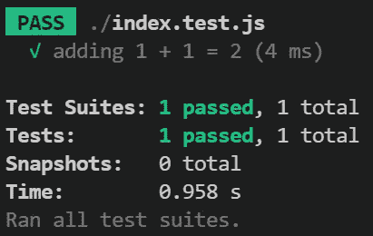
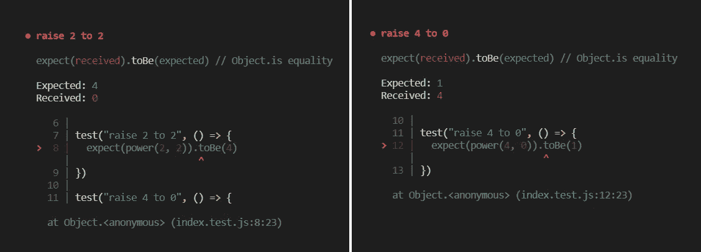
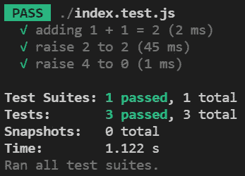

# 学习 Jest——JavaScript 单元测试

> 原文：<https://javascript.plainenglish.io/learn-jest-javascript-unit-testing-5ca104b564ce?source=collection_archive---------15----------------------->


Photo by [Ferenc Almasi](https://unsplash.com/@flowforfrank?utm_source=medium&utm_medium=referral) on [Unsplash](https://unsplash.com?utm_source=medium&utm_medium=referral)

单元测试是指测试单个代码单元，甚至多个代码单元，以确保它们按预期运行。要做到这一点，通常需要识别边缘情况，在这种情况下，由于某些输入，代码的执行可能与预期的不同。在本文中，我们将介绍如何使用 [Jest](https://jestjs.io) 测试框架在 JavaScript 中实现单元测试。

[](https://jestjs.io) [## 玩笑

### Jest 是一个 JavaScript 测试框架，旨在确保任何 JavaScript 代码库的正确性。它允许您…

jet js . io](https://jestjs.io) 

# 我们在测试什么？

你可以跟随你自己的项目，但是为了完整起见，我创建了一个小的数学库，你可以使用它来跟随本教程。在这一节中，我们将设置项目，因此如果您正在跟进自己的项目，可以跳过这一步。

1.  为项目创建一个新目录`mkdir simple-maths`
2.  初始化一个 npm 项目`npm init -y`(或纱线`yarn init -y`)
3.  创建一个新文件`index.js`并添加以下代码

```
function add(a, b) {
  return a + b
}function subtract(a, b) {
  return a - b
}function multiply(a, b) {
  return a * b
}function divide(a, b) {
  return a / b
}function power(a, b) {
  return a ^ b
}module.exports = {
  add,
  subtract,
  multiply,
  divide,
  power
}
```

# **安装笑话**

我们可以轻松地将 Jest 安装到我们的 npm 或 yarn 项目中。我们将把它作为开发依赖项来安装。

```
# npm
npm i --save-dev jest
# yarn
yarn add --dev jest
```

一旦安装完毕，给你的`package.json`文件添加一个`test`别名是个好主意。这将允许您运行`npm test`或`yarn test`而不是`jest`命令，以及您最终用来配置它的任何标志。这也让其他人更容易看到测试应该如何运行。

```
 ...
  "scripts": {
    "test": "jest"
  }
  ...
```

# **写测试**

默认情况下，Jest 会查找`*.test.js`和`*.spec.js`文件，以及`__test__`目录中的任何文件。这个选项可以被[配置为在其他地方](https://jestjs.io/docs/configuration#testregex-string--arraystring)寻找，但是为了教程的缘故，我们将使用`*.`文件。

创建一个名为`index.test.js`的文件。如果您正在使用自己的代码，请尝试找到一个包含独立工作的函数的文件。Jest 为我们提供了一个测试套件，包含帮助我们定义和运行测试的函数，以及检查函数结果的断言函数。

```
const { add } = require("./index.js")test('adding 1 + 1 = 2', () => {
  expect(add(1, 1)).toBe(2)
})
```

我们通过调用`test`函数来定义一个测试。第一个参数是测试的描述，应该描述测试的内容。第二个参数是执行第一个参数中描述的操作和检查的函数。为了验证我们的函数也返回我们期望的结果，我们使用‘expect’函数创建一个断言，然后我们“期望”它等于 2。`.toBe`函数是匹配器，如果提供给`expect`的参数不等于`to`的参数，那么抛出一个错误，测试失败。有许多匹配器，如果您正在向您的项目添加测试，我鼓励您查看[文档](https://jestjs.io/docs/expect)。

[](https://jestjs.io/docs/expect) [## 期待笑话

### 当您编写测试时，您经常需要检查值是否满足某些条件。expect 让您可以访问…

jet js . io](https://jestjs.io/docs/expect) 

# **运行测试**

在添加任何更多的测试之前，让我们运行我们已经运行过的测试，看看命令看起来像什么，并确保我们的第一个测试通过。



First try :)

很好，我们的测试通过了，否则我会担心的。但是，等一下。什么是测试套件，它与测试有什么不同？一个测试套件本质上就是一组测试，通常用一个文件来表示。所以文件“index.test.js”是一个测试套件，我们在里面定义的测试当然是测试。快照与本教程无关，但要知道快照本质上是一种将 UI 组件与规范进行比较的方式，而不是硬编码的值。

# **识别测试用例**

边缘情况通常是存在于极端情况下的一组输入或输出。测试这些有助于确保您的代码在其领域内的所有情况下都能正常工作。例如，想象一个将对象添加到列表中的函数。这个函数的边缘情况的例子是追加到一个空列表，或者追加到一个没有更多分配空间的列表。这两者都有已定义的、预期的行为，但是为了确保实现正确地处理事情，我们可以编写单元测试来检查我们的工作。

尽管测试边缘情况很重要，但我还是建议至少包含一个正常情况(例如，只是向填充列表添加一个项目)，以确保它按预期工作。最后，如果您的代码包含任何参数验证，那么显式声明无效案例的测试是一个好主意(提示:参见 [toThrow](https://jestjs.io/docs/expect#tothrowerror) matcher)。

# **测试失败时会发生什么？**

让我们再写几个测试，专门针对我的`power`函数。我们将像以前一样将测试添加到同一个文件中，将`power`添加到我们的导入中。我们将编写三个测试。一个正常情况和一个边缘情况。我们的正常情况是 2 的 2 次方，我们的极限情况是 4 的 0 次方，也就是 1。

```
const { sum, power } = require("./index.js")...test("raise 2 to 2", () => {
  expect(power(2, 2)).toBe(4)
})test("raise 4 to 0", () => {
  expect(power(4, 0)).toBe(1)
})
```

好了，让我们开始测试吧。



Terminal output can be long, so here’s a side-by-side view of both failed tests

哦不！我们的测试都失败了。返回的数字完全错误。让我们来看看这些信息。我们得到了预期的输出，收到的输出，以及测试文件中抛出错误的代码行。它不会告诉你到底出了什么问题，只是说有什么地方不对劲。现在让我们来看看`index.js`中的权力功能。

```
function power(a, b) {
  return a ^ b
}
```

快速提示，在深入代码调试函数之前，请仔细检查您收到的值是否真的出乎意料。有时候你在写测试的时候只是打了个错别字，这就是问题所在。好了，让我们在用指数运算符`**`替换了按位异或运算符`^`之后，重新运行我们的测试。



V8 is speeding through our simple tests

# 结论

自动化测试是一个强大的工具，它不仅现在能帮助你，而且在任何时候有人对你的库进行修改时也能帮助你。只是确保不要在编写测试和调查失败上落后。我只是用 Jest 触及了测试的表面，这个框架可以做更多的事情。我在下面留下了一些资源，但是如果你想看某个特定的东西的教程，请告诉我。

# 资源

*   [Jest 官网](https://jestjs.io)
*   [笑话撮合者](https://jestjs.io/docs/expect)
*   [配置笑话](https://jestjs.io/docs/configuration)
*   [快照测试](https://jestjs.io/docs/snapshot-testing)

*更多内容看* [***说白了就是***](http://plainenglish.io/) ***。*** *报名参加我们的* [***免费每周简讯这里***](http://newsletter.plainenglish.io/) ***。***