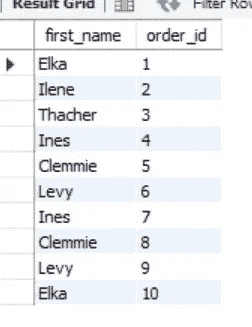
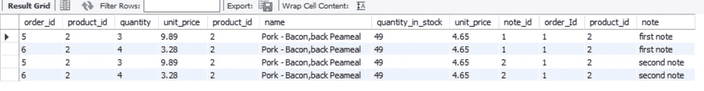
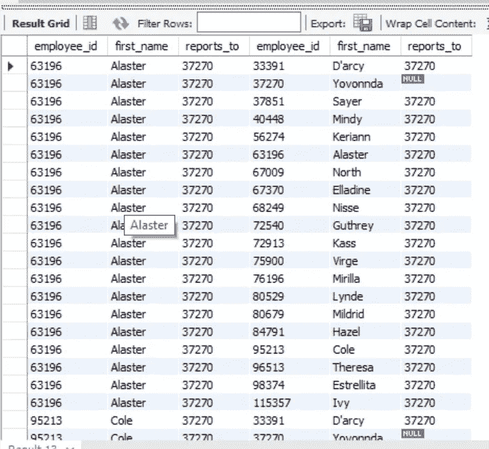
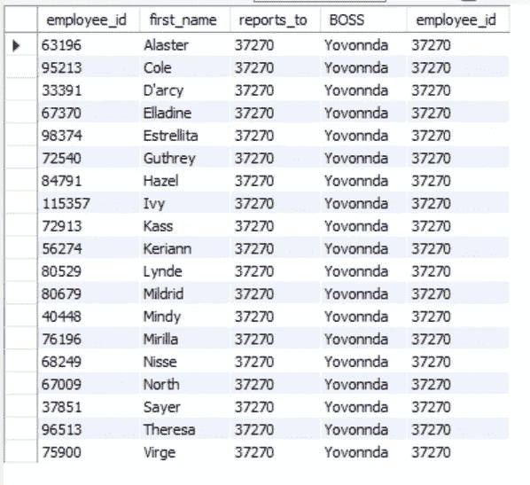

# 在 MySQL 数据库中学习 JOIN:一种实用的方法

> 原文：<https://javascript.plainenglish.io/learn-join-in-mysql-database-a-practical-approach-1933c5c6bae6?source=collection_archive---------6----------------------->

## 电子商务数据库的分解


Photo by [Leon](https://unsplash.com/@myleon?utm_source=unsplash&utm_medium=referral&utm_content=creditCopyText) on [Unsplash](https://unsplash.com/s/photos/worker-office?utm_source=unsplash&utm_medium=referral&utm_content=creditCopyText)

Join 是连接多个表的强大工具。这在任何数据库中都是一个重要的概念。

今天，我们将了解如何以及在哪里可以使用 JOIN 来获得 MySQL 数据库所需的输出。

# 我们什么时候需要加入？

假设您有一个与产品相关的订单表。如果您想获得订单细节和产品表，您需要对数据库进行两次调用。

1.  获取订单详细信息，并从订单中获取产品 id。
2.  然后使用我们在上一步中获得的产品 id 获得产品细节。

但是如果我们使用`JOIN`，那么我们可以在一个数据库查询中获得所有这些数据。让我们看看如何做到这一点！

# 在开始之前

出于演示的目的，我们采用了一个示例电子商务数据库，客户可以在其中订购各种产品，订单也有 order_notes 等等。

结构看起来像下面这样。

```
**Customers** -> customer_id , first_name , last_name, birth_date, phone, address, city, state, points.**Orders** -> order_id, customer_id, order_date, status, comments, shipped_date, shipped_id.**Order Items** -> order_id, product_id, quantity, unit_price**Order Item Notes** --> note_ID, order_ID, product_ID, note.**Order statuses** --> order_status_iD, name.**Products** --> product_Id, name, unit_price.
```

# 引擎盖下有什么连接？

当我们在两个表之间连接时，数据库获取这两个表，创建一个虚拟表，并将其作为输出返回。

join 的最基本语法是

```
**SELECT** *
**FROM**
ORDERS **JOIN** CUSTOMERS   --< see here
```

在上面的例子中，我们连接了两个表。但是我们需要指定它将如何组合这两个表。

让我们看看我们能做些什么。

```
**SELECT** *
**FROM**
ORDERS **JOIN** CUSTOMERS
**ON** ORDERS.customer_id = CUSTOMERS.customer_id
```

所以这里我们告诉数据库基于`customer_id`的相等来组合`orders`表和`customers`表。

# 选择一些属性

我们从两个表中选择所有属性。这不是很有帮助。让我们看看如何只选择一些选定的属性。

语法与普通的 SELECT 语句相同。因为，正如我们前面所说的，数据库返回的是一个虚拟表，它不是一个单独的表，而是一个单独的表。

让我们只选择客户的姓名和他们的订单 id

```
**USE sql_store;
SELECT** first_name, order_id **FROM** orders **JOIN** customers **ON** orders.**customer_id** = customers.**customer_id**
```

所以输出会变成这样。



image by author

这样我们就可以看到带有客户名字的订单 id。

# 使用别名

别名是表或列的临时昵称。做起来毫不费力。假设你的列名或者表名很大，或者你要写很多次。那么这个昵称就会变得很有帮助。制作别名的代码是:

```
**FROM** order_items **oi** 
**JOIN** products **p**
```

在这种情况下，我保留了`order_items`名为 **oi** 和`products`名为 **p** 。

这在连接多个表或自连接时特别有用。

# 如何在 MYSQL 中连接三个或三个以上的表？

假设我有`order_items` 、 `products`和`order_item_notes` 三个表。他们都有 `product_id`财产。所以出于某种原因我需要把它们放在一起看。所以语法会变成；

```
**SELECT** *
**FROM** order_items oi
**JOIN** products p
   **ON** oi.product_id = p.product_id
**JOIN** order_item_notes oin
   **ON** oin.product_id = p.product_id;
```

一个表总是与前一个表相连。

为了连接表，至少需要一个公共列。在本例中，`order_items`和`product`都有`product_id`列。而`product`、`order_item_notes`都有`product_id`列。

所以结果来了；



image by author

我们有所有产品的产品 id，但没有所有产品的注释。所以，我们得到了那些有注释的产品。

# 跨数据库联接:

当您有多个数据库时，您必须联接来自多个数据库的不同列。尽管我们当前的数据库不同，但我们需要添加另一个数据库来编写代码！

```
**USE** sql_store;
**SELECT** *
**FROM** sql_inventory.products pp
**JOIN** products p
   **ON** pp.product_id = p.product_id
```

在`USE`之后写入任何数据库，操作员是主数据库。一切都在这个数据库中运行。在这个例子中，我们的主数据库是`sql_store`。

在`FROM`部分中，我们需要来自`sql_inventory`数据库的另一个`product`表。因此，我们可以通过在表名前面加上数据库名的前缀来编写代码，以连接多个数据库。

# 自联接:

自连接意味着当您需要不同视图的相同表的列时。假设您有一个雇员数据库，显示雇员的老板 id。(表示员工去哪里提交报告)。`reports_to`是老板 id。

但是老板也是员工，所以他的数据也存储在员工的表内部。因此，如果我想获得一个雇员的信息以及他的老板的信息，那么我们必须做一个自连接。

```
**USE** sql_hr;
**SELECT**
e.employee_id,
e.first_name,
e.reports_to,b.employee_id,
b.first_name,
b.reports_to**FROM** employees e   --> using alias e
**JOIN** employees b   ---> using alias b 
```

结果变成了



image by author

现在，您需要识别每个员工的老板姓名或老板 id。意思是员工去哪里报到。

# 列中也可以有别名

如果任何人在`reports_to`单元格中有 null，你需要明白他们是这个公司的老板。让我们在一个名为。`BOSS`

```
**USE** sql_hr;
**SELECT**
e.employee_id,
e.first_name,
e.reports_to,
b.first_name **AS** 'BOSS',
b.employee_id
**FROM** employees e
**JOIN** employees b
**ON** e.reports_to = b.employee_id
```

所以结果就变成了。



image by author

# 复合连接

出于某种原因，我需要一个表来查看多个属性。喜欢；订购的项目的 id，如果有任何特殊说明，以及订购时有说明的所有产品的 id。

所以，我有两个数据库。一个是 `order_items`，另一个是`order_item_notes`。它们都有 `order_id` 和`product_id` 属性。

复合连接意味着使用 `AND`、`OR`命令从不同的表中添加多个条件。

```
**USE** sql_store;
**SELECT** *
**FROM** order_items oi
**JOIN** order_item_notes oin
  **ON** oi.order_Id = oin.order_Id
  **AND** oi.product_id = oin.product_id
```

在这个查询中，我需要`order_items`和`order_item_note`表。在这个场景中，我建立了两个连接关系。一个是两个表的 order_id，另一个是两个表的 product_id。

[](https://blog.devgenius.io/9-mandatory-operators-to-know-as-an-sql-developer-14c012e7d991) [## 作为 SQL 开发人员必须知道的 9 个操作符

### 用真实的例子和使用案例解释

blog.devgenius.io](https://blog.devgenius.io/9-mandatory-operators-to-know-as-an-sql-developer-14c012e7d991) 

*更多内容尽在*[***plain English . io***](http://plainenglish.io/)