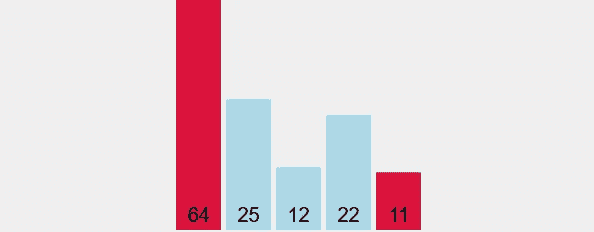
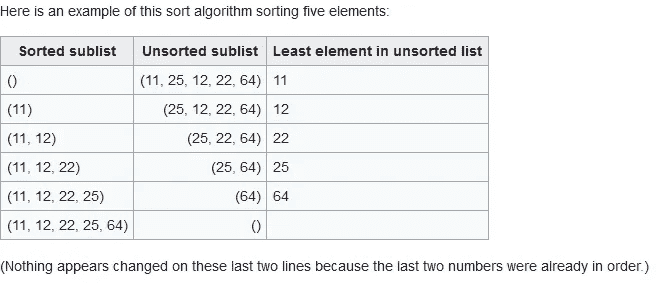
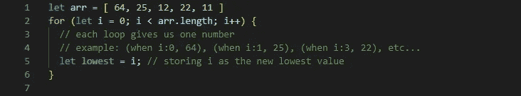
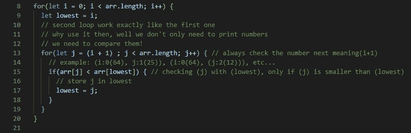
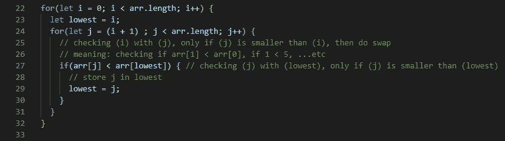
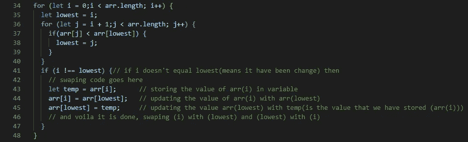

# 把选择排序学得很好，这样你就能把它教给别人了

> 原文：<https://javascript.plainenglish.io/learn-selection-sort-so-well-that-youll-be-able-to-teach-it-to-others-1addd79072ac?source=collection_archive---------13----------------------->



在[计算机科学](https://en.wikipedia.org/wiki/Computer_science)，**选择排序**是一种[原地](https://en.wikipedia.org/wiki/In-place_algorithm) [比较](https://en.wikipedia.org/wiki/Comparison_sort) [排序算法](https://en.wikipedia.org/wiki/Sorting_algorithm)。它有一个 [O](https://en.wikipedia.org/wiki/Big_O_notation) ( *n* 2) [的时间复杂度](https://en.wikipedia.org/wiki/Time_complexity)，这使得它在大型列表上的效率很低，一般比类似的[插入排序](https://en.wikipedia.org/wiki/Insertion_sort)的性能要差。选择排序以其简单性而著称，并且在某些情况下，特别是在[辅助存储器](https://en.wikipedia.org/wiki/Auxiliary_memory)有限的情况下，比更复杂的算法具有性能优势。

该算法将输入列表分为两个部分:在列表的前面(左侧)从左到右构建的已排序项目子列表，以及占据列表剩余部分的剩余未排序项目子列表。最初，排序的子列表是空的，未排序的子列表是整个输入列表。该算法通过在未排序的子列表中找到最小(或最大，取决于排序顺序)的元素，将其与最左边的未排序的元素交换(交换)(按排序顺序放置),并将子列表边界向右移动一个元素来进行。

选择排序的时间效率是二次的，因此有许多排序技术比选择排序具有更好的时间复杂度。选择排序区别于其他排序算法的一点是，它进行尽可能少的交换，在最坏的情况下，*n*-1。

与其他排序算法相比，选择排序并不难分析，因为没有一个循环依赖于数组中的数据。选择最小值需要扫描 ***n*** 个元素(进行 ***n-1*** 比较)，然后将其交换到第一个位置。寻找下一个最低的元素需要扫描剩余的 ***n-1*** 元素等等。

# 分步示例

```
***First Pass***
( **5** **1** 4 2 8 ) → ( **1** **5** 4 2 8 ), swaps since 5 > 1
( **1** 5 **4** 2 8 ) → ( **1** 4 **5** 2 8 )
( **1** 4 5 **2** 8 ) → ( **1** 4 5 **2** 8 )
( **1** 4 52 **8** ) → ( **1** 4 52 **8** ), Now, since these elements are already in order (8 > 1), algorithm does not swap them.***Second Pass***
( 1 **4** 528 ) → ( 1 **4** **5** 28 )
( 1 **4** 5 **2** 8 ) → ( 1 **2** 5 **4** 8 ), Swap since 4 > 2
( 1 **2** 54 **8** ) → ( 1 **2** 54 **8** )Now, the array is already sorted, but the algorithm does not know if it is completed. The algorithm needs one **whole** pass without **any** swap to know it is sorted.**Third Pass**
( 1 2 **5 4** 8 ) → ( 1 2 **4 5** 8 )
( 1 2 **4** 5 **8** ) → ( 1 2 **4** 5 **8** )
```

# 分步示例 2



# 分步编码示例



Step 1



Step 2



Step 3



Step 4

# 表演

像冒泡排序一样，由于嵌套循环，选择排序的最坏情况和平均复杂度为 O(n)。这意味着它的效率随着元素数量的增加而急剧下降

虽然就写入次数而言，选择排序优于插入排序(θ(*n*)交换相对于ο(*n*)交换)，但它几乎总是远远超过(且从未超过)循环排序的写入次数，因为循环排序在写入次数方面理论上是最佳的。如果写入比读取成本高得多，这可能很重要，例如使用 [**电可擦除可编程只读存储器**](https://en.wikipedia.org/wiki/EEPROM) 或[闪存](https://en.wikipedia.org/wiki/Flash_memory)，其中每次写入都会缩短存储器的寿命。

最后，在更大的数组上，选择排序大大优于θ(*n*log*n*)[分治算法](https://en.wikipedia.org/wiki/Divide_and_conquer_algorithm)，例如 [merge-sort](https://en.wikipedia.org/wiki/Mergesort) 。但是，插入排序或选择排序对于小数组(即少于 10–20 个元素)通常都更快。在实践中，递归算法的一个有用的优化是对于“足够小”的子列表切换到插入排序或选择排序。

# 奖金

**选择排序**能够**擅长**检查一切是否已经**排序**。在内存空间有限的情况下，使用它也很好。这是因为与其他**排序**算法不同的是，**选择排序**直到最后才开始交换数据，因此使用的临时存储空间更少。

# 包扎

考虑到所有的事情，选择排序仍然是一个有趣的算法，可能会在编码挑战中出现。或者，您可能会得到一个选择排序函数，并被问及 Big-O 符号是什么以及为什么。希望本文中的例子能够帮助您准备好应对这两种情况。

我希望你有一个美好的一天，感谢你花时间阅读这篇文章。

我希望你有一个美好的一天，感谢你花时间阅读这篇文章。