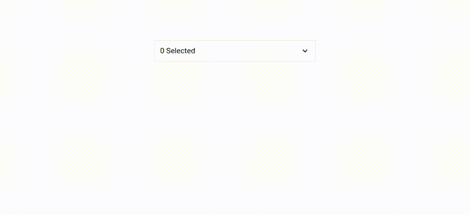

# 学会在不到 3 分钟的时间内构建一个 React 多选下拉菜单

> 原文：<https://javascript.plainenglish.io/learn-to-build-a-react-multi-select-dropdown-in-less-than-3-minutes-a8b69fe021bd?source=collection_archive---------1----------------------->

从头开始编写 react 组件可能需要时间，它还可以教会你新的技巧，让你想到解决问题的不同方法。今天我们要用 React 和 SCSS 构建一个简单的多选下拉列表。

我们开始吧！

# 数据和基本组件设置

让我们从定义我们想要在下拉列表中显示什么数据开始，通常这将来自后端，以允许用户从数据集中过滤条目。

接下来，让我们定义 2 个组件。1 是我们的父组件，第二个是多选下拉列表，它接收选项、选定的选项以及允许选择/取消选择选项的功能。

现在我们有了两个主要组件，让我们开始添加多选下拉列表所必需的 HTML 和 CSS。

# HTML 和 SCSS

让我们开始为下拉菜单定义必要的标记:

如您所见，我们给了大部分 div 元素一个类名。我总是试图将 BEM 命名约定与 ITCSS 框架结合起来(两者都值得深入学习)

目标是总是显示`c-multi-select-dropdown__selected`并且在悬停时只显示列表`c-multi-select-dropdown__options`。

我们在 SCSS 通过给`c-multi-select-dropdown`添加一个悬停动作并给我们的`c-multi-select-dropdown__options`一个绝对定位来做到这一点。

很有风格。如你所见，我非常喜欢使用 flex 来对齐元素。总而言之，这将产生以下包含静态数据的下拉列表:

是时候添加一些 API 数据了！

# 状态+将所有这些联系在一起

让我们从父组件开始

我们的父组件使用 Reacts 的 useState 钩子跟踪哪些项目被选中。它还有一个功能，可以通过多选来调用，以切换项目的选定选项。

它通过将数据条目的 id 添加到选定列表中，并在应该取消选择该项时将其过滤掉。

接下来，让我们添加我们的渲染到我们的`MultiSelectDropdown`组件:

我们做了几件事:

*   我们已将“选定的 0”替换为“选定的项目数”
*   我们已经将唯一的列表项替换为所有选项的呈现
*   在选项呈现中，我们检查我们的选项 id 是否是所选列表的一部分
*   我们添加了一个 onClick 处理程序来切换选项的选定值。

就是这样！现在运行你的代码，你会得到如下的结果！

# 结论

你已经学会了建立自己的多选，多酷啊！下一步可能是直接在“selected”栏中添加项目，并允许用户从那里删除它们。

我希望你学到了新的东西，保持好奇！

*更多内容看*[***plain English . io***](http://plainenglish.io/)