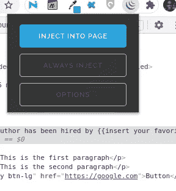

# 学会在一个晚上建立一个网络刮刀

> 原文：<https://javascript.plainenglish.io/learn-to-build-a-web-scraper-in-an-evening-6a9d2c3862c?source=collection_archive---------9----------------------->


Photo by [Jefferson Santos](https://unsplash.com/@jefflssantos?utm_source=medium&utm_medium=referral) on [Unsplash](https://unsplash.com?utm_source=medium&utm_medium=referral)

如果你一直想建立一个网页抓取器，或者只是好奇它是如何完成的，我已经创建了这个简单的教程来帮助你开始。在本教程中，你将学习网络抓取的基础知识。尽管本教程使用了 JavaScript/Node.js，但是这里使用的概念对于所有编程语言都是一样的。所以，如果你想要一个不做任何假设的教程，你就来对地方了。

## **项目设置**

首先，让我们安装 Node.js. Node.js 是一个 JavaScript 运行时，使我们能够在浏览器之外运行 JavaScript。每个浏览器都有一个 JavaScript 引擎，这样它就可以执行网站上的 JavaScript 代码。一个叫 [Ryan Dhal](https://en.wikipedia.org/wiki/Ryan_Dahl) 的家伙拿出 chrome 浏览器中的 JavaScript 引擎，并在其上构建了所谓的 Node.js。因此，我们可以像本地计算机一样在非浏览器环境中运行 JavaScript 代码。为了能够在你的计算机上运行 JavaScript，你只需要安装 Node.js

现在，不同的操作系统遵循稍微不同的方法来安装 JavaScript 运行时。要为您的操作系统安装，请访问[官方 Node.js 网站](https://nodejs.org/)，并按照您的操作系统的说明进行操作。

一旦解决了这个问题，您应该验证安装是否顺利进行。一种方法是检查安装的 Node.js 的版本。卷起您的终端或命令提示符并运行命令:

```
node --v
```

您应该看到安装的 Node.js 版本与我的版本一样，如下所示:


Terminal showing node version

你的版本可能与我的不同，但对我们来说这不是问题。

好吧，我们只安装了 Node.js，但是 npm 是和它一起安装的。如果您尝试命令`npm -v`，您将看到安装的 npm 版本。

## **那么什么是 npm 呢？**

NPM 是 Node.js 的包经理，包是由其他程序员编写并提供给我们的代码，以帮助我们做事情，所以我们不必从头开始编写一切。我们将使用这些包来创建我们的 web scraper。因此，npm 将帮助我们安装和管理这些软件包。

## **初始化项目**

让我们初始化项目。

创建一个您选择的文件夹并导航到其中。对我来说，我在我的文档目录中创建了这个文件夹，并将其命名为 **web-scraper。**


Empty web-scraper folder

现在启动终端/命令提示符并导航到文件夹。然后运行命令:

```
npm init
```

按照说明进行操作，并通过一直按下**回车**来接受。如果您确定在项目初始化期间不会对 npm 提供的默认选项进行任何更改，您可以使用`--y`标志来初始化项目。那就是:

```
npm init --y
```

这告诉 npm 简单地使用缺省值，不要等待我们继续按回车键。

运行该命令后，您将看到 npm 已经为您创建了一个 **package.json** 文件。这个文件保存了关于项目的信息，比如项目的名称、作者和版本。请参见下面的文件视图:

```
{
  "name": "web-scraper",
  "version": "1.0.0",
  "description": "",
  "main": "index.js",
  "scripts": {
    "test": "echo \"Error: no test specified\" && exit 1"
  },
  "keywords": [],
  "author": "",
  "license": "ISC"
}
```

该文件还记录了我们安装的要在项目中使用的所有包。我们无法在文件中找到包列表，因为我们还没有安装任何包。为了创建我们的 web scraper，我们需要两个包来使用: **axios** 和 **cheerio。**让我们通过运行以下命令来安装它们:

```
npm i axios cheerio
```

这将为我们安装这两个包。再次查看`package.json`文件，我们可以看到这些包已经列在文件的**依赖项**部分:

```
{
  "name": "web-scraper",
  "version": "1.0.0",
  "description": "",
  "main": "index.js",
  "scripts": {
    "test": "echo \"Error: no test specified\" && exit 1"
  },
  "keywords": [],
  "author": "",
  "license": "ISC",
  **"dependencies": {
    "axios": "^0.21.1",
    "cheerio": "^1.0.0-rc.6"
  }**
}
```

您还会注意到已经生成了其他文件和一个额外的文件夹。对我们来说重要的是 **node_modules** 文件夹。这是我们安装的所有软件包将被保存的地方。当我们运行代码时，Node 将在文件夹中查找我们的包。如果您怀疑 node_modules 文件夹已经被篡改，您总是可以使用命令:`npm install`重新安装您的所有软件包

## **接下来呢？**

在我们继续之前，我想做一个愚蠢的假设。我假设你对 HTML 和 CSS 有所了解。如果你不知道这些是什么，别担心，我会试着给你介绍一下。

网页只不过是一个文本文件，包含代表页面结构的元素。HTML 是我们用来定义这种结构语言(不是编程语言，lol)。例如，如果我想在浏览器中显示一段文本，HTML 为我提供了一个**标签**来实现。我的段落看起来会像这样:

```
<p> This is my paragraph text </p>
```

HTML 中的大标题如下所示:

```
<h1>This is a big heading</h1>
```

一个网页可以有几个段落和其他元素。这使得仅仅通过显示数据的标签来识别数据变得非常困难。除了标签之外，HTML 还提供了其他属性来唯一地标识元素。可以给一个元素一个 id，以将其与其他元素区分开来。例如:

```
<p id="p1"> this is a paragraph</p>
```

该段落的 id 为`p1`。这将把它与页面上的其他段落或元素分开。另一个有助于分隔元素的东西是**类。**类决定了元素的样式。假设一页上有两个段落: **ParagraphA** 和 **ParagraphB** 。段落可以是绿色的，段落 b 可以是黄色的。课程帮助我们实现这个目标。人们创建 CSS 类，定义 HTML 元素的样式规则，然后将这些类分配给目标元素。在真实的 HTML 文档中，我们的示例段落看起来会像这样:

```
<p id="paragraph1" class="green-text"> ParagraphA </p>
<p class="yellow-text"> ParagraphB </p>
```

您可以看到，ParagraphA 有一个 id`paragraph1`和一个类`green-text`，而 ParagraphB 没有 id，但有一个类`yellow-text`。关于这两段的信息如下表所示:


Showing attributes of the two paragraphs

> 重要的是要记住，HTML 不是一种会迫使编码人员遵守规则的严格语言。这可以在我们的示例段落中看到。即使 ParagraphB 没有给定的 id，浏览器仍然会显示它。

HTML 也遵循层次结构。所有元素都包含在`<html>`标签中。有些元素通常是容器。它们意味着包含其他元素。例子有:`div`、`span`、`template`、`section`等。当你浏览网站时，你会看到这些元素在起作用。

现在，这看起来和你来这里的主要原因有很大的偏离。但是相信我，这很重要。知道如何识别与我们想要的数据相关的所有必要属性是非常重要的。事实上，你制作铲运机的大部分时间都花在了计算这些信息上。

这就引出了一个问题:什么是网络抓取？

Web 抓取只是一个复杂的术语，用于简单地识别和提取 HTML 元素的内容，如我们前面提到的`p`和`h1`。本质上，web 抓取涉及的主要工作是收集更多关于我们想要抓取的数据的信息。

## **刮网在行动**

我创建了一个简单的[网页](http://web-scraper-tutorial.netlify.app)，这样我们就可以一起工作了。我们将在此网页上浏览提取所需数据的过程:[web-刮板-tutorial.netlify.app](https://web-scraper-tutorial.netlify.app/) :


Example website created by the author

如果您单击链接，您将在浏览器中看到显示的页面。但是我们如何看待 HTML 标记呢？要查看标记，请按组合键:**CTRL+SHIFT+I。**这将在您的浏览器中打开一个新的部分，简称为开发工具或 DevTools:


The chrome dev tools

DevTools 附带了不同的选项卡，要查看 HTML 标记，请单击元素选项卡(在大多数情况下，元素选项卡可能是默认选项卡)。开发工具窗口中的另一个重要部分是控制台。


The Elements and the Console tabs

本部分允许我们使用 JavaScript 与网页交互。如果您不知道 JavaScript，请不要担心，我们将在此过程中收集我们需要了解的内容。

为了在页面上看到元素的 HTML 表示，chrome 开发工具附带了一个检查工具。


The inspector

单击此工具，转到“新闻标题”文本并单击它。


Headline highlighted

您会注意到 HTML 标记在元素部分很快被突出显示。除此之外，您还会注意到，将光标放在页面上的元素上会显示关于这些元素的更多信息:


Highlighter information

对我们来说，重要的是:

```
h1.display-4.text-white.mt-5.mb-2
```

这告诉我们，这个“新闻标题”被包装在 h1 元素中，并且有 4 个相关的类。这些类别是:

**显示-4** 、**文字-白色**、 **mt-5** 、 **mb-2**

每节课都以一个点开始。所以如果我们看到一个点，在我们遇到另一个点之前，后面的所有东西都是类名。这就是为什么我们知道 h1 元素有 4 个类。我们得到的关于“新闻标题”的所有细节都被称为它的选择器。这很有意义，因为这些项唯一地标识了元素。

好吧，让我们试着检查一下网页上我最喜欢的文字，上面写着:“作者已被{ {在此插入您最喜欢的 FANG 公司}}录用”；


Highlights h2

这里，选择器是`h2#favourite`。由此我们可以得出，包含文本的元素是`h2`但是什么是`#favourite`？由于课程以`.`开头，所以`favourite`不是课程。当`#`在前面时，这告诉我们选择器是一个 id。因此，本质上，这个突出显示的文本被包装在 h2 元素中，id 为`favourite`。您可以使用检查工具继续突出显示页面上的元素，以查看它们的 HTML 组成。

## **使用控制台选择元素。**

您已经看到了如何使用检查工具来选择和查看页面上每个元素的更多信息。现在，我们将使用控制台来选择这些元素。转到控制台部分，单击进入编辑器并键入代码

```
document.querySelector('h2')
```


writing Javascript in console

代码是 JavaScript 在页面上选择元素的方式。`**document**` 是一个保存网页中所有东西(包括元素)的对象，所以要获取任何元素，我们只需使用`querySelector`函数向`document`请求即可。querySelector 函数希望我们提供与相关元素相关联的选择器。我们总是可以使用检查工具，通过突出显示元素来了解元素的选择器。

该页面有 4 个段落元素(即包装在

标签中的文本)，让我们在控制台中选择这些段落:

```
document.querySelector('p')
```

运行代码后，我们得到以下结果:


Query all paragraphs

不幸的是，该命令只返回一个段落。这就是`querySelector`功能的工作原理。即使有许多元素具有相同的选择器，它也会返回遇到的第一个。

如果您想返回所有匹配选择器的元素，您应该使用元素查询的不同变体，`querySelectorAll()`。

让我们试试这个:

```
document.querySelectorAll('p')
```

在控制台中运行该命令将返回一个数组，其中包含与选择器`p`匹配的元素。


Querying all paragraphs

尽管所有的元素都被返回，但是它们伴随着我们不需要的其他数据。那么我们如何得到我们所需要的，比如这些元素的文本属性呢？

一种方法是遍历这些元素并提取文本内容。这可以使用下面的代码来完成:

首先，我们得到一个数组中的所有段落。

然后，我们遍历该数组，并使用 **innerText** 属性提取每个段落的文本内容，并将其保存在变量 **text** 中。然后，我们将文本打印到控制台。

这很酷，但大多数网站不会这么容易刮。真正的网站有着复杂的标记和约定，使用普通的 JavaScript 来处理事情会变得令人不知所措。这就是 jQuery 发挥作用的地方。jQuery 是一个 JavaScript 库，可以帮助开发人员轻松执行任务。

我们可以使用 jQuery 轻松找到示例网页的元素。但是有一个问题。除非网页上安装了 jQuery，否则不能在网页上使用 jQuery。解决这个问题的一个方法是将 jQuery 注入到您想要抓取的页面中。有几个浏览器扩展可以帮助你做到这一点。

转到您的浏览器商店并搜索 jQuery injector。对于 Chrome 商店，我找到了这个:


jQuery Injector in the Chrome Store

安装它，加载你要刮的页面后注入:



Inject jQuery

一旦注入了这些内容，您就可以在控制台中运行下面的代码:

这使得它非常简洁。我们不必直接处理文档对象及其方法。此外，jQuery 为我们提供了提取数据的便捷方法，比如`.text()`函数。如果我们要使用普通的 JavaScript，这可以帮助我们减少代码行。如果我们想在一个元素上使用 jQuery，我们需要将它包装在`$()`函数中。

现在让我们获取页面上按钮的文本属性。但是我们需要知道它的选择器，对吗？我将使用检查工具来获取信息。


Button highlighted

按钮是一个**一个**元素，有 3 个类， **btn** ， **btn-primary** ， **btn-lg**

现在让我们在控制台中查询:

而`button`的文字已经印在了控制台上。不错吧。

在按钮的标记中，我们可以看到按钮有一个 href 属性:


The button markup

因此，如果我们单击按钮，它会将我们带到`google.com`。如果我们想提取那条信息呢？

我们可以用`attr()`函数来实现:

如果您在控制台中运行它，您会看到它打印了属性`**href**`，即`[https://google.com](https://google.com)`

我们首先找到带有代码的按钮:

```
let button = $('a.btn.btn-primary.btn-lg')
```

然后我们提取 href 属性:

```
let result = $(button).attr('href')
```

## **用 Node.js 刮取**

我们可以看到用 jQuery 抓取网站是多么容易。但这并不实际。这意味着我们每天都要不停地访问这些我们想要抓取的网站，给这些网站注入 jQuery，卷起我们的控制台，执行抓取。在现实世界中，人们会创建自动为他们执行这些步骤的服务器。我们将学习如何设置 Node.js 来为我们执行这个任务。

现在，回到我们在本教程第一部分创建的文件夹:


web-scraper folder

接下来，在文件夹中创建一个文件`index.js`:


Creates index.js

从现在开始，我们将要编写的代码将在这个文件中。

在您最喜欢的文本编辑器中打开 index.js，并编写以下代码:

```
const cheerio = require('cheerio')
const axios = require('axios')
```

如果你还记得，在开始的时候，我们安装了这两个包。我们现在做的是将这两个包导入到我们的项目中。

## **那么这两个包是干什么用的呢？**

网络搜集包括两个基本步骤:

*   *获取我们想要抓取的网页*
*   *从网页中选择并提取数据*

之前，我们使用浏览器来获取网页，并使用 jQuery 来选择和提取数据。Axios 和 Cheerio 在 Node.js 环境中的工作方式相同。Axios 将帮助你获得一个无标题的网页，Cheerio 的工作方式与 jQuery 相同。事实上，Cheerio 是一个面向服务器的 jQuery 实现。

让我们使用 axios 加载我们的网页:

我们创建了一个名为 **main** 的函数，并在其中使用`axios.get()`函数来获取网页的内容。实际上，axios 返回一个响应对象，但是我们只需要数据属性，所以我们用这个`{data}`析构该对象并检索数据，然后我们在函数的最后一行将它打印到控制台。

您会注意到代码中完成的**异步/等待**仪式。因为 axios 获取我们的网页需要一些时间，所以我们不得不告诉 node js 等待资源。必须等待异步工作的方法必须用 async 关键字标记。

要运行我们的代码，请在您的终端/命令提示符下运行命令:

```
node index.js
```

确保您位于自己创建的文件夹中。它应该打印页面的 HTML 表示。


printing the contents of the page

如上所示，我们可以成功地检索我们的网站资源。让我们使用 Cheerio 与这个 HTML 进行交互，并提取我们需要的数据:

由于页面的 HTML 存储在`data`中，我们可以使用`cheerio.load()`函数将这些数据加载到 Cheerio 中。该函数返回普通的 jQuery 函数`$`。然后，您可以像我们在浏览器中那样使用该功能。在上面的代码中，我们选择了`a`元素并提取了代码为`$('a').text()`的文本属性，然后打印出来。

## **当元素的直接选择器不够用时**

有时候，仅仅使用元素的选择器是不够的。您经常会遇到具有相同类和标签的不同元素。检查我们的页面，我们可以看到两个段落证明这种情况:


Identical paragraphs

这两段是一样的。它们之间唯一的区别是文本内容。所以查询`$('p.text-primary')`将返回这两个段落。

假设我们想返回页面上的最后一段。上面写着“这是第三段”的那个。有时，我们可以通过指定数据的父元素来为数据提供更多的上下文。我们可以选择父元素，然后选择目标元素。

通过仔细检查元素，我们会注意到这个段落包含在一个具有两个类`container`和`bg-secondary`的 div 中:


paragraph contained in a div

因此，我们可以告诉 Cheerio，我们关心的是这个选定 div 中包含的段落，而不是可能共享相同选择器的其他许多段落。这很简单，因为:

```
$('div.container.bg-secondary > p.text-warning')
```

我们用更大的符号`>`将两者分开。它告诉 Cheerio 右边的元素在左边的元素中。

您可以在 NodeJs 代码中实现这一点:

## 我们可能想就此打住。

但是这就是网络抓取的全部吗？肯定不是！想象一下，你想刮掉脸书墙上的前十个帖子。你不能就这样做:

```
let {data} = await axios('https://facebook.com')
```

Axios 无法知道它将获得谁的帐户。有些资源需要经过身份验证才能获得。这个还没讲。

另一件事，一些网站可以检测到它不是一个真正的人在试图访问资源，并有效地阻止访问。一些网站使用验证码来防止僵尸程序。

网络抓取的主要挑战之一是获取网页。但是一旦你把网页放在地上，选择和提取数据的过程是一样的。开发人员有很多方法可以避开这些措施。一种是使用浏览器自动化工具，如 Selenium 和 Puppeteer。然而，这个概念已经超出了本教程的范围。

本教程旨在向您介绍网络抓取的基础知识。你可以随时接受挑战，更加深入。正如所有事情一样，最大的障碍是如何开始。现在你有了开始构建的基本工具。

教程的 Github repo:

[](https://github.com/kastona/web-scraper-tutorial) [## 卡斯托纳/网络刮刀-教程

### 这是我的中型 Web Scraper 教程- kastona/web-scraper-tutorial 的存储库

github.com](https://github.com/kastona/web-scraper-tutorial) 

在 [Twitter](https://twitter.com/stephenkastona) 和 [LinkedIn](https://linkedin.com/in/kastona) 上与我联系。

## 进一步阅读

[](/automate-web-scraping-with-an-easy-to-use-browser-extension-cb6073f1e61d) [## 使用易于使用的浏览器扩展自动抓取网页

### 如何使用 Listly，一个初学者友好的无代码工具，轻松实现 web 抓取过程的自动化。

javascript.plainenglish.io](/automate-web-scraping-with-an-easy-to-use-browser-extension-cb6073f1e61d) 

*更多内容请看*[***plain English . io***](https://plainenglish.io/)*。报名参加我们的* [***免费周报***](http://newsletter.plainenglish.io/) *。关注我们关于*[***Twitter***](https://twitter.com/inPlainEngHQ)[***LinkedIn***](https://www.linkedin.com/company/inplainenglish/)*[***YouTube***](https://www.youtube.com/channel/UCtipWUghju290NWcn8jhyAw)*[***不和***](https://discord.gg/GtDtUAvyhW) *。***