# 学习将 Firebase 身份验证与您的 Nuxt.js 项目集成

> 原文：<https://javascript.plainenglish.io/learn-to-integrate-firebase-authentication-with-your-nuxt-js-project-90c5238f18a7?source=collection_archive---------6----------------------->


Photo by [Emile Perron](https://unsplash.com/@emilep?utm_source=medium&utm_medium=referral) on [Unsplash](https://unsplash.com?utm_source=medium&utm_medium=referral)

在本指南中，您将了解如何在您的 Nuxt.js 应用程序中使用 Google 的 Firebase 认证服务。

完成本文后，您将能够在您的应用程序中使用电子邮件和密码创建或验证用户。

因此，如果您想——或者正在考虑——在您的一个 Nuxt.js 项目中使用 Firebase 身份验证，您会喜欢这篇文章的。

**nuxt . js 中使用 Firebase 认证的要求**

*   带有 yarn/npm 包管理器的 Node.js 安装版本(14.x 或更高版本)
*   代码编辑器—我更喜欢 Visual Studio 代码
*   谷歌账户——我们需要这个来使用 Firebase
*   Nuxt.js 基础知识—对于 Nuxt.js 的完全初学者，我不会推荐这个教程。

如果你在整个教程中遇到任何问题，你可以参考 [GitHub 库](https://github.com/slim-python/nuxt-js-firebase-auth-example)中的代码。

# 什么是 Firebase 认证？

Firebase 是谷歌开发的平台。Firebase 是一个后端即服务(BaaS)，为 web 和移动应用程序开发提供各种服务。

比如:

*   用户认证
*   可伸缩数据库
*   云消息传递
*   云代码功能
*   社交媒体整合
*   文件存储器

还有更多。

Firebase 身份验证是 Firebase 的服务之一，它允许您在 web 应用程序中轻松实现身份验证，从而提高 web 应用程序的安全性。

现在让我们开始:

首先，我们将建立我们的 Firebase 项目。为此，请前往 firebase.google.com 的[用我们的谷歌账户登录。](https://console.firebase.google.com/)

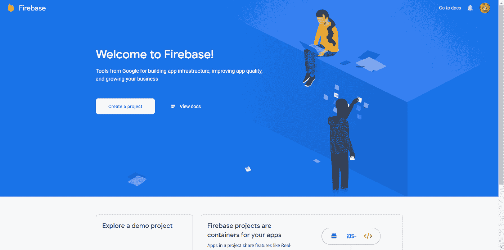

点击**创建一个项目**，输入任何名称，接受条款并点击继续。

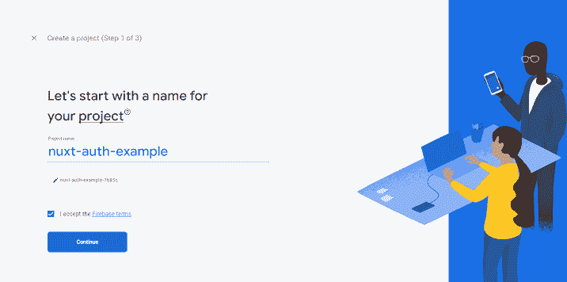

之后，取消勾选**为该项目启用谷歌分析**(因为我们的项目不需要谷歌分析)并点击创建项目。

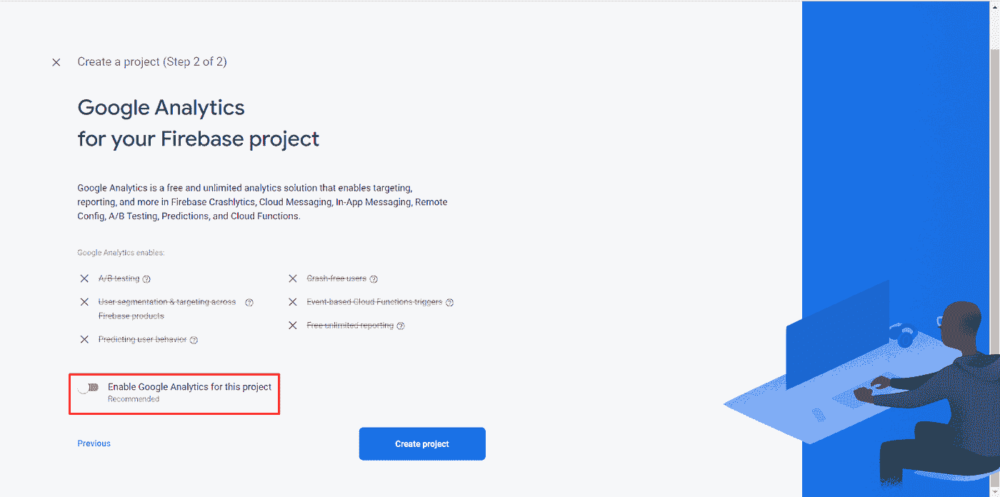

等待几秒钟直到它结束，然后点击**继续**。

.


现在，在仪表板上，点击这个图标(下面有标记)为 web 创建一个应用**。**

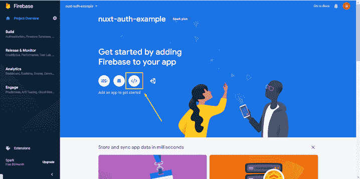

现在输入你的网络应用程序的名称，点击**注册应用程序**。

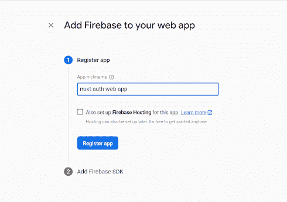

现在您将看到这个屏幕，在这里您可以看到您的 API 密钥和其他个人信息，请确保它是私有的。

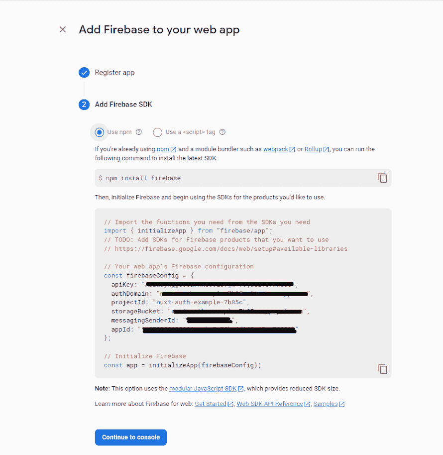

这里你需要复制这 6 样东西，并把它们保存在记事本之类的东西里，因为你将来会用到它们。

```
apiKey: '<apiKey>', authDomain: '<authDomain>', projectId: '<projectId>', storageBucket: '<storageBucket>', messagingSenderId: '<messagingSenderId>', appId: '<appId>', measurementId: '<measurementId>'
```

保存这些详细信息后，点击**继续控制台**。

现在我们已经在 firebase 中创建了应用程序，我们将使用带有电子邮件和密码的 Firebase 身份验证服务。

单击“构建”,然后单击“身份验证”选项卡。

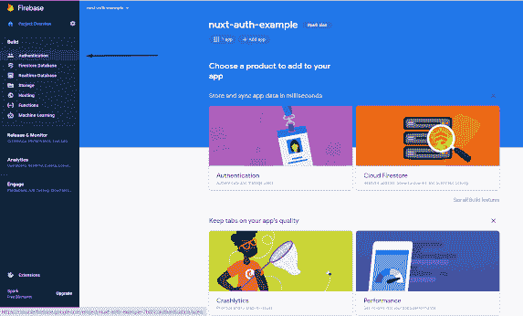

现在点击**开始**。

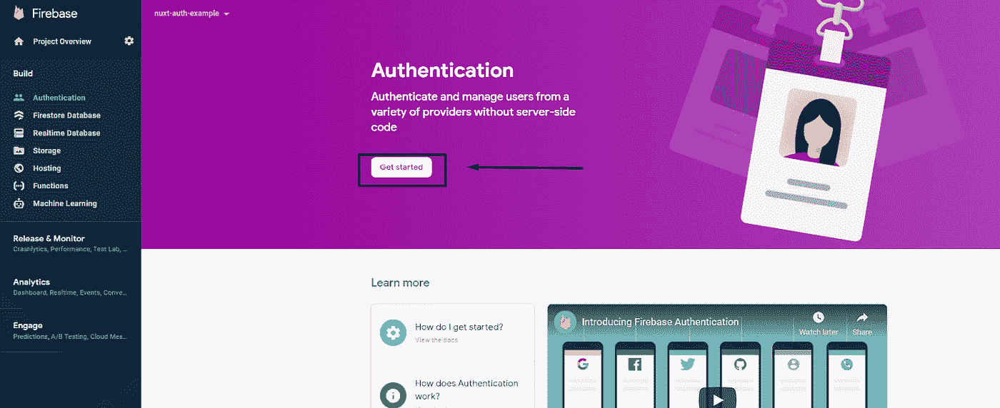

在这里点击**邮箱/密码**。

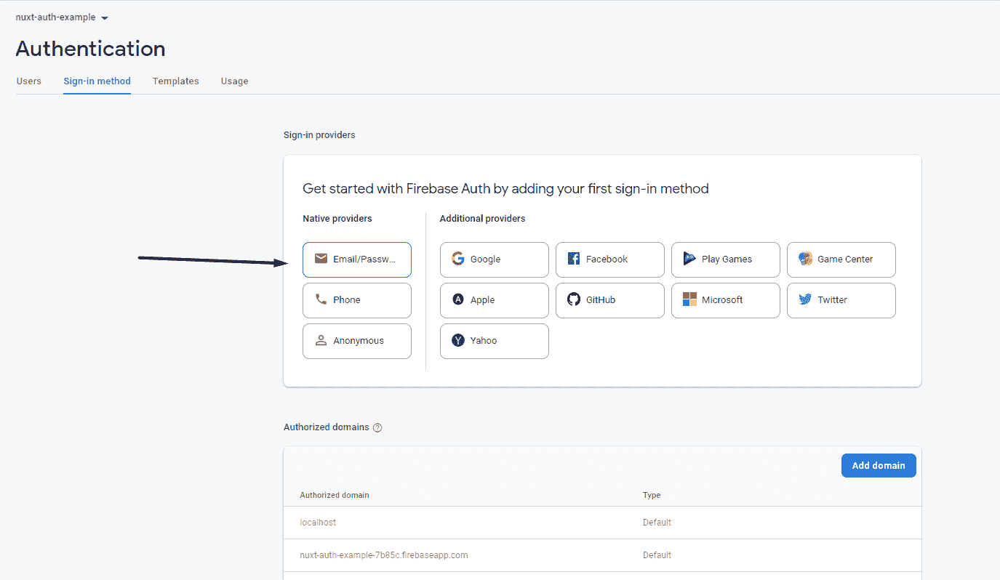

启用顶部的一个，点击一个**保存**。

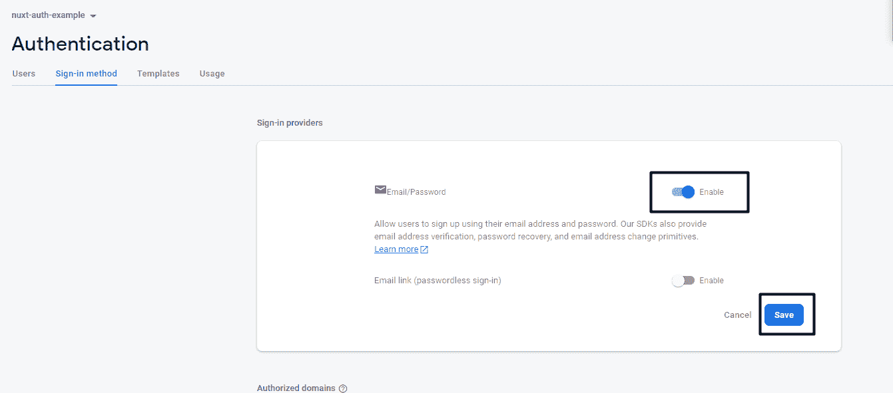

就这样，现在我们完成了 Firebase 部分。现在让我们创建一个 Nuxt.js 项目。

打开您的 VS 代码编辑器，在终端中，键入下面的命令并按 enter 键。它将创建一个名为 **"** nuxt-auth "的 Nuxt.js 项目。

```
**yarn create nuxt-app nuxt-auth**
```

在创建项目时，您需要选择一些配置，我们将使用一些与 Nuxt.js 一起的东西，所以下面是我们需要的配置:

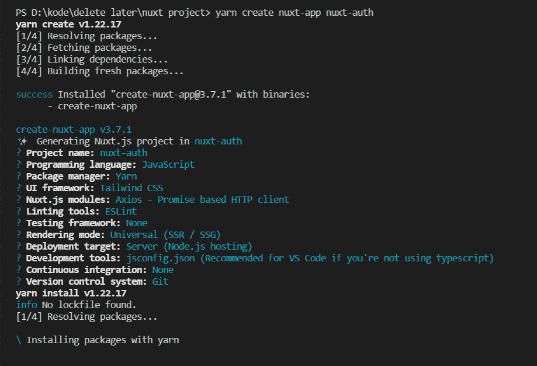

**注意:**按空格键选择 Node.js 模块。

之后，我们还需要在我们的项目中安装一个 Firebase。为此，请键入下面的命令并按回车键。

```
yarn add firebase
```

然后通过键入下面的命令并按 enter 键来安装这个 Nuxt 模块。

```
yarn add @nuxtjs/firebase
```

成功安装后，通过键入`**cd nuxt-auth**`命令并按 enter 键进入 Nuxt.js 项目，然后键入`**yarn dev**`并按 enter 键运行服务器。

这将启动您的浏览器，您应该会看到以下屏幕:

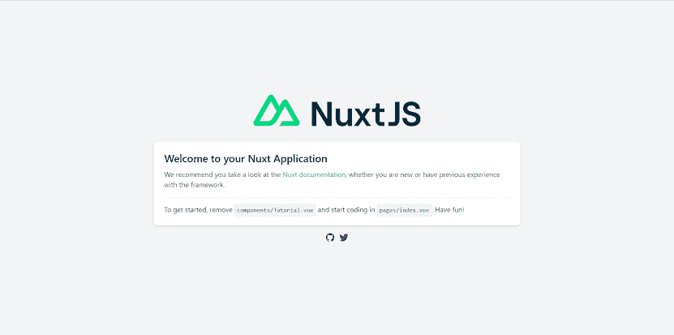

让我们稍微清理一下，以便继续编码。在组件文件夹中，删除 **NuxtLogo.vue** 和 **Tutorial.vue** 。删除这些文件后，从 index.vue 中删除教程组件，index.vue 文件将如下所示:

```
<template> </template> <script> 
export default {} 
</script>
```

现在转到您的 **nuxt.config.js** 文件

替换这个

```
modules: [ // https://go.nuxtjs.dev/axios '@nuxtjs/axios' ],
```

对此:

```
modules: [
    // [https://go.nuxtjs.dev/axios](https://go.nuxtjs.dev/axios)
    '[@nuxtjs/axios](http://twitter.com/nuxtjs/axios)',
    [
      '[@nuxtjs/firebase](http://twitter.com/nuxtjs/firebase)',
      {
        config: {
          apiKey: '<apiKey>',
          authDomain: '<authDomain>',
          projectId: '<projectId>',
          storageBucket: '<storageBucket>',
          messagingSenderId: '<messagingSenderId>',
          appId: '<appId>',
          measurementId: '<measurementId>'
        },
        services: {
          auth: true // Just as example. Can be any other service.
        }
      }
    ]
  ],
```

还记得我告诉你复制那些 Firebase API 密钥和其他个人信息吗？现在您需要将这些信息粘贴到这里。

我们现在已经将 Nuxt.js 连接到 firebase。我们现在可以在页面上使用 firebase 身份验证。

# 在 Nuxt.js 中创建注册页面

首先，我们将创建一个注册功能，让用户使用他们的电子邮件和密码在我们的应用程序中注册。之后，我们会将他们重定向到另一个页面

让我们从在`index.vue`中制作一个简单的注册 HTML 页面开始，用一个电子邮件和密码变量来模拟电子邮件和密码输入字段，这样我们就可以提取数据，然后创建一个注册按钮，当按下该按钮时将运行一个名为“createUser”的功能。

整个代码将如下所示:

在脚本部分，我们声明了两个变量，email 和 password，它们将对我们在上面创建的输入字段中的数据进行建模。

然后，我们将创建一个名为`createUser()`的函数，该函数将从 firebase 调用我们的 auth 实例，该实例具有一个"**createUserWithEmailAndPassword**"方法，该方法以电子邮件和密码作为参数，在 Firebase 中创建新的用户对象。

在此之后，我们只是将用户重定向到另一个页面，注册后的名称。

现在让我们在注册后创建一个名为**的页面，它将在用户注册后显示。**

首先，在页面文件夹中创建一个文件名`aftersignup.vue`，并在注册后向用户显示任何你想显示的内容，例如:

整个注册页面如下所示:


注册后，它将如下所示:

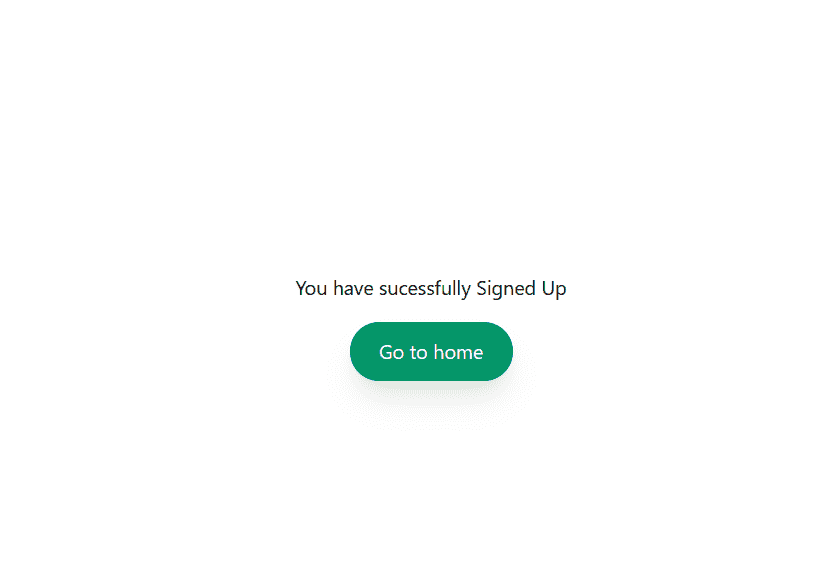

现在我们已经用 firebase 身份验证服务创建了注册页面，让我们创建一个登录页面。

# 在 Nuxt.js 中创建登录页面

首先，我们将创建一个登录功能，让用户用他们的电子邮件和密码登录我们的应用程序。成功登录后，我们会将他们重定向到另一个页面。

首先，在页面文件夹中创建一个文件名`login.vue`。

然后开始在 login.vue 中创建一个简单的登录 HTML 页面，并像我们在注册页面中所做的那样，用一个电子邮件和密码变量来模拟电子邮件和密码输入字段，然后创建一个登录按钮，当按下该按钮时，将运行一个名为“T5”的功能。

整个代码如下所示:

在这里，我们做了一个名为`loginUser()`的函数，它将从 firebase 调用我们的 auth instance，firebase 有一个`signInWithEmailAndPassword`方法，它将电子邮件和密码作为登录的参数。

在这之后，我们将把用户重定向到另一个页面，名为 afterlogin。

现在让我们创建一个页面名称**登录后**我们将显示在用户成功登录后。

首先，在您的 pages 文件夹中创建一个文件名`afterlogin.vue`，然后在登录后向用户显示您想要显示的任何内容，例如:

整个登录页面如下所示:


注册后，它将如下所示:

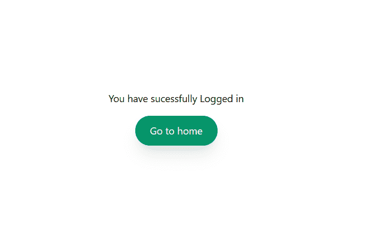

最后，运行下面的命令来运行服务器，查看所有的变化。

这个应用应该运行良好。

一旦你完成了这个构建，你可以尝试添加不同的认证系统，比如谷歌认证，脸书认证，等等，继续尝试代码。

如果您对代码有任何错误或疑问，这里有 [GitHub 存储库](https://github.com/slim-python/nuxt-js-firebase-auth-example)供您参考。

*原为发表于*[*https://windowsground.com*](https://windowsground.com/learn-to-integrate-firebase-auth-with-nuxt-js-project/)*。*

*更多内容请看*[***plain English . io***](http://plainenglish.io/)*。报名参加我们的* [***免费每周简讯点击这里***](http://newsletter.plainenglish.io/) ***。***