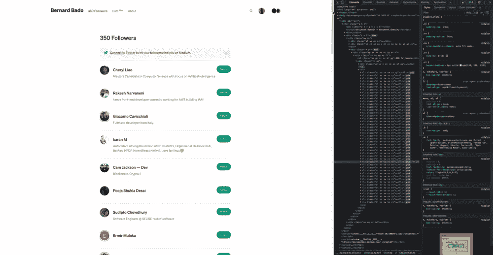
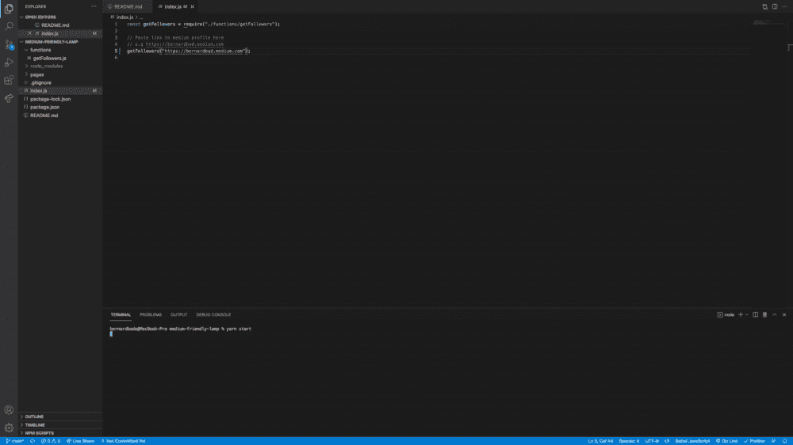

# 学会在 4 分钟内用 JavaScript 抓取任何网站

> 原文：<https://javascript.plainenglish.io/learn-to-scrape-any-website-with-javascript-in-4-minutes-dbe73323a9f1?source=collection_archive---------15----------------------->

## 3 如果你阅读速度很快。

Photo by [Towfiqu barbhuiya](https://unsplash.com/@towfiqu999999?utm_source=medium&utm_medium=referral) on [Unsplash](https://unsplash.com?utm_source=medium&utm_medium=referral)

在我们开始之前，确保没有人在看着你。为什么？因为我将向你展示如何从另一个网站窃取数据。

抛开所有玩笑，当你想到网络抓取的时候。这基本上是从另一个网站窃取信息。但这是否意味着我们要做些违法的事情呢？

不完全是。

归根结底是一件事。你打算怎么处理你刚偷的信息？要不要用于商业目的？这可能违反了网站的条款，你可能会因此惹上麻烦。

另一方面，收集信息供个人使用并没有错。为了尽可能远离监狱酒吧，这正是我要做的。我将创建一个机器人:

*   为给定用户打开一个媒体配置文件
*   收集所有的追随者
*   将它们保存到一个文件中

顺便说一下，我会在最后分享这个机器人，这样你也可以使用它。但是请记住，不要与**“收集的”**数据有任何关系。

GIF by [Giphy](https://giphy.com/gifs/I79LJnc93nufe/links)

# 建造一个机器人

各种编程语言中有许多工具可用于抓取。我选择的语言是 JavaScript，所以我会坚持使用它。

接下来我们需要的是一个可以在浏览器中模拟用户交互的工具。同样，您可以使用许多工具来实现这一点。我将使用[木偶师](https://github.com/puppeteer/puppeteer)，因为它需要零配置开始。它有很好的文档记录，并且有坚实的用户基础。

如果你第一次听说木偶师。我将快速总结一下它能为我们做什么:

*   打开浏览器
*   转到浏览器中的任意 URL
*   点击元素
*   在字段中键入
*   从任何 HTML 元素中提取数据
*   许多其他有用的东西

既然我们选好了武器，是时候组建我们的军队了。我说的军队，是指一个能完成所有战斗的机器人。但在此之前，我们需要分析战场。

## 检查网站

说到抓取网站，你必须意识到没有万能的解决方案。每个网站都有不同的表现，收集所需信息的方法也各不相同。这就是为什么抓取的第一步是分析你正在处理的网站。

我去了 https://bernardbad.medium.com/followers 的，这是一个显示我所有关注者的页面。从一开始，我只能看到少数几个追随者。

为了显示更多的追随者，我需要滚动到页面的底部。等待几秒钟(或者几分钟，如果我的互联网向我宣战的话)。过了一会儿，你就可以看到下一个关注者了。技术行业的人把这种方法称为无限滚动。

现在，您可以在一个列表中看到我所有的关注者。你已经准备好保存这些信息了。但是首先，您需要在 DOM 中找到它。

每个浏览器都带有**“Inspect”**工具，可以让你点击元素并在 DOM 中找到它。现在我找到了我想要的元素。我有所有的信息，现在是时候开始建立一个机器人

# 组装机器人

就像通常的编码一样，为了完成最终产品，需要一些时间和调试。我不想用实现细节来烦你。毕竟，代码将是开源的。

你只对一件事好奇。我能完成这个机器人吗？它真的如我所愿吗？

你打赌。

向下滚动需要一些时间，所以我不能展示整个执行过程。我猜你不得不[下载机器人](https://github.com/codewithbernard/medium-friendly-lamp)并亲自尝试一下。

# 总结想法

对我来说，这是一个非常有趣的实验。我希望你也一样。刮痧是一种强大的技术，可以节省你大量的时间。而且一旦实现了，就可以反复使用。

完整的代码和运行指令可以在 [Github](https://github.com/codewithbernard/medium-friendly-lamp) 上获得。如果你对如何改进有任何问题或建议，请告诉我。玩得开心！

在你出去开始四处**收集数据之前，记住我说的话。请务必先阅读服务条款。**

# **进一步阅读**

** [## 克服开发者面临的 3 大网络抓取挑战

### 如何克服 3 个主要的网络抓取限制—动态网站、网站交互和指纹管理…

javascript.plainenglish.io](/overcoming-3-major-web-scraping-challenges-that-developers-face-1e664ffe4783) 

*更多内容请看*[***plain English . io***](http://plainenglish.io/)**