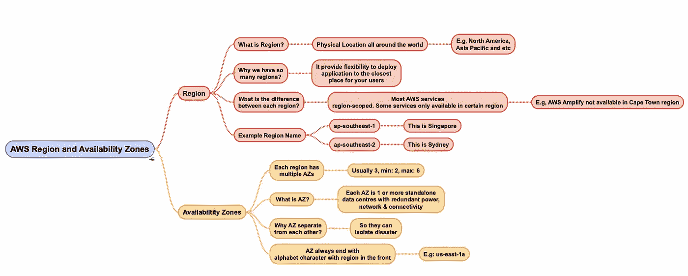

# AWS 认证开发人员—考试系列—AWS 地区和可用性区域

> 原文：<https://javascript.plainenglish.io/learning-aws-most-frequently-asked-questions-in-aws-regions-and-availability-zones-880bcf843a97?source=collection_archive---------18----------------------->

Photo by [Green Chameleon](https://unsplash.com/@craftedbygc?utm_source=medium&utm_medium=referral) on [Unsplash](https://unsplash.com?utm_source=medium&utm_medium=referral)

我决定在即将到来的 2021 年 3 月参加我的 [AWS 认证云开发者助理](https://aws.amazon.com/certification/certified-developer-associate/)考试。因此，我现在正在参加 Udemy 的课程，为考试做准备。

这篇文章总结了 AWS 区域和可用性区域的学习要点。此外，我还做了一个思维导图，以便以后更容易复习。事不宜迟，我们开始吧。

# 地区

## 什么是区域？

AWS 引入了区域的概念，它实际上是某个位置的数据中心的集群组

例如，我们有**、亚太东南亚(新加坡)**、美国东部(俄亥俄州)等地区。

## AWS 为什么引入这么多地区？

它允许我们选择在哪个区域部署我们的应用程序。例如，如果 70%的用户流量来自马来西亚。最好将您的应用程序部署在亚太东南部(新加坡)地区，而不是美国东部。它可以让你的用户享受到更快的应用速度。

## 各地区有什么区别？

大多数 AWS 服务都是区域性的。您正在寻找的服务可能在您所在的地区不可用。但是，仍然有一个解决方法，就是切换区域。您可以通过切换到提供该服务的地区来使用该特定服务。

例如，AWS Amplify 在南非(开普敦)地区不可用。但它在亚太和东南亚地区以及其他大部分地区都有售。

# 可用性区域

## 什么是可用性区域？

可用性区域(AZ)是 AWS 区域中一个或多个具有冗余电源、网络和连接的离散数据中心。— [AWS 文档](https://aws.amazon.com/about-aws/global-infrastructure/regions_az/)。每个区域至少包含 2 个 az，通常为 3 个，最多为 6 个。AZ 正常情况下是相互分离的。

## 为什么我们有多个 az？

AZs 基本上提供冗余并允许容错。假设数据中心因地震而倒塌，您的应用程序可以迁移到其他 az，而不会对您的现有业务产生任何影响。

## 为什么 az 之间是分开的？

物理隔离是为了保证高可用性。再次以地震为例，如果一个地区的所有 az 相邻，那么该地区的所有应用程序都很有可能会停止运行。

这是 AWS 区域和可用性区域的思维导图版本。

如果你认为思维导图是有帮助的和有价值的，请随意下载[这里](https://drive.google.com/file/d/1ldVHHNRZvZP2y-uYasSlLFtq06hVgZiL/view?usp=sharing)。

# 结论

以下是这篇文章的一些要点。

*   区域是一个物理位置区域中的一组集群数据中心。
*   大多数 AWS 服务都是区域性的。您所在的地区可能无法提供某些服务。
*   每个区域有多个可用区域，最少 2 个，通常 3 个，最多 6 个。
*   az 彼此分离，这样我们就可以隔离灾难。
*   AZs 的好处是高可用性、可伸缩性和容错性。

感谢您的阅读，下一篇文章再见。