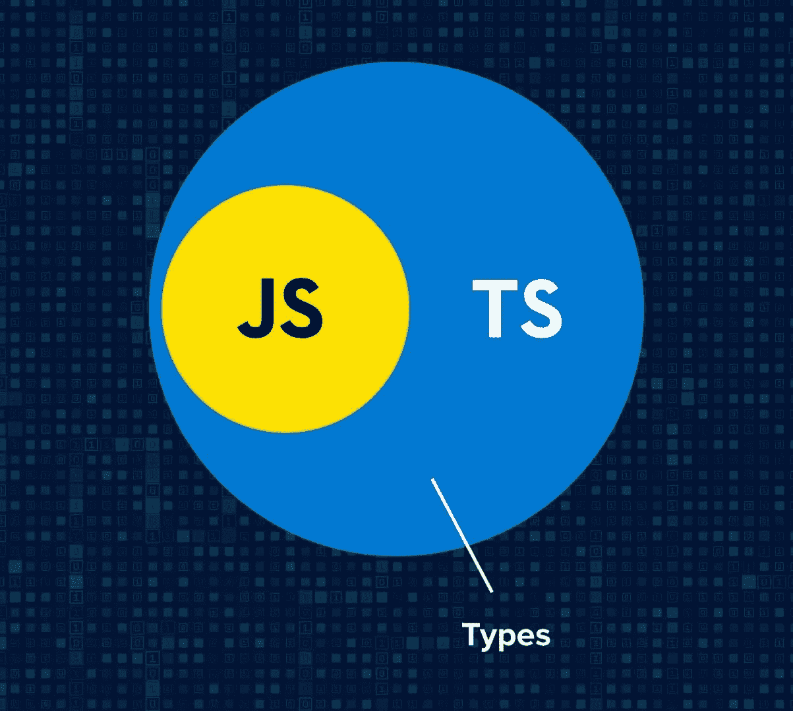
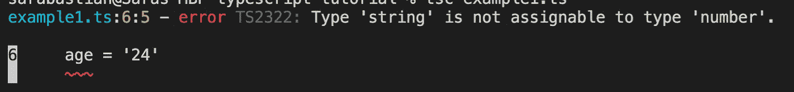
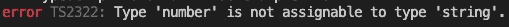
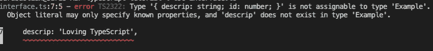

# 学习类型脚本:概念概述

> 原文：<https://javascript.plainenglish.io/learning-typescript-concept-overview-1d9cf7429dd1?source=collection_archive---------1----------------------->

*在 Rust 之后，TypeScript 在* [*Stack Overflow 的 2020 年开发者调查*](https://insights.stackoverflow.com/survey/2020#technology-most-loved-dreaded-and-wanted-languages-loved) *中排名第二。我决定加入炒作。*

Photo from [https://serokell.io/blog/why-typescript](https://serokell.io/blog/why-typescript)

## TypeScript 的简单内容和原因

TypeScript 由微软开发，于 2012 年发布，旨在解决 JavaScript 在构建大规模应用程序时的各种缺点，即 JavaScript 无法像严格语言那样检查和通知开发人员某个代码区域何时会破坏其他区域。作为一种静态脚本语言，TypeScript 为 Javascript 增加了力量，因为它会检查你的代码中的错误，类似于一种更严格的编程语言。

使用*类型系统，*其中描述了正在使用的变量的数据类型，TypeScript 是 JavaScript 的超集，这意味着它由 JavaScript 的特性组成，并且还提供额外的特性。这种类型的系统将帮助我们找到潜在的错误。

TypeScript 的一些附加功能和特征包括:

*   支持函数的可选参数
*   包含 ***接口*** 在代码中定义契约
*   IDE 工具 — TS 将在错误的代码下加下划线
*   **重构工具**——因为 TypeScript 理解代码中的引用和符号，所以在一个地方更改变量名会在其他地方更改它
*   称为面向对象编程语言，而 Javascript 是支持面向对象编程的脚本语言

这段摘自[打字手册](https://www.typescriptlang.org/docs/handbook/2/basic-types.html#static-type-checking)的摘录很好地总结了这一点:

> 静态类型系统描述了当我们运行程序时，我们的价值观的形状和行为。像 TypeScript 这样的类型检查器使用这些信息，并告诉我们什么时候事情可能会出错。

## 如何使用 TypeScript

基于每个项目安装 TypeScript:

`npm install typescript --save-dev`

全局安装(以便 TypeScript 在所有项目中都可用):

`npm install -g typescript`

TypeScript 以扩展名`.ts`写入文件。这些文件中的所有代码都通过 TypeScript**[**trans compiler**](https://en.wikipedia.org/wiki/Source-to-source_compiler)(它将源代码作为输入，并以相同或不同的编程语言生成等效的源代码)运行。接下来，如果成功，transcompiler 将输出文件的 Javascript 版本。**

**要使用 transcompiler，请在命令行中运行`tsc [filename]`。这个命令将运行代码，指出代码转换器在命令行中发现的任何错误，如果没有错误，将在同一个目录中创建一个等效的`.js`文件。**

**让我们先举一个例子:**

**运行`tsc example1.ts`会导致以下错误:**

****

**当创建变量并将其赋给特定值时，Typescript 可以推断其数据类型。这里，`firstName`是一个字符串——当我们运行这个文件时，我们看到 Typescript 不允许我们将一个变量重新分配给不同的数据类型，即从字符串到数字。这个例子演示了 Typescript 的一个关键特性， ***类型推断*** :在整个程序中，Typescript 希望变量的数据类型与声明时赋给它的值的类型相匹配。**

## **当打字稿不能推断时**

**然而，并不是所有的类型都很容易被 TypeScript 推断出来，例如当一个变量在没有被赋予初始值的情况下被声明时。在这些情况下，TypeScript 将变量视为类型`any`。**

**如果这些变量被重新分配给不同的类型，TypeScript 将不会抛出任何错误。**

## **类型注释**

**如果我们想定义一个变量，但没有给它赋值，但又要确保它只被赋予特定类型的值，那该怎么办呢？在这种情况下，我们可以利用 ***类型注释***/类型声明在变量名之后，就像这样:**

**这里，通过将冒号`:`附加到`example`，我们将变量声明为一种没有初始值的字符串类型。然后，可以将该变量重新赋给任何字符串类型的值。**

**然而，如果我们试图将`example`定义为字符串以外的任何东西，TypeScript 将警告我们该变量不可赋给该类型。**

****

**当 TS 代码被编译成 JS 时，注释被自动移除。**

# **定义类型**

**有两种语法，**接口、**和**类型别名**，用于构建允许我们在类型注释之外编写类型的类型，用于当我们希望不止一次地使用同一个类型并通过单个名称引用它时。**接口**和**类型别名**可以在不同用例的程序中一起使用。**

## **接口声明**

**当处理对象时，使用一个**接口**允许我们显式地描述该对象的*形状*(它由什么组成)，然后通过在变量声明后面加上`: TypeName`来声明 JS 对象匹配该接口的形状。**

**但是，如果您指定的常数与界面的形状不一致(参考。代码在左边)，TypeScript 会注意到这一点并抛出一个警告:**

****

**由于 TypeScript 是建立在 JavaScript 及其对类/面向对象编程的支持之上的，所以我们也可以对类使用接口声明。**

## **键入别名**

**类型别名的语法类似于接口的语法:**

**唯一真正的区别是在花括号前需要一个`=`。类型别名和接口非常相似，但是，**声明合并**不能扩展到类型别名。当在类型别名和接口之间进行选择时，还有一些额外的考虑要记住，但是一般来说，TypeScript [handbook](https://www.typescriptlang.org/docs/handbook/typescript-in-5-minutes.html) 声明:**

> **你应该喜欢`interface`。当您需要特定功能时，使用`type`。**

## **什么是声明合并？**

**仅适用于接口，**声明合并**发生在两个或两个以上接口同名并合并为一个的情况下。举个例子:**

**接下来，当我们使用`Artist`接口时，我们将可以访问这两个属性。**

## **TS 中的可用类型**

**TypeScript 中的类型类别包括**内置**、**自定义**以及**任意**(类型的超集，将退出类型检查)。**

***原始/内置类型:***

*   **线**
*   **数字**
*   **布尔型**
*   **空**
*   **不明确的**
*   **void —用于不返回值的函数中**

***用户自定义类型:***

*   ****数组**:根据组成数组的类型，在 TS 中称为`type[]`，即`number[]`表示数字数组**
*   ****Tuple** :不同(未知)类型的数组，即`[string, number]`。 ***只能由类型别名声明(不是接口)*****
*   ****枚举** —一组命名的常量**
*   ****界面****
*   ****类****

## **主要要点**

**有一些主要的概念我还没有涉及到，包括联合和泛型，如何给接口和类型添加属性，等等。但到目前为止，学习 TypeScript 的结构化类型规则令人惊讶地加深了我对 JavaScript 的特性、用途和局限性的理解。我学得越多，就开始明白为什么开发人员喜欢这种语言。**

***更多内容请看*[*plain English . io*](http://plainenglish.io/)**