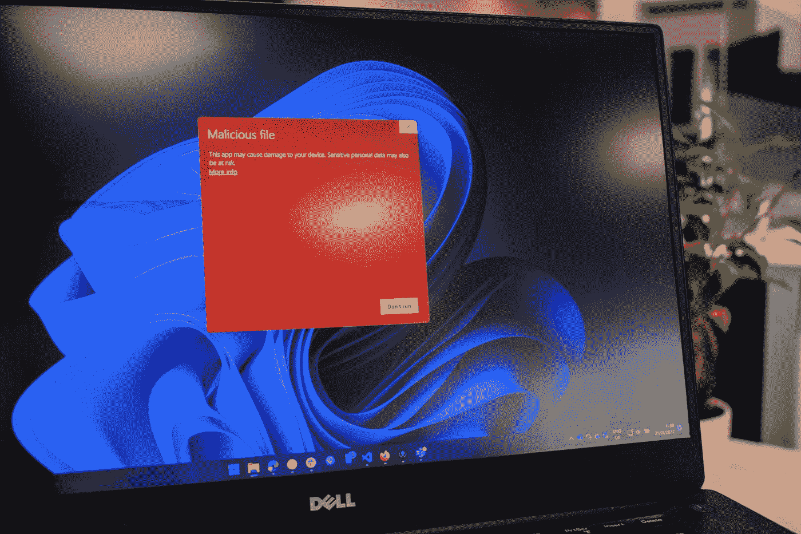

# LeetCode 928:最小化恶意软件传播 II

> 原文：<https://javascript.plainenglish.io/leetcode-928-minimize-malware-spread-ii-15eb03b55f8a?source=collection_archive---------5----------------------->

Photo by [Ed Hardie](https://unsplash.com/@impelling?utm_source=medium&utm_medium=referral) on [Unsplash](https://unsplash.com?utm_source=medium&utm_medium=referral)

给我和大家的算法问题笔记

与此同时，我试图用不同的故事模板。让我知道你的想法！感谢阅读！

*更多内容请看*[***plain English . io***](https://plainenglish.io/)*。报名参加我们的* [***免费周报***](http://newsletter.plainenglish.io/) *。关注我们关于*[***Twitter***](https://twitter.com/inPlainEngHQ)*和*[***LinkedIn***](https://www.linkedin.com/company/inplainenglish/)*。查看我们的* [***社区不和谐***](https://discord.gg/GtDtUAvyhW) *加入我们的* [***人才集体***](https://inplainenglish.pallet.com/talent/welcome) *。*