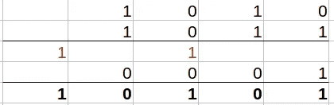

# LeetCode 算法挑战:添加二进制

> 原文：<https://javascript.plainenglish.io/leetcode-algorithm-challenge-add-binary-77daf22cee72?source=collection_archive---------10----------------------->


Photo by [Alexander Sinn](https://unsplash.com/@swimstaralex?utm_source=medium&utm_medium=referral) on [Unsplash](https://unsplash.com?utm_source=medium&utm_medium=referral)

[问题 ](https://leetcode.com/problems/add-binary/)

给定两个二进制字符串`a`和`b`，将它们的和作为二进制字符串返回*。*

**例 1:**

```
**Input:** a = "11", b = "1"
**Output:** "100"
```

**例 2:**

```
**Input:** a = "1010", b = "1011"
**Output:** "10101"
```

## 我们来分解一下

我的第一个想法是“哦，这应该很容易，因为我刚刚做了[加一个挑战](/leetcode-algorithm-challenge-plus-one-i-wish-it-could-be-that-simple-5b6172dc6317?sk=079d5974a6e2580093f790817339989c)，但是这里的主要区别是我们使用二进制数。

> [二进制数是以 2 为基数的数制或二进制数制表示的数，一种只用两个符号的数学表示方法:典型的是“0”(零)和“1”(一)。](https://en.wikipedia.org/wiki/Binary_number#:~:text=Binary%20number%20is%20a%20number,a%20bit%2C%20or%20binary%20digit.)

因此在这种情况下“1”+“1”=“10”。让我们记住这一点。



因为操作数组更容易，所以我把两个字符串都变成了数组，因为我们要添加值，所以我把它们的顺序颠倒了，因为我们要从末尾开始添加。

```
let result = a.split("").reverse();
let plus = b.split("").reverse();
let r = 0;
```

我还声明了变量 r，它将指示我们是否有结转 1，因为正如我前面提到的，1+1 将产生 0，1 将结转。

现在我们有两个数组，我们将使用一个 for 循环，但是因为我们有两个数组，并且可能有 r(结转)，所以看起来会很复杂。

```
for (let i = 0, j = 0; i <= result.length-1 || j<=plus.length-1 || r > 0; i++, j++) {
---
}
```

我已经声明了两个索引，每个数组一个，我们将继续循环，直到至少有一个条件为真:

1.  尚未到达结果数组的末尾；
2.  还没有到达加号数组的末尾；
3.  遗留物— r 存在或大于 1；

一旦进入循环。我们将把数组中的每一项加在一起，并添加结转。此外，由于我们有两个字符串元素的数组，数组的每个元素都将被解析为一个整数。最后，如果一个数字有更少的元素(即“10”+“111”=“1001”，数组将看起来像这样= ['0 '，' 1'] & plus = ['1 '，' 1']。所以结果[2] =未定义。因此||用于将我们公式中的任何未定义项更改为 0。

```
let sum = (parseInt(result[i])||0) + (parseInt(plus[j])||0) + r
```

一旦 sum 可用，我们需要检查我们是否有结转，这发生在 sum > 1 时，然后我们需要更新我们的 r 来保存结转。

```
if (sum>1) {
  result[i]=sum%2
  r = 1;
}
```

否则，我们将总和加到结果数组中，并重置 r。

```
else {
 result[i]=sum;
 r=0;
}
```

当我们从这个循环中出来时，我们应该有我们的结果数组，一旦我们反转并把它变回一个字符串，它就应该被返回。

```
return result.reverse().join("")
```

## 密码

请在以下社交网络上查看我，我很乐意收到您的来信！——[*LinkedIn*](https://www.linkedin.com/in/nick-solonyy/)*，* [*GitHub*](https://github.com/nicksolony) ， [*脸书*](https://www.facebook.com/nick.solony) *。*

*更多内容请看*[***plain English . io***](http://plainenglish.io)