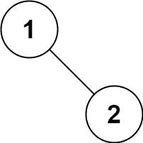

# LeetCode 算法挑战:二叉树有序遍历

> 原文：<https://javascript.plainenglish.io/leetcode-algorithm-challenge-binary-tree-inorder-traversal-82d1886fb738?source=collection_archive---------7----------------------->

# 问题

[给定二叉树的](https://leetcode.com/problems/binary-tree-inorder-traversal/) `[root](https://leetcode.com/problems/binary-tree-inorder-traversal/)` [，返回*对其节点值*的有序遍历。](https://leetcode.com/problems/binary-tree-inorder-traversal/)

**例 1:**


```
**Input:** root = [1,null,2,3]
**Output:** [1,3,2]
```

**例 2:**

```
**Input:** root = []
**Output:** []
```

**例 3:**

```
**Input:** root = [1]
**Output:** [1]
```

**例 4:**


```
**Input:** root = [1,2]
**Output:** [2,1]
```

**例 5:**



```
**Input:** root = [1,null,2]
**Output:** [1,2]
```

我第一次遇到使用树的挑战，所以我有很多问题。

# 二叉树

什么是二叉树？它是一个[树形数据结构](https://en.wikipedia.org/wiki/Tree_(data_structure))，其中每个节点最多有两个[子节点](https://en.wikipedia.org/wiki/Child_node)，分别称为*左子节点*和*右子节点*。(来源:[https://en.wikipedia.org/wiki/Binary_tree](https://en.wikipedia.org/wiki/Binary_tree))


[https://en.wikipedia.org/wiki/Binary_tree#/media/File:Binary_tree.svg](https://en.wikipedia.org/wiki/Binary_tree#/media/File:Binary_tree.svg)

# 树遍历

**树遍历**指的是访问(检查和/或更新)一个[树数据结构](https://en.wikipedia.org/wiki/Tree_(data_structure))中的每个节点的过程，恰好一次。这种遍历按照访问节点的顺序进行分类。(来源:[https://en.wikipedia.org/wiki/Tree_traversal](https://en.wikipedia.org/wiki/Tree_traversal))

Inorder Traversal —从左到右访问树的每个节点。所以如果你看下图。


1.  访问的第一个元素将是 4，我们将从根 1 开始，但是将通过左 2 移动到左 4；
2.  然后我们将返回并访问 root 2；
3.  现在向右——5；
4.  回到根 1；
5.  再次向右 3。

因此，如果我们在一个数组中传递它，它将看起来像这样[4，2，5，1，3]

现在，我对这个任务有了一个更好的想法，让我们来编码。

# 密码

让我们声明一个数组列表来收集我们的数据。

```
let list = [];
```

现在我们将构建一个带有两个参数的递归函数检查树。我们将传递一个根和当前列表。

```
function checkTree(root, list) {~~~
}
```

如果我们的根是一个空节点，那么我们将返回列表中的所有数据。

```
if (root === null) { return list}
```

现在我们将开始深入我们的树，正如之前讨论的那样，我们将从左侧开始。我们将在左边的节点上使用递归函数。

```
list = checkTree(root.left, list);
```

现在，我们有了列表，我们得到了左边的值，我们将把根值添加到列表中，

```
list.push(root.val);
```

用我们的递归函数在正确的子节点上结束一切。

```
return checkTree(root.right, list);
```

以下是最终结果。

请在以下社交网络上查看我，我很乐意收到您的来信！——[*LinkedIn*](https://www.linkedin.com/in/nick-solonyy/)*，* [*GitHub*](https://github.com/nicksolony) ， [*脸书*](https://www.facebook.com/nick.solony) *。*