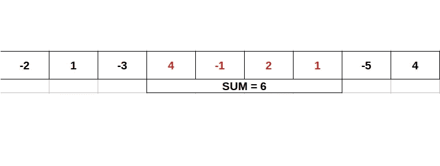

# LeetCode 算法挑战:最大子阵列—暴力对抗 Kadane 算法

> 原文：<https://javascript.plainenglish.io/leetcode-algorithm-challenge-maximum-subarray-brut-force-versus-kadanes-algorithm-333b1267fbc1?source=collection_archive---------5----------------------->



## 问题

给定一个整数数组“nums ”,找到具有最大和的连续子数组(至少包含一个数),并返回其和。

**例一:**

**输入:** nums = [-2，1，-3，4，-1，2，1，-5，4]

**输出:** 6

**解释:** [4，-1，2，1]的和最大= 6。

**例 2:**

**输入:** nums = [1]

**输出:** 1

**例 3:**

**输入:** nums = [5，4，-1，7，8]

**输出:** 23

## 我们在找什么？

在此任务中，该函数应该返回子数组值的最大和。子数组是连续数组中的一部分(即，占据连续的位置),并且本质上保持元素的顺序。所以它可以是整个数组的和，数组的一部分，甚至数组的单个元素(例如，[-1，0，-2，5]函数将只返回 5)。

## 选择

我们有两个选择来解决这个问题

1.  蛮力—计算每个可能子数组的总和并进行比较，然后返回最大值。
2.  Kadane 的算法——我们不是计算每个最大和，而是基于比较一个元素是否总是增加子数组的和，以及它的值是否高于包括先前元素的子数组的和来计算它。

## 蛮力 2 圈

对于这两种情况，我将使用两个变量:

1.  currSum —当前子数组的总和，它将被赋予数组的第一个元素的默认值。
2.  maxSum —最大总和，在开始之前，我们假设数组的第一个元素提供最大总和。

```
let currSum = nums[0]let maxSum = currSum;
```

使用蛮力，我们将需要通过数组循环两次，以计算所有数组的总和。这是第一个循环的开始。

```
for (let i = 0; i < nums.length; i++) {currSum = nums[i];
```

在这个解决方案中，我们将经常检查我们的最大和是否已经改变。因此，如果当前总和高于最大总和，则更新最大总和。

```
if (currSum > maxSum) {maxSum = currSum}
```

现在，我们进入第二个循环，以确保我们通过每个子数组。

```
for (let j = i + 1; j < nums.length; j++) {currSum = currSum + nums[j];
```

一旦我们到了那里，我们会检查越来越多，如果我们找到一个最大值。一旦我们完成了这个双循环 ***maxSum*** 将保存可以返回的答案。

## 野蛮的代码

## 卡丹算法

据我所知，这种方法是通过消去数字来减少子阵列的和，从而得到最大值。你可以在这里了解更多关于 Kadane 的算法[并且解决这个问题在](https://en.wikipedia.org/wiki/Maximum_subarray_problem#Kadane's_algorithm)[这个视频](https://www.youtube.com/watch?v=jnoVtCKECmQ)中有非常详细的解释。

正如我提到的，这两种方法的设置是一样的，但是这种方法会有一些循环，因此速度会更快。

因为在设置中我们假设当前总和等于最大总和，并且等于数组的第一个元素，所以我们可以从数组的第二个元素开始迭代。

```
for (let i = 1; i < nums.length; i++) {
```

棘手的部分来了，我们将比较当前元素加到当前 sum 值是否会小于当前值。如果当前值更大，我们将使用当前值重置当前总和，并删除数组中开始新的子数组的所有先前部分。否则，我们将只增加当前值的当前总和。

```
if (currSum + nums[i] < nums[i]) {currSum = nums[i]} else {currSum = currSum + nums[i];}
```

然后我们将返回到我们的最大值检查，这看起来和暴力选项 exit 中的一样，结束我们的循环并返回 **maxSum** 。

```
 if (currSum > maxSum) { maxSum = currSum }}return maxSum;
```

## 密码

蛮力解决方案通常更容易想出来，能够完成这些很好，但这些通常很耗时，我建议尝试找到更聪明和更快的方法。我想我们都知道，现在你可以在网上很多地方找到答案，youtube 上也有大量的视频讲解。

*请也在以下社交网络上关注我，我很乐意收到你的来信！——*[*LinkedIn*](https://www.linkedin.com/in/nick-solonyy/)*，* [*GitHub*](https://github.com/nicksolony) ， [*脸书*](https://www.facebook.com/nick.solony) *。*

*更多内容请看*[*plain English . io*](http://plainenglish.io/)