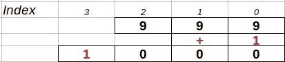

# LeetCode 算法挑战:加一——我希望它能这么简单

> 原文：<https://javascript.plainenglish.io/leetcode-algorithm-challenge-plus-one-i-wish-it-could-be-that-simple-5b6172dc6317?source=collection_archive---------27----------------------->


# 问题

给定一个代表非负整数的非空的十进制数字数组，将最后一个整数加 1。

存储数字时，最高有效数字位于列表的开头，数组中的每个元素都包含一个数字。

你可以假设整数不包含任何前导零，除了数字 0 本身。

**例一:**

```
**Input:** digits = [1,2,3]
**Output:** [1,2,4]
**Explanation:** The array represents the integer 123.
```

**例二:**

```
**Input:** digits = [4,3,2,1]
**Output:** [4,3,2,2]
**Explanation:** The array represents the integer 4321.
```

**例 3:**

```
**Input:** digits = [0]
**Output:** [1]
```

# 简单任务

所以一开始，这个任务看起来真的很简单。我们需要做的就是在数组的最后一个元素上加 1。没多想 a 写下了下面这段代码。

*   第 6 行—我会找到数组中最后一个元素的索引。
*   第 7 行—递增最后一个元素(执行加一操作)。
*   第 8 行—返回更新后的数组。

这不是很好吗？不会，因为数组中的每个元素只包含一个**个位数**。如果我遇到一个以 9，[ 2，5，9 ]结尾的数组，这将导致我的解是错误的。因为我当前的解会返回[ 2，5，10 ]。

因此，我必须找到一个不同的解决方案，将实际工作。

# 实际溶液

所以我开始思考一个过程并增加步骤:

1.  我将需要反转数组，因为如果它看起来像[ 9，9，9 ]，我可能需要遍历数组的所有元素，因为“加 1”将得到[ 1，0，0，0 ]。此外，我需要设置一个变量来维护我的索引。

```
let rev = digits.reverse();
let i = 0;
```

2.创建一个递归函数来检查数组元素并执行操作。我的函数需要两个参数——当前元素的数组和索引。

```
function add(arr, i) {
```

3.在 add 函数中，我们需要检查我们是否到达了数组的末尾，如果到达了，我们就在反转数组的末尾加 1。



```
if (i!==arr.length) { ----} else { arr.push(1)}
```

4.在上面的第一个 if 语句中，我们将检查当前元素+ 1 是否大于 9。如果它不止一个，我们将把当前元素更新为当前元素+1 的余数，一旦我们去掉 10。然后我们可以增加索引，并使用 add 函数检查下一个元素。

```
if (arr[i] + 1 > 9) { arr[i] = (arr[i] + 1) % 10; i++ add(arr, i)}
```

5.如果当前元素+ 1 小于 10，我们可以只更新当前元素。

```
else { arr[i] = arr[i] + 1}
```

6.现在我们的 add 函数已经完成，我们将调用它并返回我们的数组。别忘了我们需要把它倒回来。

```
add(rev, i)return rev.reverse();
```

# 密码

最简单的解决方案并不总是有效，一定要检查边缘案例，因为这些案例会告诉你是否在正确的道路上。

请在以下社交网络上查看我，我很乐意收到您的来信！——[*LinkedIn*](https://www.linkedin.com/in/nick-solonyy/)*，* [*GitHub*](https://github.com/nicksolony) ， [*脸书*](https://www.facebook.com/nick.solony) *。*

*更多内容请看*[*plain English . io*](http://plainenglish.io/)