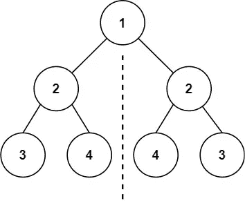
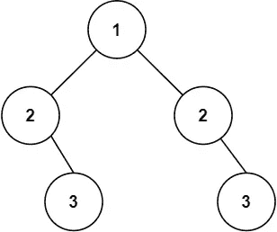
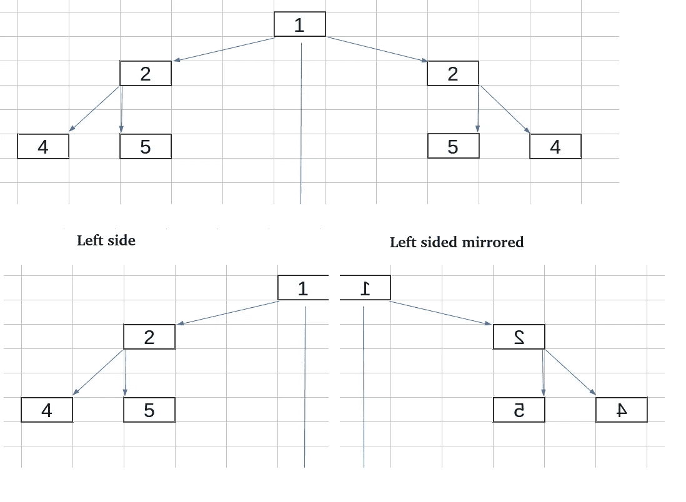

# LeetCode 算法挑战:对称树

> 原文：<https://javascript.plainenglish.io/leetcode-algorithm-challenge-symmetric-tree-b5b5183ed1d8?source=collection_archive---------5----------------------->

# 问题

给定一棵二叉树的`root`，*检查它是否是自身*的镜像(即围绕其中心对称)。

**例 1:**



```
**Input:** root = [1,2,2,3,4,4,3]
**Output:** true
```

**例 2:**



```
**Input:** root = [1,2,2,null,3,null,3]
**Output:** false
```

## 什么是对称树？

如果左右子树是彼此相同的镜像，则认为树是对称的。



正如你从上图中看到的，镜像并不等同于你原本认为的相等，因为在这种情况下是`root.val===root.val`而是`root.left===root.right`，反之亦然。这是我们编写代码时的主要支点。

## 方法

在这种情况下，我们将使用递归函数遍历树，检查每个子树。姑且称之为对称。

```
function symmetric(treeLeft, treeRight) {....}
```

首先，当一个或两个子树都为空时，检查边缘情况会很好。

```
if(treeLeft===null && treeRight===null) {return true};
```

如果两个子树相等，我们将返回 true。但如果只有一个等于 null，结果将为 false。

```
if(treeLeft===null || treeRight===null) {return false};
```

现在我们到了需要评估子树的步骤，子树由`tree.val`、`tree.left`和`tree.right`组成。所以我们将检查每一个条件并返回结果。

对于`.val`,我们将检查两个值是否相同，然后我们将需要使用`.left`和`.right`作为我们对称函数的参数，记住`treeLeft.right`将与`treeRight.left`进行比较，反之亦然。

```
return (treeLeft.val===treeRight.val) && symmetric(treeLeft.right,treeRight.left) && symmetric(treeLeft.left,treeRight.right)
```

一旦我们完成了递归函数，我们现在可以两次都使用参数根调用它，让函数完成它的工作。

```
return symmetric(root,root)
```

## 密码

*请在以下社交网络上查看我，我希望收到您的来信！——*[*LinkedIn*](https://www.linkedin.com/in/nick-solonyy/)*，* [*GitHub*](https://github.com/nicksolony) ， [*脸书*](https://www.facebook.com/nick.solony) *。*

*更多内容请看*[***plain English . io***](http://plainenglish.io/)