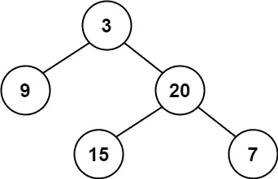
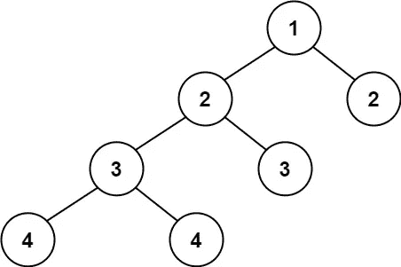

# LeetCode 算法挑战:平衡二叉树

> 原文：<https://javascript.plainenglish.io/leetcode-algorithm-challenges-balanced-binary-tree-3bb95007163c?source=collection_archive---------17----------------------->

# 问题

给定一棵二叉树，确定它是否是高度平衡的。

对于这个问题，高度平衡的二叉树被定义为:

> *每个*节点的*左右子树高度相差不超过 1 的二叉树。*

**例 1:**



```
**Input:** root = [3,9,20,null,null,15,7]
**Output:** true
```

**例 2:**



```
**Input:** root = [1,2,2,3,3,null,null,4,4]
**Output:** false
```

**例 3:**

```
**Input:** root = []
**Output:** true
```

# 平衡二叉树？

那么什么是平衡二叉树呢？[平衡二叉树是每个节点的左右子树高度相差不超过 1 的二叉树结构。人们也可以考虑二叉树，其中没有一片叶子比其他叶子离根更远](https://en.wikipedia.org/wiki/Binary_tree#Types_of_binary_trees)。

所以树是平衡的，如果:

1.  树是空的
2.  左右子树的高度差不超过 1。
3.  左右子树都是平衡的

# 解决办法

如上所述，我们会以某种方式需要计算左右子树的高度，我将使用在我以前的一篇文章中讨论过的最大深度函数。我就把这个函数重新命名为 height。

[](/leetcode-algorithm-challenges-minimum-maximum-depth-of-binary-tree-d075a271fbda) [## LeetCode 算法挑战:二叉树的最小和最大深度

### 今天我将回答两个问题，因为它们看起来和我很相似，尽管寻找的是相反的结果。但是……

javascript.plainenglish.io](/leetcode-algorithm-challenges-minimum-maximum-depth-of-binary-tree-d075a271fbda) 

```
function height(root) { return !root ? 0 : 1 + Math.max(height(root.left),
     height(root.right));};
```

现在，让我们开始检查上述条件:

树是空的，这意味着如果根不存在，返回 true。

```
if (!root) { return true;};
```

左右子树的高度差不超过 1。首先，我将获得两个子树的高度值。

```
lsub = height(root.left);rsub = height(root.right);
```

条件#2 和#3 将被合并到单个`if`语句中，但是我将从条件#2 开始。

```
if (Math.abs(lsub - rsub) <= 1 && ... && ...) { return true;};
```

上面我使用了`[Math.abs](https://developer.mozilla.org/en-US/docs/Web/JavaScript/Reference/Global_Objects/Math/abs)`函数，它返回一个数字的绝对值，以便我确定子树高度之间的差值，并且这个差值是一个正数，这样我就可以检查它是否小于或等于 1。

现在是时候检查左右子树是否平衡了。嗯，我们正在编写的`isBalanced`函数将在这里使用，如果你注意到我在上面的`if`语句中漏掉了`…`。我现在用`isBalanced(root.left)`和`isBalanced(root.right)`替换它们。

```
if (Math.abs(lsub - rsub) <= 1 && isBalanced(root.left) &&    
    isBalanced(root.right)) { return true;};
```

最后，如果没有一个条件被满足来确认我们的树是平衡的，我们将想要返回`false`。

```
return false;
```

# 密码

请在以下社交网络上查看我，我很乐意收到您的来信！——[*LinkedIn*](https://www.linkedin.com/in/nick-solonyy/)*，* [*GitHub*](https://github.com/nicksolony) ， [*脸书*](https://www.facebook.com/nick.solony) *。*

*更多内容请看*[***plain English . io***](http://plainenglish.io/)