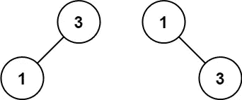

# LeetCode 算法挑战:将排序数组转换为二叉查找树

> 原文：<https://javascript.plainenglish.io/leetcode-algorithm-challenges-convert-sorted-array-to-binary-search-tree-a0f3e7b18fd4?source=collection_archive---------17----------------------->

# 问题

给定一个整数数组`nums`，其中的元素按**升序**排序，将*转换为一个高度平衡的***二叉查找树*。*

*高度平衡的二叉树是这样一种二叉树，其中每个节点的两个子树的深度相差不超过 1。*

*例 1:*

**

```
***Input:** nums = [-10,-3,0,5,9]
**Output:** [0,-3,9,-10,null,5]
**Explanation:** [0,-10,5,null,-3,null,9] is also accepted:*
```

**

***例 2:***

**

```
***Input:** nums = [1,3]
**Output:** [3,1]
**Explanation:** [1,3] and [3,1] are both a height-balanced BSTs.*
```

# *问题*

*在我的上一篇文章中，我解释了平衡二叉树的概念。*

*[](https://nicksolonyy.medium.com/leetcode-algorithm-challenges-balanced-binary-tree-3bb95007163c) [## LeetCode 算法挑战:平衡二叉树

### 问题

nicksolonyy.medium.com](https://nicksolonyy.medium.com/leetcode-algorithm-challenges-balanced-binary-tree-3bb95007163c) 

为了确保我们将一个数组转换成一个平衡的二叉树，每个创建的子树上的数组元素的数量之差不超过 1。这个想法导致了一个非常简单的解决方案，我们应该把数组分成两半。

基于以上内容，我们将创建一个递归函数，将子数组一分为二，并创建下一组树节点。* 

# *解决办法*

*让我们从一个空数组的例子开始，我们只需要返回`null`。*

```
*if (nums.length === 0) return null;*
```

*我们仍然需要返回`null`值，因为随着递归的深入，一些树节点将会变成`null`。*

*使用简单的数学计算，我们将确定我们的中间元素。*

```
*let middle = Math.floor(nums.length / 2);*
```

*现在，`middle`之前和之后的任何东西都是相同的大小(如果差 1 个元素我们没问题)，我们可以从`root`开始构建树。*

```
*let root = new TreeNode(nums[middle]);*
```

*中间元素之前的子数组将使用`sortedArrayToBST`创建左子树，并使用`.slice`函数获取新的子数组。*

*类似地，中间元素后的子数组将创建右边的子树。我们将在这里使用我们的递归函数，遍历整个数组并构建一个完整的树。*

```
*root.left = sortedArrayToBST(nums.slice(0, middle));root.right = sortedArrayToBST(nums.slice(middle + 1));*
```

# *密码*

*请在以下社交网络上查看我，我很乐意收到您的来信！——[*LinkedIn*](https://www.linkedin.com/in/nick-solonyy/)*，* [*GitHub*](https://github.com/nicksolony) ， [*脸书*](https://www.facebook.com/nick.solony) *。**