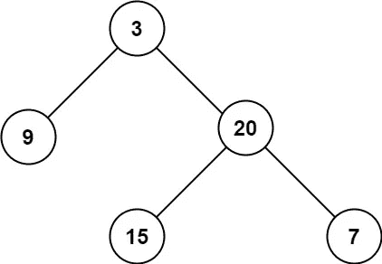
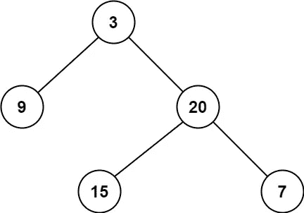

# LeetCode 算法挑战:二叉树的最小和最大深度

> 原文：<https://javascript.plainenglish.io/leetcode-algorithm-challenges-minimum-maximum-depth-of-binary-tree-d075a271fbda?source=collection_archive---------8----------------------->

今天我将回答两个问题，因为它们看起来和我很相似，尽管寻找的是相反的结果。但是解决方案会有一些共同点。

# 问题 1

给定二叉树的`root`，返回*其最大深度*。

二叉树的**最大深度**是从根节点到最远叶节点的最长路径上的节点数。

**例 1:**



```
**Input:** root = [3,9,20,null,null,15,7]
**Output:** 3
```

# 解决办法

我发现在二叉树中使用递归函数非常有用，可以覆盖所有分支。这个问题其实有一行解，但是我们来分解一下。

我们将在每个节点的左右分支上使用递归函数。但是首先，我们将检查根是否存在。因此，如果根不存在，我们将返回 0，因为分支不存在。

```
!root ? 0
```

然而，如果根存在，它给我们的深度为 1。现在我们将使用`Math.max()` Javascript 函数，它返回作为输入参数的零个或多个数字中的最大值，并使用带有`root.left`和`root.right`作为参数的`maxDepth`函数。它将比较每个节点的分支，最终将返回最长的分支深度，该深度将加 1，表示我们的根。

```
1 + Math.max(maxDepth(root.left),maxDepth(root.right))
```

# 密码

正如我前面提到的，最终代码将是一个简单的单行代码。

# 问题 2

给定一棵二叉树，求其最小深度。

最小深度是从根节点到最近的叶节点的最短路径上的节点数。

**注意:**叶子是没有子节点的节点。

**例 1:**



```
**Input:** root = [3,9,20,null,null,15,7]
**Output:** 2
```

**例 2:**

```
**Input:** root = [2,null,3,null,4,null,5,null,6]
**Output:** 5
```

# 问题

乍一看，这很简单，使用问题 1 中的代码，我们可以假设我们的解决方案如下所示。

```
var minDepth = function(root) { return !root ? 0 : 1 +     
       Math.min(maxDepth(root.left),maxDepth(root.right));};
```

对，我们用`Math.min`代替`Math.max`，就这样。不，这是错的，因为从上面的例子 2 中你可以看到。这是因为最小深度是从根节点到最近的叶节点的最短路径上的节点数。请注意，路径必须在叶节点上结束。在示例 2 中，只有右边的分支，左边没有叶子，这就是为什么正确答案是 5，而不是上面函数返回的 0。

# 解决办法

因此，在选择需要计数的分支之前，我们需要检查树叶是否存在。我仍然会开始检查根是否存在，如果不存在就返回 0。

```
var minDepth = function(root) { if(root === null) { return 0 }....};
```

所以我们可以安全使用`Math.min`的唯一情况是当两片叶子都存在的时候。我们将使用`if`函数来检查这一点。

```
if (root.left && root.right) { return 1 + Math.min(minDepth(root.left),minDepth(root.right))}
```

否则，我们将检查唯一的`root.left`是否存在，并应用类似的逻辑，但不使用`Math.min`，因为我们已经知道`root.right`是`null`。

```
else if (root.left) { return 1 + minDepth(root.left)}
```

最后，如果`root.left`不存在，那么我们将使用`root.right`作为`minDepth`递归函数的参数。

```
else { return 1 + minDepth(root.right)}
```

这将涵盖所有场景，并提供最终结果。

# 密码

我决定把这两个问题放在一起，因为我发现你如何解决一个问题，但看着一个不同的问题，这很有趣。

*请在以下社交网络上查看我，我希望收到您的来信！——*[*LinkedIn*](https://www.linkedin.com/in/nick-solonyy/)*，* [*GitHub*](https://github.com/nicksolony) ， [*脸书*](https://www.facebook.com/nick.solony) *。*

*更多内容请看*[***plain English . io***](http://plainenglish.io)