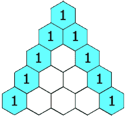

# LeetCode 算法挑战:帕斯卡三角形

> 原文：<https://javascript.plainenglish.io/leetcode-algorithm-challenges-pascals-triangle-92f76488489b?source=collection_archive---------15----------------------->

# 问题

给定一个整数`numRows`，返回**帕斯卡三角形**的前几行。

在**帕斯卡三角形**中，每个数字都是它正上方的两个数字之和，如下所示:



**例 1:**

```
**Input:** numRows = 5
**Output:** [[1],[1,1],[1,2,1],[1,3,3,1],[1,4,6,4,1]]
```

**例 2:**

```
**Input:** numRows = 1
**Output:** [[1]]
```

# 帕斯卡三角形是什么？

尽管 leetcode 提供了帕斯卡三角形的简要解释

> 在**帕斯卡三角形**中，每个数字都是它正上方的两个数字之和

我仍然更喜欢用谷歌搜索新术语，作为顶级来源之一，我得到了维基百科的帮助。它只是让我们对这个术语有了更深一层的理解:

> [帕斯卡三角形的行通常从顶部的第](https://en.wikipedia.org/wiki/Pascal%27s_triangle) `[n=0](https://en.wikipedia.org/wiki/Pascal%27s_triangle)` [行(第 0 行)开始计数。每一行中的条目从左边开始编号，从](https://en.wikipedia.org/wiki/Pascal%27s_triangle) `[k=0](https://en.wikipedia.org/wiki/Pascal%27s_triangle)` [开始，并且通常相对于相邻行中的编号交错排列。三角形可以用以下方式构建:在行 0(最上面的行)中，有唯一的非零条目 1。每个后续行的每个条目都是通过将左上的数字与右上的数字相加而构成的，空白条目被视为 0。例如，第一行(或任何其他行)中的初始数字是 1(0 和 1 的和)，而第三行中的数字 1 和 3 相加得到第四行中的数字 4。](https://en.wikipedia.org/wiki/Pascal%27s_triangle)

但是继续往下看，我发现了一个[公式](https://en.wikipedia.org/wiki/Pascal%27s_triangle#Formula)，它解释了行是如何生成的，以及对于任何非负整数 n 和任何整数 0≤ k≤n


这基本上说明了需要做什么，我只需要把这个公式转换成代码。

# 解决办法

我们将使用将 number 行作为参数的`generate`函数。让我们从声明一个值数组开始。因为我们将从一个空数组开始，因为那将是我们的结果`numRows`是 0。

```
let values = []
```

由于我们将处理一定数量的行，并且每一行都需要被填充，我们将需要迭代每一行以得到最终结果，因此我们将使用`for loop`首先遍历所有的行。当我们处理数组时，我们的第一行将有一个索引 0，因此`n`——我们的行号(行索引)应该低于行数。

```
for (let n = 0; n < numRows; n++) { ...}
```

每一行将代表它自己的数组，我们接下来声明它。

```
values[n] = [];
```

我们知道每一行的第一个和最后一个元素都是 1。行号也清楚地表明行有多少个元素(例如，行 1 — [1]，行 3 — [1，2，1])。

```
values[n][0] = 1;values[n][n] = 1;
```

即使我们有 1 行，最后一条语句也只是用相同的值覆盖第一条语句。

现在更棘手的部分，如果我们有 3 行或更多行，我们需要在这些 1 之间添加一个数字。我们将使用另一个`for loop`，因为我们在这里处理的是另一个数组。因此，使用 0≤ k≤n 作为我们的循环条件，并将上面的公式添加到循环中，我们得到以下结果。在我们的例子中，k 从 1 开始，因为当我们只有 2 行时，我们不需要中间值，我们已经声明了上面第二行的第一个和第二个数字。

```
for (let k= 1; k < n; k ++) { values[n][k ] = values[n-1][k -1]+values[n-1][k]}
```

一旦完成，我们只需要返回结果。

```
return values;
```

# 密码

*也请在以下社交网络上关注我，我希望收到您的来信！——*[*LinkedIn*](https://www.linkedin.com/in/nick-solonyy/)*，* [*GitHub*](https://github.com/nicksolony) ， [*脸书*](https://www.facebook.com/nick.solony) *。*

*更多内容请看*[*plain English . io*](http://plainenglish.io/)