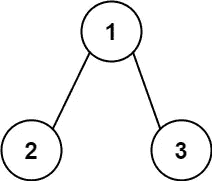

# LeetCode 算法挑战:路径和

> 原文：<https://javascript.plainenglish.io/leetcode-algorithm-challenges-path-sum-25cab495220c?source=collection_archive---------1----------------------->

# 问题

给定一棵二叉树的`root`和一个整数`targetSum`，如果该树有一条**根到叶的**路径，使得沿着该路径的所有值相加等于`targetSum`，则返回`true`。

一片**叶子**是一个没有孩子的节点。

**例 1:**


```
**Input:** root = [5,4,8,11,null,13,4,7,2,null,null,null,1], targetSum = 22
**Output:** true
```

**例 2:**



```
**Input:** root = [1,2,3], targetSum = 5
**Output:** false
```

**例 3:**

```
**Input:** root = [1,2], targetSum = 0
**Output:** false
```

在这个挑战中，逻辑非常简单:

1.  穿过树枝
2.  将分支的所有值相加
3.  一旦我们到达一个叶子，即没有任何子节点的节点，检查我们从#2 得到的和是否等于 targetSum
4.  如果是假的，继续检查

递归函数将被用来解决这个问题，因为我们并不真的想检查每个节点，一旦我们有一个匹配。

# 解决办法

我将调用我的递归函数 checkTree，它将接受以下参数`root, targetSum, sum`。

```
function checkTree(root, targetSum, sum) {....}
```

首先检查`root`是否存在是有意义的，所以我们可以先抛出一个简单的 if 语句。

```
if (!root) { return false;}
```

现在我们可以开始为当前分支填充`sum`。

```
sum += root.val;
```

现在，我们想通过检查`root`是否有孩子来知道我们是否到达了叶子(即分支的末端)。如果`root`是叶子，那么我们应该检查`sum`是否等于`targetSum`并返回`true`或`false`。

```
if (root.left === null && root.right === null) { return sum === targetSum;}
```

否则，让我们在子节点上进一步使用`checkTree`函数。

```
return checkTree(root.left, targetSum, sum) || checkTree(root.right, targetSum, sum)
```

请注意，我们正在使用`||`运算符，因为我们正在寻找`true`值。`checkTree`函数将返回真或假，并且`||`将选择`true`作为选项。

现在让我们执行刚刚编写的函数。

```
return checkTree(root, targetSum, 0);
```

# 密码

请在以下社交网络上查看我，我很乐意收到你的来信！——[*LinkedIn*](https://www.linkedin.com/in/nick-solonyy/)*，* [*GitHub*](https://github.com/nicksolony) ， [*脸书*](https://www.facebook.com/nick.solony) *。*

*更多内容看*[***plain English . io***](http://plainenglish.io/)