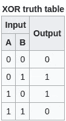

# LeetCode 算法挑战:单一数字

> 原文：<https://javascript.plainenglish.io/leetcode-algorithm-challenges-single-number-302e14e08a66?source=collection_archive---------2----------------------->

**问题:** *给定一个* ***非空*** *整数数组* `*nums*` *，每个元素除一个外都出现两次。找到那个单身的。*

您必须实现一个具有线性运行时复杂性的解决方案，并且只使用恒定的额外空间。

**例 1:**

```
**Input:** nums = [2,2,1]
**Output:** 1
```

**例 2:**

```
**Input:** nums = [4,1,2,1,2]
**Output:** 4
```

**例 3:**

```
**Input:** nums = [1]
**Output:** 1
```

# 线性运行时间复杂度

理解一个任务很重要，所以我们需要理解什么是线性运行时复杂度。

我们先来看看时间复杂度的定义。

> 在[计算机科学](https://en.wikipedia.org/wiki/Computer_science)中，**时间复杂度**是[计算复杂度](https://en.wikipedia.org/wiki/Computational_complexity)，它描述了运行一个[算法](https://en.wikipedia.org/wiki/Algorithm)所需的计算机时间量。时间复杂度通常通过计算算法执行的基本操作的数量来估计，假设每个基本操作花费固定的时间来执行。因此，所花费的时间量和算法执行的基本运算的数量最多相差一个[常数因子](https://en.wikipedia.org/wiki/Constant_factor)。[https://en.wikipedia.org/wiki/Time_complexity](https://en.wikipedia.org/wiki/Time_complexity)

从短期来看，这是运行一个函数所需要的时间。因此，线性可能意味着以线性方式遍历数据的每个元素。先说[维基百科的定义](https://en.wikipedia.org/wiki/Time_complexity#Linear_time)。

> 如果一个算法的时间复杂度为 *O* ( *n* )，则称该算法花费**线性时间**，或 *O* ( *n* )时间。通俗地说，这意味着运行时间最多随着输入的大小线性增加。更准确地说，这意味着存在一个常数 *c* ，使得对于大小为 *n* 的每个输入，运行时间最多为 *cn* 。例如，如果添加时间是常数，或者至少是由常数限定的，那么将列表的所有元素相加的过程需要与列表长度成比例的时间。在算法必须顺序读取其整个输入的情况下，线性时间是可能的最佳时间复杂度。

`For loop`将是，其中检查数组的每个元素将是线性查询的一个例子。

# 解决办法

正如我上面提到的，我们将使用 for 循环来解决这个问题，因为我们需要找到一个不重复的数组元素。但是首先，让我们通过检查我们的数组是否只有一个元素来简化我们的生活。

```
if (nums.length===1) { return nums[0]}
```

我们将需要创建`result`变量。

```
let result = 0;
```

我将使用`forEach`循环，因为我们知道我们需要检查数组的每个元素。

```
nums.forEach(element => { result = result ^ element});
```

解决这一挑战的循环部分是`result = result ^ element`，因此我们将更深入地研究它。`^`代表异或。

> [按位 XOR 运算符(^)在每个位位置返回 1，其中任一操作数(但不是两个操作数)的对应位为 1。](https://developer.mozilla.org/en-US/docs/Web/JavaScript/Reference/Operators/Bitwise_XOR)



[https://en.wikipedia.org/wiki/Exclusive_or#Truth_table](https://en.wikipedia.org/wiki/Exclusive_or#Truth_table)

XOR 对其整数参数的每一位执行布尔异或运算，并通过查看上面的 XOR 真值表:其中一个或另一个为真，但不是两个都为真。因此，如果数组中除了一个值之外的所有值都是唯一的，最终，每个重复的值将在按位运算期间相互抵消，我们将得到一个唯一的非重复值。

现在我们可以直接返回`result`。

```
return result;
```

# 密码

请在以下社交网络上查看我，我很乐意收到您的来信！——[*LinkedIn*](https://www.linkedin.com/in/nick-solonyy/)*，* [*GitHub*](https://github.com/nicksolony) ， [*脸书*](https://www.facebook.com/nick.solony) *。*

*更多内容看*[***plain English . io***](http://plainenglish.io)