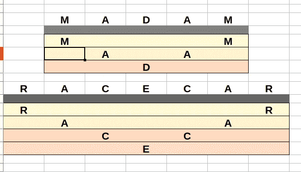

# LeetCode 算法挑战:有效回文

> 原文：<https://javascript.plainenglish.io/leetcode-algorithm-challenges-valid-palindrome-297810c301e5?source=collection_archive---------8----------------------->


Photo by [Markus Spiske](https://unsplash.com/@markusspiske?utm_source=medium&utm_medium=referral) on [Unsplash](https://unsplash.com?utm_source=medium&utm_medium=referral)

# 问题

给定一个字符串`s`，判断它是否是回文，只考虑字母数字字符，忽略大小写。

**例 1:**

```
**Input:** s = "A man, a plan, a canal: Panama"
**Output:** true
**Explanation:** "amanaplanacanalpanama" is a palindrome.
```

**例 2:**

```
**Input:** s = "race a car"
**Output:** false
**Explanation:** "raceacar" is not a palindrome.
```

# 什么是回文？

如果我不知道什么，我会用谷歌搜索，通常，维基百科会给出很好的答案。所以这里有一个快速的答案

> [“一个**回文**是一个单词、数字、短语或其他向前和向后读一样的字符序列，如*夫人*或*赛车*。”](https://en.wikipedia.org/wiki/Palindrome)

基于这个解决方案听起来很简单，我们只需要确保我们检查字符串两端的每个元素都匹配。



# 解决办法

我需要两个变量:

1.  我的最终结果是，当我遍历一个字符串时，我需要确保我可以更新我的返回结果，因此我将声明`result`为`true`。
2.  因为我们检查的是字符串两端的值，我们只需要到字符串的中间，因此我需要得到中间元素的索引。

```
let m = parseInt(s.length / 2);let result = true;
```

我以为就这么简单，但是当我开始浏览例子时，其中一些给了我一个错误(例如，“aA”会给我`false`)。这显然表明我的任务是区分大小写的，所以我决定再回顾一下这个问题。我相对较快地发现了自己的错误`“considering only alphanumeric characters and ignoring cases”`。因此，我需要确保当我开始对 string 进行任何操作时，它只有字母数字字符，并且忽略大小写。我发现 [regex](https://en.wikipedia.org/wiki/Regular_expression) 通过使用`replace`方法和`toLowerCase`方法使字符串大小写相同，帮助我删除了任何标点和空格。

```
let regex = /[!"#$%&'()*+,-./:;<=>?@[\]^_`{|}~"" ]/g;let cleanString = s.replace(regex, '').toLowerCase();
```

由于字符串的长度，我们将会处理，由于删除空格和其他字符而改变，我们将更新字符串中间的`m`。

```
let m = parseInt(cleanString.length / 2);
```

现在，我们将构建一个循环，该循环将迭代 string 的每个元素，直到它到达字符串的中间。

```
for (let i = 0; i <= m; i++) { ....}
```

现在是时候检查我们对应的元素是否匹配了，如果不匹配，我们需要将结果更新到循环中的`false`和`break`，因为没有其他要检查的了。

```
if (cleanString[i] != cleanString[cleanString.length - 1 - i]) { result = false; break;}
```

因此，如果循环中断，我们将返回最终结果`false`，但是如果循环结束，并且没有中断地遍历每一对元素，我们将返回`true`。

```
return result;
```

# 密码

*请也在以下社交网络上关注我，我很乐意收到你的来信！——*[*LinkedIn*](https://www.linkedin.com/in/nick-solonyy/)*，* [*GitHub*](https://github.com/nicksolony) ， [*脸书*](https://www.facebook.com/nick.solony) *。*

*更多内容请看*[***plain English . io***](http://plainenglish.io/)