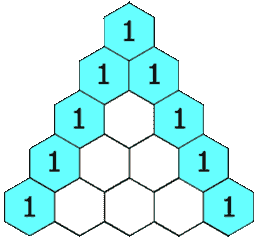

# LeetCode 算法系列:帕斯卡三角

> 原文：<https://javascript.plainenglish.io/leetcode-algorithm-series-pascals-triangle-253856454598?source=collection_archive---------7----------------------->


Photo by [Pankaj Patel](https://unsplash.com/@pankajpatel?utm_source=unsplash&utm_medium=referral&utm_content=creditCopyText) on [Unsplash](https://unsplash.com/s/photos/javascript?utm_source=unsplash&utm_medium=referral&utm_content=creditCopyText)

哈罗。今天的问题来自 Leetcode 的《顶级采访问题——其他人很容易》T2 一章。

在**帕斯卡三角**:

> 给定一个整数`numRows`，返回**帕斯卡三角形**的前几个数值。
> 
> 在**帕斯卡三角**中，每个数字都是其正上方的两个数字之和，如下图所示:



示例:

```
**Input:** numRows = 5
**Output:** [[1],[1,1],[1,2,1],[1,3,3,1],[1,4,6,4,1]]**Input:** numRows = 1
**Output:** [[1]]
```

从这些示例中可以看出，我将返回一个数组数组。每个数组代表三角形中的一行，每个后续数组在前一个数组的基础上生成。我意识到我需要在 **for-loop** 内部有一个 **for-loop** ，因为我需要根据需要创建的行的数量来迭代一组次数，并且我需要再次迭代代表一行的数组，以便生成下一行。

下面是每一行的计算方法。因为第一个数字和最后一个数字始终是 1，所以我使用零来确保在转到下一行时加到 1 的数字。

```
row1: 0 1 0 => 0 + 1, 1 + 0
row2: 0 1 1 0 => 0 + 1, 1 + 1, 1 + 0
row3: 0 1 2 1 0 => 0 + 1, 1 + 2, 2 + 1, 1 + 0
row4: 0 1 3 3 1 0 => 0 + 1, 1 + 3, 3 + 3, 3 + 1, 1 + 0
row5: 0 1 4 6 4 1 0
```

一旦我有了这个模式下来，它只是一个简单的过程，写如何条件逻辑取决于什么元素的数组我是在。首先，我需要建立一个结果数组。由于存在 numRows 总是大于或等于 1 的约束，因此我可以自动将结果数组中的[[1]]作为第一行。知道还需要添加多少行后，这就开始了我的第一个 **for-loop** ，numRows -1 是我的限制，因为我的计数器从 0 开始计数。在第一个循环中，我建立了另一个名为**行**的数组，这将是所创建的新行，然后将该行推入我的最终结果数组。创建新行将使用第二个 **for-loop** 通过访问结果数组当前行中的数字来完成。这也是为什么我需要我的第一个 **for-loop** 计数器从 0 开始，因为数组是零索引的。

为了创建一个新行，我基本上检查了，如果我所在的元素之前的元素是未定义的，那么这就是数组的起始元素，我会向其中添加 0，并将总和推入到我的新行中。同样，如果计数器与当前行的最后一个索引匹配，这意味着我在数组中的最后一个元素上，我将向其中添加 0，并将总和推入新行。对于中间的任何元素，我只需将它与以下元素值相加，然后将总和推入新数组。

我必须添加的唯一额外的条件逻辑是，如果数组的当前行中只有 1 个元素，其中前一个和后一个元素都没有定义，那么我会将它的值+ 0 推两次。回想起来，在进入 for 循环之前，我可能设置了两个不同的条件语句，如果 numRows = 1，则返回[[1]]，如果 numRows = 2，则返回[[1]，[1，1]]。这将允许我消除对条件逻辑语句的需求。

下面是我完成的代码:

```
var generate = function(numRows) {
  let result = [[1]] for (let i = 0; i < numRows-1; i++) {
    row = [];

    for(let j = 0; j < result[i].length; j++) {
      if (result[i][j-1] === undefined && result[i][j+1] === undefined) {
          row.push(0 + result[i][j])
          row.push(result[i][j] + 0)
      } else if (result[i][j-1] === undefined) {
          row.push(0 + result[i][j])
          row.push(result[i][j] + result[i][j+1])
      } else if (j === result[i].length - 1) {
          row.push(0 + result[i][j])
      } else {
          row.push(result[i][j] + result[i][j+1])
      }
    }

    result.push(row)
  }

  return result
};
```

这样做的时间复杂度是 O(n ),因为我有一个 for 循环在另一个 for 循环中运行。在 LeetCode 上运行这个，运行时间是 **72ms** ，比提交的 **70.73%** 要好。

如果你有一个不同的方法来解决这个问题，或者你是如何解决这个算法的，我很乐意听到我的代码如何改进。如果你正在与它斗争，我希望这有助于澄清它！

请关注未来更多的 LeetCode 解决方案！

LeetCode 系列:

> 1.[包含重复的](/leetcodes-series-contains-duplicate-644f3f8a3291)
> 2。[合并排序后的数组](https://kdshah6593.medium.com/leetcode-algorithm-series-merge-sorted-array-3ec101aa3cca)
> 3。[高度检查器](https://kdshah6593.medium.com/leetcode-algorithm-series-height-checker-2cb703879529)
> 4。[有效回文](https://kdshah6593.medium.com/leetcode-algorithm-series-valid-palindrome-3cd94c4b00cc)
> 5。[快乐数字](https://kdshah6593.medium.com/leetcode-algorithm-series-happy-number-1bdea90dde7)
> 6。[最长常用前缀](https://kdshah6593.medium.com/leetcode-algorithm-series-longest-common-prefix-fc40ba439ed7)7
> 。[爬楼梯](https://kdshah6593.medium.com/leetcode-algorithm-series-climbing-stairs-c308255dcb9e)
> 8。[有效括号](https://kdshah6593.medium.com/leetcode-algorithm-series-valid-parentheses-3a379f9dceb7)
> 9。[帕斯卡三角形](https://kdshah6593.medium.com/leetcode-algorithm-series-pascals-triangle-253856454598)
> 10。[最大子阵列](https://kdshah6593.medium.com/leetcode-algorithm-series-maximum-subarray-776252f61ea0)

*更多内容请看*[***plain English . io***](http://plainenglish.io)