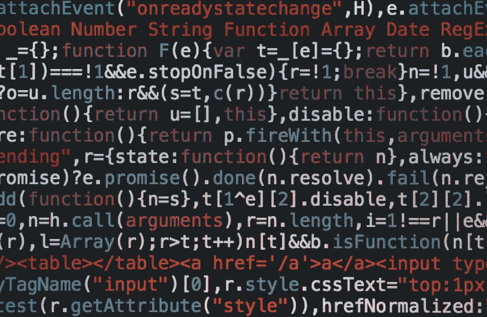

# LeetCode 算法系列:有效回文

> 原文：<https://javascript.plainenglish.io/leetcode-algorithm-series-valid-palindrome-3cd94c4b00cc?source=collection_archive---------7----------------------->



Photo by [Markus Spiske](https://unsplash.com/@markusspiske?utm_source=unsplash&utm_medium=referral&utm_content=creditCopyText) on [Unsplash](https://unsplash.com/s/photos/code?utm_source=unsplash&utm_medium=referral&utm_content=creditCopyText)

你好！我还有另一个算法问题要解决。这个问题来自 Leetcode 的*顶级面试问题简易集*。

所以在**有效回文:**

> 给定一个字符串`s`，判断它是否是回文，只考虑字母数字字符，忽略大小写。

示例:

```
**Input:** s = "A man, a plan, a canal: Panama"
**Output:** true
**Explanation:** "amanaplanacanalpanama" is a palindrome.**Input:** s = "race a car"
**Output:** false
**Explanation:** "raceacar" is not a palindrome.
```

看一下例子，我们只想要字符串中的字母数字字符，并且它应该是向前和向后的同一个字符串。因此，我肯定需要一种方法来删除任何不是字母数字字符的字符。

将它分解成几个步骤:

1.  创建一个新字符串，去掉所有非字母数字字符
2.  然后我需要一个方法来比较字符串和字符串的倒数是否相同。

我决定只获取字母数字字符的方法是使用正则表达式(RegEx)。如果你不熟悉 RegEx，我肯定会去查一下，它非常有帮助。以下是我的代码:

```
let str = s.match(/[A-Za-z0-9]/g)
if (str === null) {return true}
str = str.join("").toLowerCase()
```

**match()** 方法接受一个正则表达式，并对字符串进行迭代。它返回与 RegEx 表达式匹配的任何元素的数组。在上面的表达式中，我寻找字符串中的任何大写字母、小写字母或数字。如果 **match()** 没有找到匹配，那么它返回 null，所以我检查这个。否则，这将返回字符串中的所有字母，不包括空格或标点符号，然后我使用 **join()** 方法将数组转换回字符串。

现在我有了一个只有字母数字字符的字符串，我需要检查我的字符串前后是否相同。我想在不使用像 **reverse()** 这样的内置方法的情况下做到这一点。所以我决定循环遍历我的字符串，检查第一个字母和最后一个字母是否相同。然后我从字符串的头部和尾部移动一个，检查它们是否相同。这样做的一个很大的好处是我只需要遍历字符串的一半，因为我一次检查两个地方。

```
for (let i = 0; i < str.length / 2; i++) {
        if (str.charAt(i) !== str.charAt(str.length - 1 - i)) {
            return false
        }
    }
return true
```

如你所见，如果我检查两个不相等的字母，我会自动返回 false。否则，如果我在循环中没有返回 false，那么当我退出时，我将为整个函数返回 true。

我的完整代码:

```
var isPalindrome = function(s) {
    let str = s.match(/[A-Za-z0-9]/g)
    if (str === null) {return true}
    str = str.join("").toLowerCase()

    for (let i = 0; i < str.length; i++) {
        if (str.charAt(i) !== str.charAt(str.length - 1 - i)) {
            return false
        }
    }
    return true
};
```

这是处理字符串和使用 JavaScript 循环字符串的能力以及处理正则表达式的良好实践。我认为这样做的时间复杂度是 O(n + n/2 ),因为 match()函数必须遍历字符串，然后我运行另一个 **for 循环**,然后遍历字符串的一半。在 LeetCode 上运行，运行时间为**100 毫秒**，仅好于提交的 **42.15%** 。

我很想知道我的代码如何改进，或者你是如何解决这个算法的。

请关注未来更多的 LeetCode 解决方案！

LeetCode 系列:

> 1.[包含重复的](/leetcodes-series-contains-duplicate-644f3f8a3291)
> 2。[合并排序后的数组](https://kdshah6593.medium.com/leetcode-algorithm-series-merge-sorted-array-3ec101aa3cca)3
> 。[高度检查器](https://kdshah6593.medium.com/leetcode-algorithm-series-height-checker-2cb703879529)
> 4。[有效回文](https://kdshah6593.medium.com/leetcode-algorithm-series-valid-palindrome-3cd94c4b00cc)
> 5。[快乐数字](https://kdshah6593.medium.com/leetcode-algorithm-series-happy-number-1bdea90dde7)
> 6。[最长常用前缀](https://kdshah6593.medium.com/leetcode-algorithm-series-longest-common-prefix-fc40ba439ed7)
> 7。[爬楼梯](https://kdshah6593.medium.com/leetcode-algorithm-series-climbing-stairs-c308255dcb9e)
> 8。[有效括号](https://kdshah6593.medium.com/leetcode-algorithm-series-valid-parentheses-3a379f9dceb7)
> 9。[帕斯卡三角形](https://kdshah6593.medium.com/leetcode-algorithm-series-pascals-triangle-253856454598)
> 10。[最大子阵列](https://kdshah6593.medium.com/leetcode-algorithm-series-maximum-subarray-776252f61ea0)

*更多内容请看*[***plain English . io***](http://plainenglish.io)