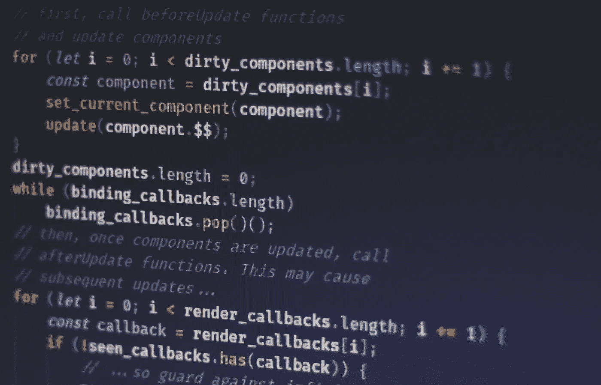

# LeetCode 算法系列:有效括号

> 原文：<https://javascript.plainenglish.io/leetcode-algorithm-series-valid-parentheses-3a379f9dceb7?source=collection_archive---------18----------------------->



Photo by [Ferenc Almasi](https://unsplash.com/@flowforfrank?utm_source=unsplash&utm_medium=referral&utm_content=creditCopyText) on [Unsplash](https://unsplash.com/s/photos/code?utm_source=unsplash&utm_medium=referral&utm_content=creditCopyText)

你好！让我们深入另一个算法问题。今天的问题来自 Leetcode 的顶级面试问题——轻松在*其他*章节下。

在**有效括号**中:

> 给定一个仅包含字符`'('`、`')'`、`'{'`、`'['`和`']'`的字符串`s`，确定输入的字符串是否有效。
> 
> 在以下情况下，输入字符串有效:
> 
> 左括号必须用相同类型的括号括起来。
> 
> 左括号必须以正确的顺序结束。

示例:

```
**Input:** s = "()"
**Output:** true**Input:** s = "()[]{}"
**Output:** true**Input:** s = "(]"
**Output:** false**Input:** s = "([)]"
**Output:** false**Input:** s = "{[]}"
**Output:** true
```

重要的是遵循两个验证:一个开括号必须由相同类型的括号括起来，并且它们必须以正确的顺序括起来。所以我需要遍历输入字符串，识别括号的类型，是左括号还是右括号，以及它是否正确匹配到它的对应部分。

我知道我需要循环输入字符串，所以我继续设置我的初始循环。

```
for (let i = 0; i < s.length; i++) {
// do something here with s[i]
}
```

现在，我希望能够比较我所在的当前字符串字符，以确定正确的括号。此外，因为括号在打开和关闭时需要是相同的括号，所以我需要设置那个连接。我可以用一个数据结构解决这两个问题。有什么猜测吗？

…

如果你说的是 Object(或者 Hash 或者 Dictionary，取决于语言)你就对了！我设置了一个名为 map 的对象，其中左括号是键，值是右括号。

```
const map = {
        '(': ')',
        '{': '}',
        '[': ']'
}
```

现在，当我遍历输入字符串时，如果我遇到一个左括号，那么我想继续遍历输入字符串。如果我遇到一个右括号，那么我想检查是否以正确的顺序与左括号**匹配。为此，我使用 push()和 pop()方法建立了一个数组，以正确的顺序存储所有的左括号。然后，当我遍历输入字符串时，每当我遇到一个左括号，我就可以把它添加到数组中。当我遇到一个右括号(也不是左括号)时，我可以把最后一个左括号添加到数组中，并检查它们是否匹配。如果是，我们继续循环输入字符串。如果它们不匹配，那么我有无效的括号，我可以返回 false。**

```
for (let i= 0; i < s.length; i++) {
    if (s[i] in map) {
        k.push(s[i])
    } else {
        let opening = k.pop()
        if (map[opening] !== s[i]) {
            return false
        }
    }
}
```

如你所见，我在字符串中循环。首先，使用操作符中的**来检查我是否有一个开括号。如果我这么做了，我就把左括号放入数组。如果不是，那么我有一个右括号。该右括号必须与我添加到数组中的最后一个左括号匹配，才能被认为是正确的顺序。我使用 pop()方法获取最后添加的左括号。知道了左括号，我就可以在我的对象中访问与它相关的值，以便与输入字符串中我当前所在的右括号进行比较。如果它们不匹配，那么我返回 false。如果它们匹配，那么我继续遍历字符串。**

我添加的一些最后润色是:

1.  有效的括号总是意味着输入字符串需要偶数个字符。如果字符串长度是奇数，这意味着我将有一个额外的无效的左括号或右括号。所以不用遍历整个数组得出结论，我可以做这个简单的检查，而不用运行整个方法，这样可以节省很多时间。
2.  如果我遍历整个字符串而不返回 false，那么我必须有一个有效的字符串，对吗？你几乎是正确的。想象输入字符串是**“{ {((“**)。由于长度是偶数，该方法将继续并循环遍历字符串。该循环永远不会返回 false，因为它们都是看起来要关闭的左括号。这仍然是无效字符串。所以最后，我不是在完成循环的**后才返回 true，而是通过三元运算符使用条件逻辑来检查我的数组是否为空。如果数组是空的，那就意味着我正确地匹配了每个括号。如果我在数组中有剩余的东西，那么我没有，所以我需要返回 false。**

记住这一点，查看完整的代码:

```
var isValid = function(s) {
    if (s.length % 2 !== 0){return false}

    let k = []

    const map = {
        '(': ')',
        '{': '}',
        '[': ']'
    }

    for (let i= 0; i < s.length; i++) {
        if (s[i] in map) {
            k.push(s[i])
        } else {
            let opening = k.pop()
            if (map[opening] !== s[i]) {
                return false
            }
        }
    }

    return k.length !== 0 ? false : true
};
```

这样做的时间复杂度是 O(n ),因为我知道我的 for 循环将根据输入(n)的值运行。在 LeetCode 上运行这个，运行时间是 **83ms** ，只比提交的 **29.44%** 好。但是，看看其他一些 50 毫秒-70 毫秒(前 90%)的解决方案，我的代码几乎是相同的。此外，我确信有一种递归的方法可以完成这个解决方案，从而提高性能。

如果你有一个不同的方法来解决这个问题，或者你是如何解决这个算法的，我很乐意听到我的代码如何改进。如果你正在与它斗争，我希望这有助于澄清它！

请关注未来更多的 LeetCode 解决方案！

LeetCode 系列:

> 1.[包含重复的](/leetcodes-series-contains-duplicate-644f3f8a3291)
> 2。[合并排序后的数组](https://kdshah6593.medium.com/leetcode-algorithm-series-merge-sorted-array-3ec101aa3cca)3
> 。[高度检查器](https://kdshah6593.medium.com/leetcode-algorithm-series-height-checker-2cb703879529)
> 4。[有效回文](https://kdshah6593.medium.com/leetcode-algorithm-series-valid-palindrome-3cd94c4b00cc)
> 5。[快乐数字](https://kdshah6593.medium.com/leetcode-algorithm-series-happy-number-1bdea90dde7)
> 6。[最长常用前缀](https://kdshah6593.medium.com/leetcode-algorithm-series-longest-common-prefix-fc40ba439ed7)
> 7。[爬楼梯](https://kdshah6593.medium.com/leetcode-algorithm-series-climbing-stairs-c308255dcb9e)
> 8。[有效括号](https://kdshah6593.medium.com/leetcode-algorithm-series-valid-parentheses-3a379f9dceb7)
> 9。[帕斯卡三角形](https://kdshah6593.medium.com/leetcode-algorithm-series-pascals-triangle-253856454598)
> 10。[最大子阵列](https://kdshah6593.medium.com/leetcode-algorithm-series-maximum-subarray-776252f61ea0)

*更多内容请看*[***plain English . io***](http://plainenglish.io)