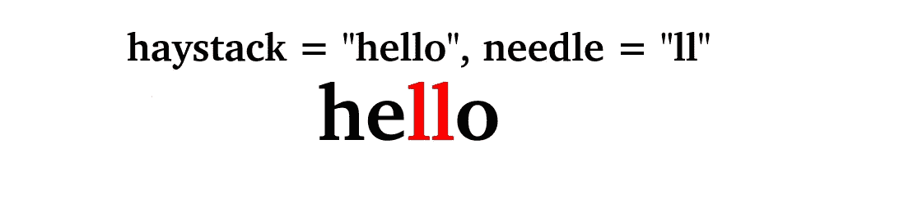
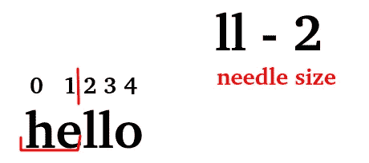

# LeetCode 算法挑战:大海捞针

> 原文：<https://javascript.plainenglish.io/leetcode-needle-in-a-haystack-challenge-38a2f67bdeee?source=collection_archive---------2----------------------->



Find the needle

# 问题

*实现* [*strStr()*](http://www.cplusplus.com/reference/cstring/strstr/) *。*

*返回针在草堆中第一次出现的索引，如果针不是草堆的一部分，则返回-1。*

## **澄清**

*当针为空字符串时，我们应该返回什么？这是在面试中问的一个很好的问题。*

*对于这个问题，当针为空字符串时，我们将返回 0。这与 C 的*[*strstr()*](http://www.cplusplus.com/reference/cstring/strstr/)*和 Java 的*[*index of()*](https://docs.oracle.com/javase/7/docs/api/java/lang/String.html#indexOf(java.lang.String))*是一致的。*

## **例 1:**

**输入:** haystack = "hello "，needle = "ll "

**输出:** 2

## **例 2:**

**输入:** haystack = "aaaaa "，needle = "bba "

**输出:** -1

# 挑战

1.  检查指针是否存在—当指针为空字符串时，返回 0。
2.  将干草堆分解成可比较的部分
3.  找针——为了找到一根针，我们将把干草堆的一部分与一根针进行比较
4.  返回针的起始位置。

# 让我们编码

**检查针是否存在——当针为空字符串时返回 0。这是一个非常简单的 if 语句。**

```
if (needle === "") { return 0;}
```

但是，如果针存在，我们将进一步进行。

## **把干草堆分解成可比较的部分**

要将干草堆分解成可比较的部分，我们需要确定针的长度，然后我们可以使用 [slice()方法](https://developer.mozilla.org/en-US/docs/Web/JavaScript/Reference/Global_Objects/String/slice)来分离干草堆的一部分。

我们将为起始位置创建一个变量，从这个位置开始，我们将切割干草堆，直到到达一个等于起始位置加上针的长度的位置。



First slice

```
let pos = 0;haystack.slice(pos,pos+needle.length)
```

## **找针——为了找到一根针，我们将把干草堆的一部分与一根针进行比较**

现在我们有了可比较的部分，我们将从头开始，从头开始。如果可比部分等于针，我们将为结果变量分配起始位置，否则，我们将移动到下一个切片。但是如果我们到达了干草堆的尽头呢？我们将检查我们的位置是否小于或等于干草堆大小减 1。

```
if (pos<=haystack.length-1)
```

如果我们还在堆栈中，我们将使用递归函数 find。

```
function find(haystack, needle, pos) { if (haystack.slice(pos,pos+needle.length)===needle) { result = pos; } else { pos++; if (pos<=haystack.length-1) { find(haystack, needle, pos) } }}
```

## **返回注射针的起始位置。**

我已经声明了一个变量结果，它将在函数结束时返回，除非我们找到指针，否则它将返回-1。

*也请在以下社交网络上关注我，我很想听到你的消息！—*[*LinkedIn*](https://www.linkedin.com/in/nick-solonyy/)*[*git hub*](https://github.com/nicksolony)，以及 [*脸书*](https://www.facebook.com/nick.solony) *。**