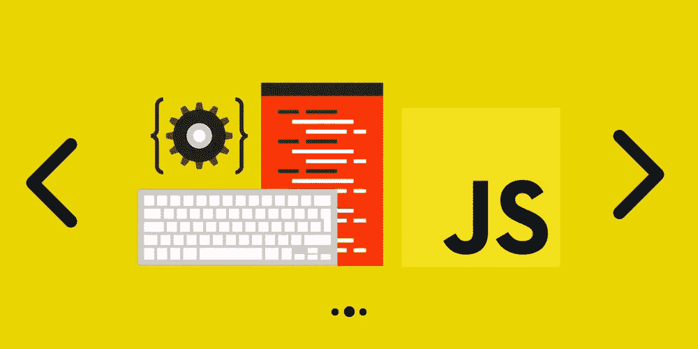
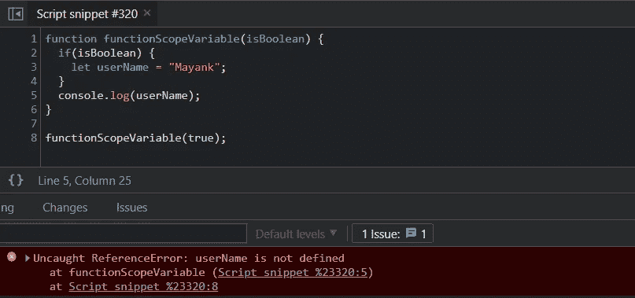
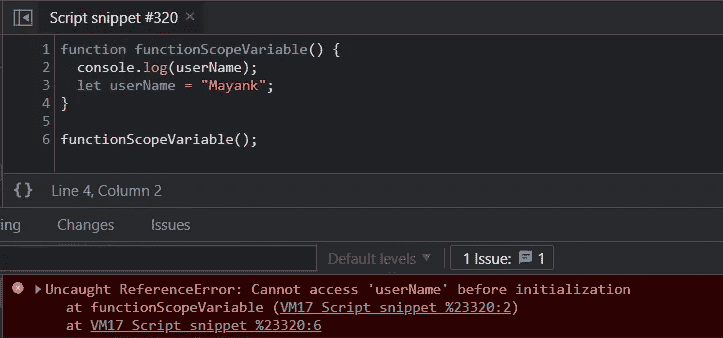
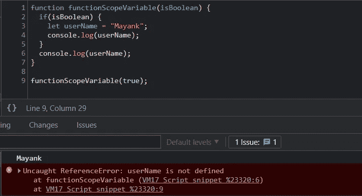
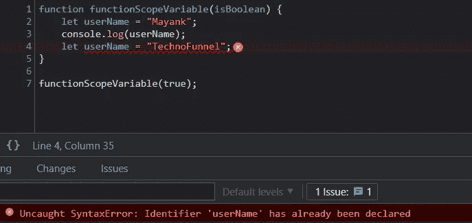
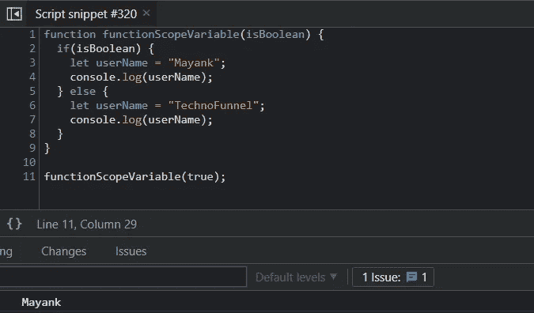

# 初学者用 JavaScript 中的 let 关键字

> 原文：<https://javascript.plainenglish.io/let-keyword-in-javascript-for-beginners-93ee6aa343fe?source=collection_archive---------13----------------------->

## 了解“让”这个关键词在面试的 JavaScript 中是如何工作的。

Let keyword in JavaScript

[技术漏斗](https://www.youtube.com/channel/UCo-h1M-5M6Y5D4Lgut8ge4w)展示了另一篇文章，这次是关于 JavaScript 中的“let”关键字。**在 ES6 中引入了****“let”这个关键词，在 JavaScript 访谈**中常见相关问题。我们将讨论 JavaScript 中 **let 关键字的要求和用法。**

# “让”关键字是什么？

*   ***让*** 让用户在 JavaScript 中**声明变量**
*   ***让*** 关键字声明**块范围变量**
*   ***让*** 帮我们**减少记忆足迹**
*   ***让*** 关键词是**不吊**
*   用 ***定义的变量让*** 关键字**不能重新声明**

# 功能范围与块范围

为了理解“let”关键字的影响，我们首先需要理解**函数作用域和块作用域变量**，然后再继续讨论“let”和“var”之间的区别。

## 函数作用域变量

函数作用域变量的作用域是它所属的最近的函数。变量的生命周期和作用域将绑定到最近的函数。让我借助一个简单的例子来解释一下:

[https://gist.github.com/Mayankgupta688/cfb3bf5e3225779c24aa3f1fc0721194](https://gist.github.com/Mayankgupta688/cfb3bf5e3225779c24aa3f1fc0721194)

在上面的代码中，即使变量是在“if”块中声明的，这个变量的范围也是绑定到声明它的函数的。这意味着，即使在“if”块被执行之后，变量“username”仍然可以在“if”块之外被访问，因为该变量是函数范围的。我们可以使用“var”关键字声明函数范围的变量

## 块作用域变量

块作用域变量是只能在定义它们的块中访问的变量。我们可以把一个块想象成“for”、“do-while”、“while”、“if”、“switch”等。如果一个变量被定义为块范围的，它将不能在块外被访问。

[https://gist.github.com/Mayankgupta688/b385efa8ecd7e99729c79321521e1bf9](https://gist.github.com/Mayankgupta688/b385efa8ecd7e99729c79321521e1bf9)

在上面给出的例子中，使用“let”关键字在块内定义变量名。因为我们使用“let”关键字，所以它是一个块范围的变量，不能在该块范围之外访问。任何试图在外部访问它的行为都将导致错误。

Block Scoped Variable in JavaScript

# “让”关键字未被悬挂

提升的概念定义了变量的作用域，并使变量可用于最近的函数作用域。将变量所属的最近的函数设置为变量的作用域。所以变量可以在函数中使用。下面声明的函数使用“let”关键字创建一个变量。如果变量被提升，它应该在函数范围内可用，我们应该能够在第 2 行访问该变量。

[https://gist.github.com/Mayankgupta688/45c273c28f6cbf85a8cd386e41a83415](https://gist.github.com/Mayankgupta688/45c273c28f6cbf85a8cd386e41a83415)

在上面的代码中，用“let”关键字声明的变量不会被提升，并且在函数范围内不可用。我们只能在声明后使用 let 定义的变量，因为它只能在第 3 行后使用。

在上面的代码中，我们可以看到，在第 3 行用“let”声明变量之前，任何访问该变量的尝试都会导致错误。

No Hoisting for variable declared with “let”

该错误指出在初始化之前不能访问该变量。该变量在第 3 行初始化，因此只有在第 3 行执行后才能使用。

# **减少内存占用**

使用“let”关键字声明的变量的作用域在定义它们的块内。一旦块完成执行，使用“let”关键字声明的变量将可供垃圾收集器销毁。我们只在需要变量的地方限制变量的范围，并在块执行后立即处理它们，因此提供了更好的内存管理。

[https://gist.github.com/Mayankgupta688/b385efa8ecd7e99729c79321521e1bf9](https://gist.github.com/Mayankgupta688/b385efa8ecd7e99729c79321521e1bf9)

在上面的代码中，变量“userName”将在第 5 行之后对垃圾收集器可用，因为该变量是在“if”块中声明的。所以变量“userName”的存在范围仅限于“if”块。

[https://gist.github.com/Mayankgupta688/7617280887e8e31d93933fdc3062485b](https://gist.github.com/Mayankgupta688/7617280887e8e31d93933fdc3062485b)

在“if”块完成后，任何访问变量的尝试都将导致错误。

Reduce Memory Footprint with let keyword

# ***【让】*** 关键字不能重申报

同名变量不能在一个块中声明两次。在一个块中多次声明一个变量会导致错误。

[https://gist.github.com/Mayankgupta688/8beb594505456d55d227d6063238b3b7](https://gist.github.com/Mayankgupta688/8beb594505456d55d227d6063238b3b7)

上面的代码会因为“重新声明”而抛出一个错误。

let keyword cannot be redeclared.

**注意:同名变量可以在同一个函数的另一个块中重新声明。**

[https://gist.github.com/Mayankgupta688/ddfbb04b6f4834125a3ca204df0b8542](https://gist.github.com/Mayankgupta688/ddfbb04b6f4834125a3ca204df0b8542)

上述程序的输出如下图所示。这两个变量都是在不同的代码块中使用“let”关键字声明的。由于这些变量的范围仅限于声明它们的“if/else”块，因此代码不会给用户任何错误。

# var 和 let 之间的差异

“let”和“var”之间的区别可以总结如下:

*   let 是块范围的，而 var 是函数范围的变量
*   let 关键字不能在同一个块中重新声明，而 var 可以
*   let 可以减少内存占用并有效地管理内存
*   let 变量不能被提升，而 var 可以被提升

*更多内容看*[***plain English . io***](http://plainenglish.io/)