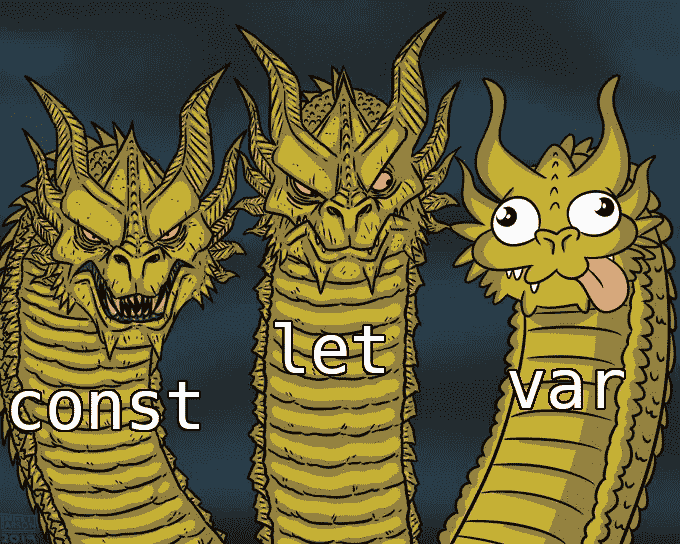
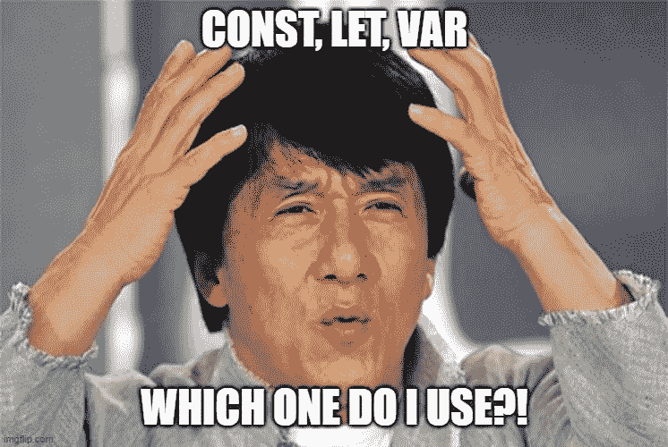

# let' vs 'var ':实际区别是什么？

> 原文：<https://javascript.plainenglish.io/let-vs-var-what-is-the-actual-difference-5acdb1f1c83?source=collection_archive---------8----------------------->

这里有一篇关于 JavaScript 中的`let`和`var`的区别的快速阅读，可能会派上用场。了解这些有助于决定在您的实现中使用什么。



## **范围**

`var`和`let`的作用域不同。`var`的作用域是直接封闭函数，而`let`的作用域是直接封闭块。

**例如:**

```
function run() {
  var first = "First";
  let second = "Second";
  console.log(first, second); // First Second
  {
    var third = "Third"
    let fourth = "Fourth";
    console.log(third, fourth); // Third Fourth
  }
  console.log(third); // Third
  console.log(fourth); // ReferenceError
}

run();
```

## **创建全局属性**

全局`var`变量作为属性添加到全局对象中。全局对象是 web 浏览器上的`window`和 Node.js 上的`global`:

```
var counter = 0;
console.log(window.counter); *//  0*
```

然而，`let`变量没有被添加到全局对象中:

```
let counter = 0;
console.log(window.counter); *// undefined*
```

## **重新申报**

`var`关键字允许你重新声明一个变量，没有任何问题:

```
var counter = 10;
var counter = "abcd";
console.log(counter); *// abcd*
```

然而，如果你用关键字`let`重新声明一个变量，你会得到一个错误:

```
let counter = 10;
let counter; *// error*
```

## **太阳穴死区**

`let`变量有时间死区，而`var`变量没有。为了理解时间死区，让我们检查一下`var`和`let`变量的生命周期，它们有两个步骤:创建和执行。

**var 变量**

*   在创建阶段，JavaScript 引擎为`var`变量分配存储空间，并立即将其初始化为`undefined`。
*   在执行阶段，JavaScript 引擎给`var`变量分配赋值所指定的值(如果有的话)。否则，`var`变量仍未定义。

**let 变量**

*   在创建阶段，JavaScript 引擎为`let`变量分配存储空间，但不初始化变量。引用未初始化的变量会导致`ReferenceError`。
*   `let`变量与`var`变量具有相同的执行阶段。

临时死区从程序块开始，直到`let`变量声明被处理。换句话说，在定义`let`变量之前，您不能在这个位置访问它们。【[链接](https://www.javascripttutorial.net/es6/difference-between-var-and-let/)

## **吊装**

用 var 声明的变量如下所示。在这个例子中，声明将使用一个未定义的值，但是初始化将不会在以后完成。

```
function checkVarScope() {
  console.log(varScope); // undefined
  var varScope = "Var Scope";
  console.log(varScope); // Var Scope
}

checkVarScope();
```

而用 let 定义的变量不提升。`let`变量在定义求值之前不会被初始化。在初始化之前访问它们会导致`ReferenceError`。

```
function checkLetScope() {
  console.log(letVar); // "Uncaught ReferenceError: Cannot access 'letVar' before initialization"
  let letVar = "Let Variable";
  console.log(letVar); // Let Variable
}

checkLetScope();
```



希望这能给你一些关于如何决定在哪个场景中使用什么的好主意。

## **好读**

[https://www . JavaScript tutorial . net/es6/difference-between-var-and-let/](https://www.javascripttutorial.net/es6/difference-between-var-and-let/)

*更多内容看* [***说白了。报名参加我们的***](http://plainenglish.io/) **[***免费每周简讯点击这里***](http://newsletter.plainenglish.io/) ***。*****