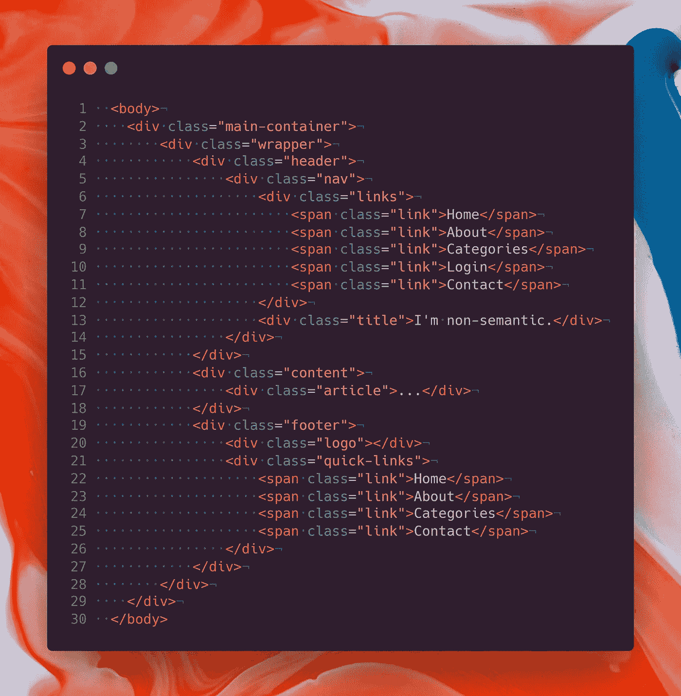
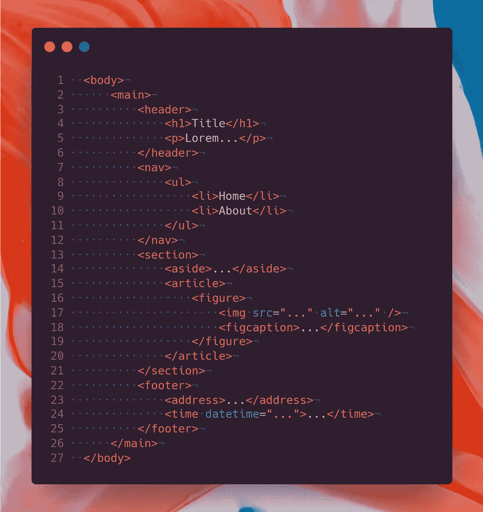

# 使用语义元素让您的 HTML 有意义

> 原文：<https://javascript.plainenglish.io/let-your-html-make-sense-using-semantic-elements-34c9aa97a2fa?source=collection_archive---------21----------------------->

## 停止错误地使用超文本标记语言。超文本标记语言的发明不是为了创造一些酷的视觉效果，而是为了传递关于内容的信息。

Photo by [Cris DiNoto](https://unsplash.com/@crisdinoto?utm_source=medium&utm_medium=referral) on [Unsplash](https://unsplash.com?utm_source=medium&utm_medium=referral)

> HTML 不是出现在屏幕上的东西，而是完全失明的浏览器所看到的东西。

今天，网络发展正处于黄金时代。所建的遗址不仅信息丰富，而且富有艺术性。十年前，没有人能梦想到现在我们可以用浏览器做的事情。然而，尽管如此，我们还是在 HTML 的重要性上妥协了。

# DIV 是一种无限的力量

这里有一个有趣的事实:除了准系统，你只需要使用`div`和`span`元素就可以建立一个功能齐全的网站。这是完全可能的，因为使用 CSS，你可以把空白的部分和跨度变成任何视觉上有吸引力的元素。默认情况下`div`和`span`没有语义和样式。它们只是装着你放进去的东西的盒子。我认为这就是为什么特别是 T4 在最近的网站上被大量使用的原因。与语义 HTML 元素不同，它没有任何意义。所以，你不必考虑它在其他地方的位置或顺序。他们都是平等的，看起来就像你想要的那样。看看这个例子。

A non-semantic markup.

当您看到上面的 HTML 片段时，您是否一眼就看出了内容或布局？我知道你没有，因为你看到的只是一堆带有类的嵌套的`div`标签。

为了理解标记，您查看了类并试图可视化它们。浏览器就是这种情况。由于标记中没有语义，浏览器无法理解网站并对其进行索引。这导致了糟糕的搜索引擎优化，并给残疾用户和使用虚拟屏幕阅读器访问网站的用户带来一些麻烦。因此，网站的可访问性急剧下降。

非语义标记引起的另一个问题是开发困难。因为我们都是人，我们不能像计算机那样阅读书面标记。让我们假设我们想在现有部分的正下方添加另一部分。我们必须找到现有的部分，然后找到块的末端，开始添加新的部分。如果标记是非语义的，并且看起来像上面图片中的东西，这将是非常困难的，因为每个元素都只是一个`div`并且看起来几乎相同。在这种情况下，如果节有很多行，要找到现有节的结束标记是非常困难的。因为我们必须遵循缩进而不出错。

# 用你写超文本标记语言的方式交流

然而，幸运的是，你有大量的选项可以选择，而不是写一长串的`div`元素。有`output`来显示结果，或者有`time`在标记中插入日期。

或者你可以用`blockquote`来引用任何人。看看这个列表[看看所有你可以在创建你的标记时使用的标签。你可以确保对于`span`和`div`肯定有一个语义上的替代，它工作得非常好，并且贡献了标记的上下文。看看下面的标记:](https://www.w3schools.com/tags/default.asp)

A semantic and more meaningful markup.

乍一看，你看到有一个页眉、页脚和一个节，并设想了布局，不是吗？。这完全归功于语义 HTML 标签，因为它们实际上给了读者一个关于其内容的提示，并从其他标签中脱颖而出。你不会期望在`time`标签中看到引用。

因此，语义元素更容易阅读，也更令人愉悦。此外，由于有一些标签暗示了内容和布局，浏览器将更容易识别和索引站点。这将导致一个伟大的搜索引擎优化和更多的意见。此外，该网站将通过屏幕阅读器访问，以便残疾人可以访问该网站。

使用语义 HTML 的另一个好处是，因为标签是不一样的，如果我们寻找某个标签，我们可以很容易地找到它。我是否要在现有部分下添加另一个部分？很简单。在现有的`section`标签之后再添加一个`section`标签。或者您想更改页脚显示的日期？就在`time`标签里。

这些例子可能看起来有点夸张，但它们肯定不是。现在尝试一下，你会发现它的易用性。除了查找标签，使用语义 HTML 使标记更加清晰，因为大多数时候，您不需要为每个标签编写类。因为它们不一样，你可以在 CSS 或 JavaScript 中指向它们，而不需要添加额外的类。结果，标记变得更加清晰易读。

因此，编写语义 HTML 极大地提高了标记的质量和可访问性。因为语义 HTML 元素，

*   提高搜索引擎优化，使您的网站在浏览器上排名更高。
*   允许残疾用户通过屏幕阅读器访问和使用网站。
*   让开发人员无需过多考虑就能理解内容和布局。
*   减少了`id`和`class`的使用，因此，标记看起来更流畅。
*   使在标记中查找内容变得容易，并让您以不太复杂的方式更新它。

这就对了。您对如何为您的项目编写和不编写标记有一个基本的概念。如果想进一步阅读，可以访问 [MDN Web Docs](https://developer.mozilla.org/en-US/docs/Glossary/Semantics) 。希望你觉得有用。

请继续关注更多的故事，如果你喜欢，一定要鼓掌。

*更多内容尽在*[***plain English . io***](http://plainenglish.io/)