# 让我们为我们的电子商务应用程序在 Vue.js 中添加一个购物车功能

> 原文：<https://javascript.plainenglish.io/lets-add-a-shopping-cart-feature-in-vue-js-for-our-ecommerce-app-ae0cc65374ff?source=collection_archive---------7----------------------->

在本教程中，我们将学习如何在我们的演示电子商务应用程序中显示、更新和删除购物车商品

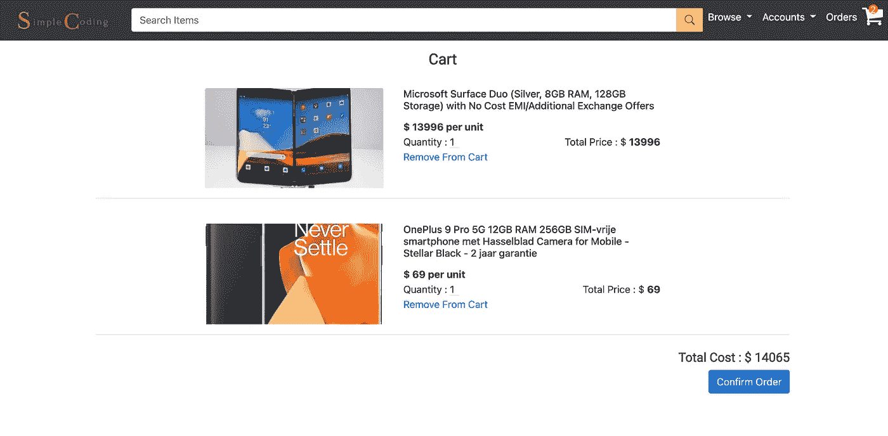

shopping cart

# 介绍

我们正在从头开始构建一个电子商务应用程序，前端使用 Vue.js，后端使用 Java 和 Springboot。你可以在这里查看这个系列的第一个前端教程

[](https://medium.com/javarevisited/a-complete-guide-on-how-to-develop-an-e-commerce-platform-f0bde77dac68) [## 如何开发电子商务平台的完整指南

### 我们将使用 Vue.js 和 Spring 框架从头开始构建一个电子商务平台

medium.com](https://medium.com/javarevisited/a-complete-guide-on-how-to-develop-an-e-commerce-platform-f0bde77dac68) 

我们正在构建一个购物车组件，用于显示和更新用户添加到购物车中的商品。

我们将使用 Vue.js 为购物车制作一个漂亮的 UI。

# 我们将实施的演示

[这里可以玩电商 app](http://remotedevs.org:8000/)

你可以在 [Github](https://github.com/webtutsplus/ecommerce-vuejs) 找到完整的代码。

# 后端

之前，我们已经使用 Java 和 Springboot 构建了购物车的后端。你可以在这里找到它

[](https://medium.com/javarevisited/lets-develop-shopping-cart-for-ecommerce-app-8e57a9ab4868) [## 让我们为电子商务应用程序开发购物车

### 每个电子商务网站都有购物车功能，今天我们将学习如何使用 Java 和

medium.com](https://medium.com/javarevisited/lets-develop-shopping-cart-for-ecommerce-app-8e57a9ab4868) 

# 先决条件

1.  关于 Vuejs 的知识
2.  [Visual Studio 代码](https://code.visualstudio.com/) **—** 开源(推荐)
3.  一个好的浏览器 **—** (Chrome —推荐)

# API 描述摘要

在开始编码前端部分之前，我们必须讨论一下我们将用于前端的 API。你可以在这里找到后端代码

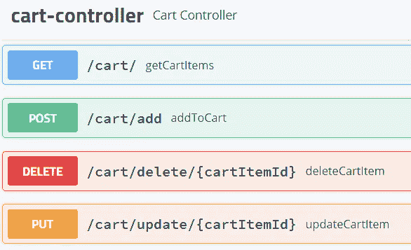

backend API

## 添加到购物车(发布) :

在这个方法中，我们必须发送产品的 id 和数量，以便给定的产品可以添加到相应的用户购物车中。因此，POST 请求的主体应该如下所示，

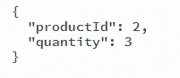

Post Body if product id is 3 and quantity is 2

## **获取所有购物车物品(GET) :**

现在，为了获取特定用户购物车中的所有商品，我们需要一个 get 请求。作为回报，我们将获得购物车中所有的`product`细节、`quantity`和商品的总价格。`cartItems`是购物车中所有`products`的数组，`totalCost`代表购物车中所有商品的总成本。

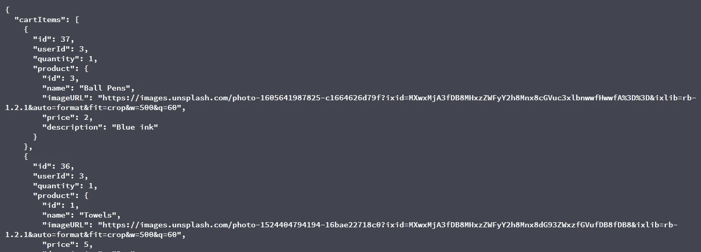

The response body in JSON format

## 更新项目(上传) :

为了更新购物车中的特定产品，我们需要`cart_item_id`、`quantity`和`user_token`。

## 从购物车中删除商品(删除) :

要从购物车中删除特定的产品，我们需要`cart_item_id`。我们可以通过 id 删除该项目。

# 本教程的流程

> *1。添加到购物车*
> 
> *2。显示购物车商品*
> 
> *3。更新购物车中的商品*
> 
> *4。删除购物车中的商品*

# 文件夹结构

继续在我们的 Vue 项目的 views 文件夹中创建一个名为 Cart 的文件夹，然后在 Cart 文件夹中创建一个 vue.js 文件`Cart`。

文件夹结构应该如下所示

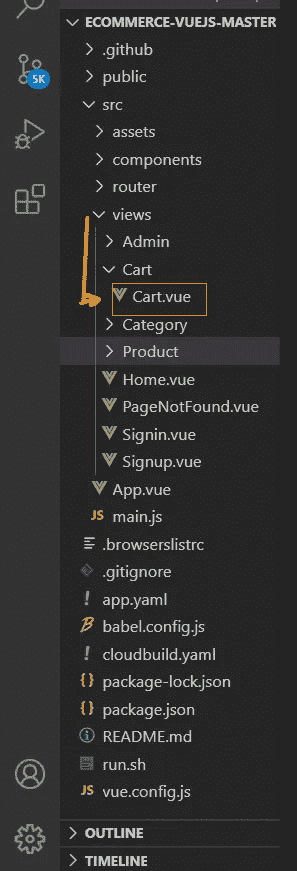

Folder Structure

在这个(`Cart.vue`)组件中，我们将显示用户添加到购物车中的商品。

在这里，用户还可以更新购物车中的商品数量或删除购物车中的商品。此外，我们将在页面底部显示购物车价格，每次用户修改购物车时，价格都会更新。

用户还可以单击某个特定项目来查看其详细信息。

# 现在让我们开始编码

我们将创建一个`Cart.vue`文件，它像任何 Vue.js 文件一样有三个组成部分

1.<template></template>

2.一个

3.一个

在脚本标签中，我们需要导出 Cart 组件，通过导入它可以在一些组件中呈现该组件。

# 1.加入购物车

我们将使用我们在上面的 **API** 描述中看到的 **API** :/cart/add。

我们有一个`showdetails`组件，显示用户希望查看或添加到购物车的产品的详细信息。

因此，在这个组件中，我们有一个按钮 addToCart，它调用我们后端 API 的 post 方法(AddtoCart ),该方法将有一个产品 id 和该产品数量的 post 主体。

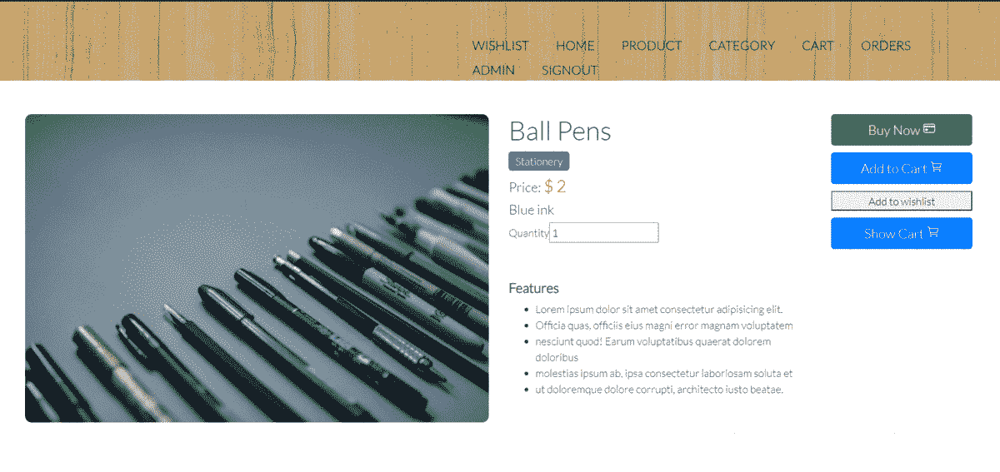

adding a product to the cart

# **2。显示购物车商品**

我们将使用我们在上面的 **API** 描述中看到的**API:**[/cart/](http://localhost:8080/api/swagger-ui.html#/operations/cart-controller/getCartItemsUsingGET)getcartitem。

为此，我们需要将数据变量与 HTML 属性绑定在一起

*   **carts** :用于存储将从 API 调用中获取的响应数据。
*   **令牌**:检查用户是否登录的用户令牌。
*   **len** :存储购物车中物品的长度
*   **总成本**:存储购物车中商品的总成本，
*   **cartItem** :一个对象数组，其中每个对象包含以下数据字段:

1.  **imgUrl** :产品的形象
2.  **pName** :产品名称，
3.  **p 描述**:产品描述，
4.  **PP price**:产品价格，
5.  **pQuantity** :产品数量，
6.  **id** :物品 id，
7.  **用户标识**:用户的标识

从应用程序。vue 文件我们将属性传递给路由器视图组件，在这种情况下，Cart 组件接收属性，因此我们存储从属性接收的 baseURL。

现在，只要用户被导航到/cart，即 cart 组件被装载/呈现，我们就从本地存储设置令牌值。

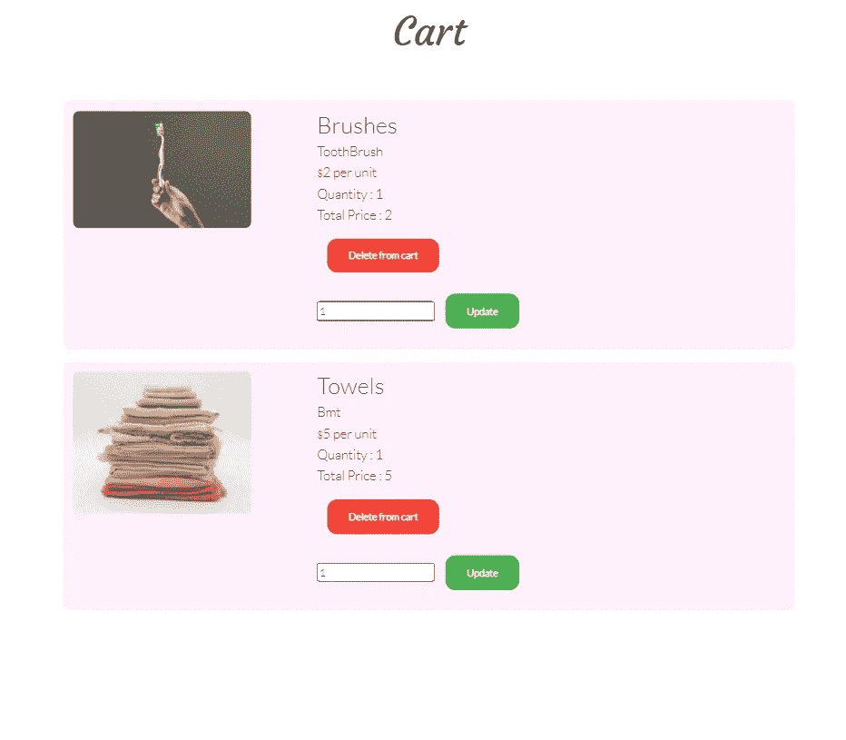

displaying the cart items

***listCartItems()函数*** :将用于获取并显示购物车中的物品。

因为我们想要获取项目，所以将使用 Axios 的 get 方法，并将用户的令牌作为参数传递给它。因此，我们的**后端 API** ，用提供的令牌找到用户，然后根据用户 ID 返回他/她的购物车中的一组商品，状态代码为`success`。但是，如果所提供的令牌无效，即用户没有登录，那么它将返回一个声明令牌无效的响应。

如果我们发出的 **API** 调用的响应状态是`success`，那么我们将把响应数据存储在我们之前创建的**购物车**数据变量中。响应包含一个名为 cartItems 的数组，该数组包含 cartId、productId、userId 和一个包含产品详细信息的 product 数组。然后“`carts`”数组的长度将给出购物车中的商品数量，我们将把这些商品存储在变量“`len`”中。

现在，我们使用 for 循环遍历购物车商品，并将每个商品的详细信息存储在“cartItem”数组中。

# **显示产品的详细信息**

每当用户单击购物车中的一个项目时，用户将被导航到 showDetails 组件，该组件将显示该项目的详细信息。

***showDetails()函数*** :将接收一个参数，即产品的 id，该参数将在路由器实例($router)的 push 方法中作为参数传递，然后用户将被导航到 showDetails 组件，该组件将根据接收到的 id 显示产品的详细信息。因此，当我们单击图片或项目名称时，它会显示该项目的详细信息，如下所示:

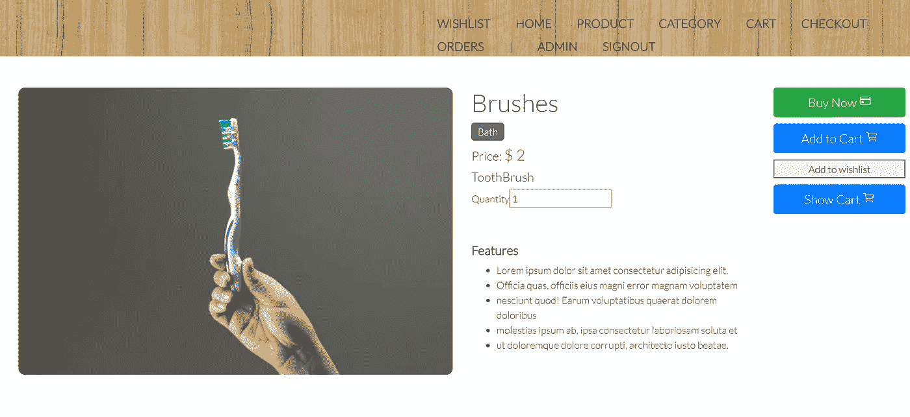

displaying details of a particular item

不要担心我们没有添加 HTML 部分，您可能想知道它是如何显示的。我在最后附上的 HTML 部分是为了给出我们正在构建的可视化内容，敬请关注！

# 3.更新购物车商品

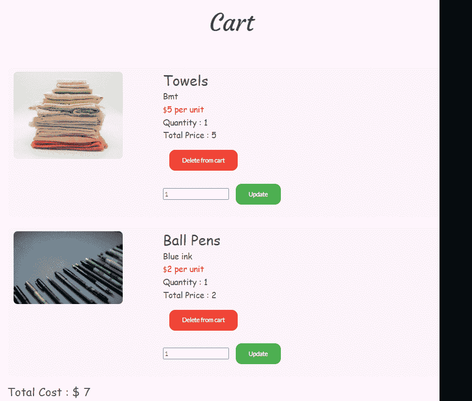

updating an item (here Towels product)

我们将使用我们在上面的 **API** 描述中看到的**API:/cart/update/{ cartItemId }**。

***【update item()****:*该函数将接收 cartItem 中产品的索引和新的数量

首先，我们将通过循环查找 cartItems 数组中的 itemId，然后打破循环，将找到的项的索引存储在变量“I”中。

然后用从参数中收到的新数量更新产品的数量。此外，我们将 userId 和 productId 存储在变量中，因为我们需要将响应主体传递给后端 API 调用。在这个后端 API 中，也将首先进行用户身份验证，然后将找到具有所提供的 itemId 的项目，并因此更新其数量。

因为我们正在更新一个实体，所以我们使用 Axios 的 put 方法，并将 itemId 和 token 作为参数传递，将 itemId、userId、productId、quantity 作为响应体传递。

# 4.从购物车中删除商品

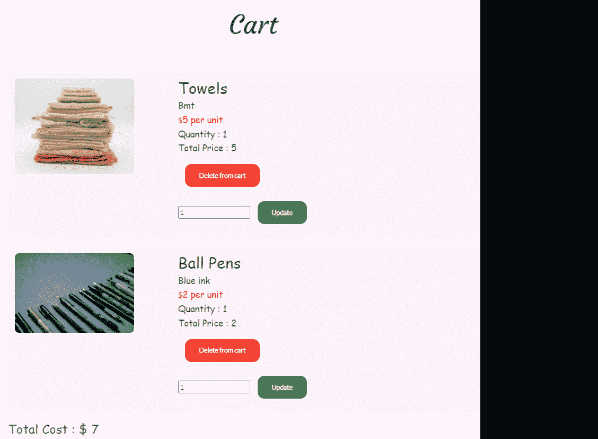

deleting an item from the cart

我们将使用我们在上面的 **API** 描述中看到的**API:/cart/delete/{ cartItemId }**。

**deleteItem():** 这个函数将接收一个 itemId

我们调用 Axios 的 delete 方法，该方法将调用相应 URL 映射的后端 **API** ,并将 itemId 和 token 作为参数提供给它。因此，这个后端 API 将首先找到提供了令牌的用户，如果找到了用户，那么将从数据库中删除提供了 itemId 的购物车商品。删除后，API 发送响应状态 200，产品从购物车中删除，我们刷新页面。

**现在，还有一点需要注意，当该组件将被渲染/安装时，购物车商品应被显示。因此，我们在“mounted”方法中调用 listCartItems()方法。**

```
mounted() {
   this.token = localStorage.getItem("token");
   this.listCartItems();
}
```

# 我们特性的 HTML 部分:

现在让我们开始处理 HTML 部分。所以在模板标签中，我们需要添加 HTML 属性。现在，当且仅当用户将商品添加到购物车中时，我们才显示这些商品。所以一般来说，无论什么时候进行条件渲染，我们都使用 Vuejs 的 v-if 指令。只有当指令的表达式返回真值时，才会呈现该块。

当我们将从 API 获得的响应数据存储在“carts”变量中时，它用于确定是否显示项目，即如果“carts”值不为空，那么将显示带有 v-if 指令的 div 块。

现在，由于购物车中可能有多个商品，我们需要遍历“cartItem”数组，然后显示它们。为此，我们使用 v-for 指令，该指令需要传递一个键(必需的)来惟一地标识一个项目。记住我们存储在“len”变量中的购物车商品的长度，它在这里循环使用。

现在，在 v-bind 指令的帮助下，我们为每个产品显示它的图像，单击它时，我们调用 showDetails()方法。

现在使用 vuejs 的双向数据绑定概念，我们显示了该项目的名称、描述、价格、数量和总价。

此外，我们需要为删除和更新方法添加按钮。

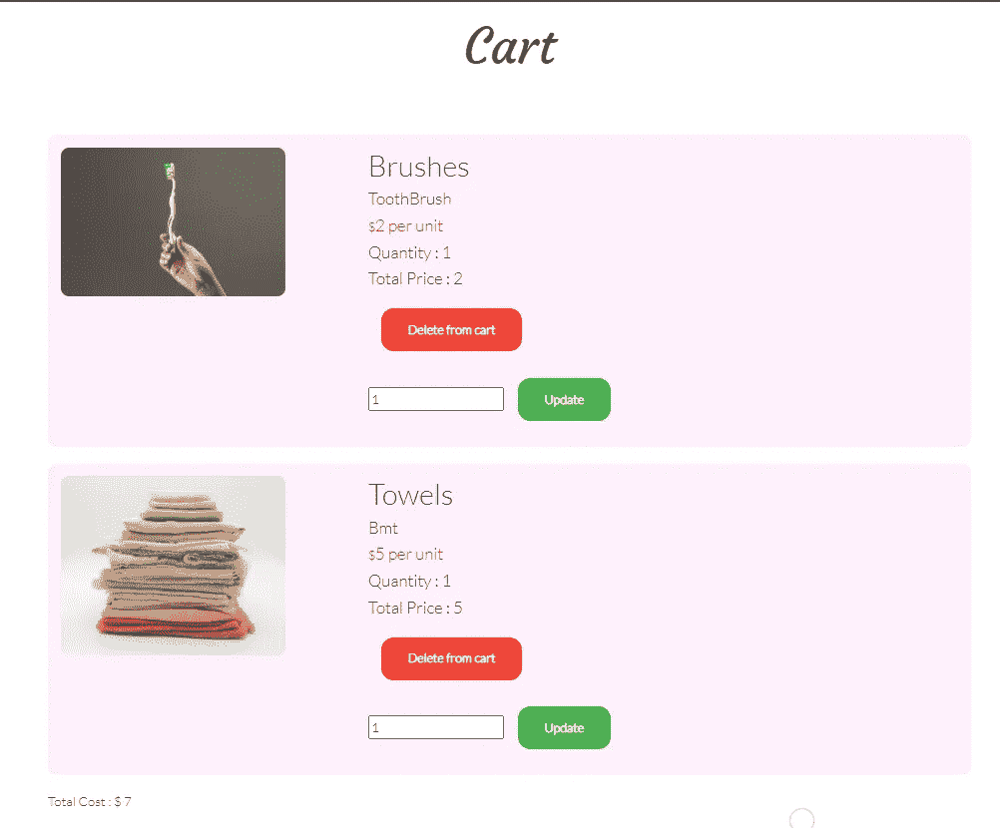

Update button and delete button and displaying the total cost of the cart

当单击删除按钮时，将调用 deleteItem，我们前面已经看到了它的实现。

由于数量可以更新，我们创建了一个接受数量的表单，然后使用更新按钮提交。我们用使用指令 v-model 创建的“pQuantity”变量绑定输入属性。

这将调用 updateItem()函数，该函数将传递需要更新的产品的索引(回想一下，在实现该方法时，我们接受了一个参数来查找购物车中的产品)和数量。

最后，我们显示存储在“total cost”变量中的购物车的总成本。

# 恭喜你！

您现在已经成功展示并更新了添加到购物车中的产品。

您可以在此 [GitHub Repo](https://github.com/webtutsplus/ecommerce-vuejs/blob/master/src/views/Cart/Cart.vue) 中找到完整的代码