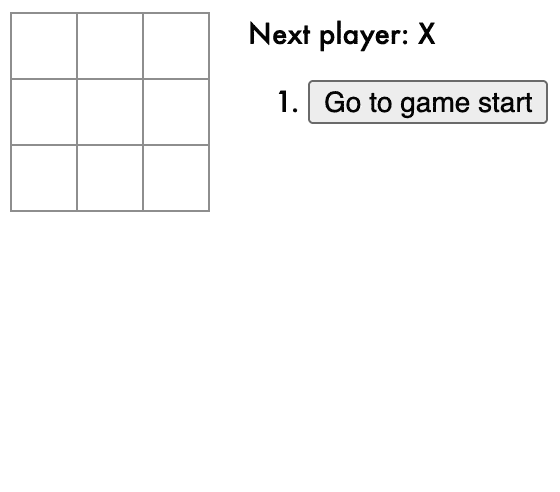
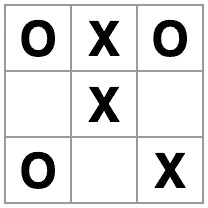
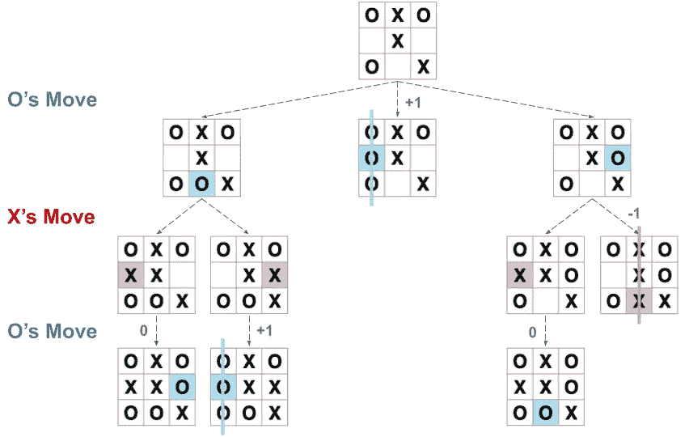
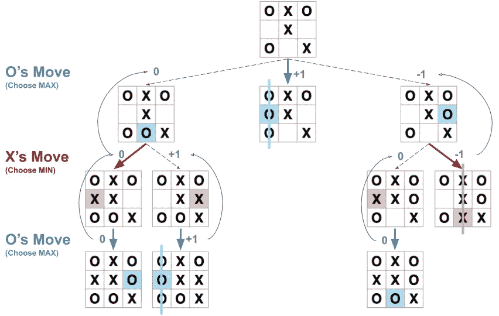

# 在 React 中创建无与伦比的井字游戏人工智能

> 原文：<https://javascript.plainenglish.io/lets-add-an-unbeatable-ai-to-react-tic-tac-toe-c57392579381?source=collection_archive---------6----------------------->

## 通过在正式的 React 教程中增加几行代码。

Photo by [Jon Tyson](https://unsplash.com/@jontyson?utm_source=medium&utm_medium=referral) on [Unsplash](https://unsplash.com?utm_source=medium&utm_medium=referral)

不管你是已经知道 React，还是刚刚开始学习，你可能在某个时候遇到过官方的[井字游戏教程](https://reactjs.org/tutorial/tutorial.html)。最终的结果非常简洁——一个具有历史跟踪功能的全功能井字游戏用户界面:

The [official final result](https://codepen.io/gaearon/pen/gWWZgR?editors=0010) linked from the official [React Tic-Tac-Toe tutorial](https://reactjs.org/tutorial/tutorial.html).

但是你只能和你自己(或者一个朋友)玩得很开心。让我们用一些智慧来增加它的趣味吧！通过增加一点点代码，你可以增加一个无敌的人工智能对手:

Me (X) playing against the AI (O). Image by [Author](https://wilsonlouie.medium.com/).

# 它是如何工作的？

在开始编写代码之前，让我们先了解一下算法。假设现在的棋盘是这样的，轮到玩家 O 了:

The current Player (O) has three possible moves in this example board. Image by [Author](https://wilsonlouie.medium.com/).

此时参与人 O 有三种可能的行动。哪一步是最优的？我们可以模拟从当前棋盘到残局的所有可能的移动，并将它们布局为一棵树:

Example Tic-Tac-Toe game tree. Image by [Author](https://wilsonlouie.medium.com/).

很明显，下一步的一些选择会导致玩家 O“赢”，而一些会导致“平”或“输”。如果赢(或平)是好，输是坏，那么我们来量化一个“赢”用正分+1，“平”用 0，“输”用负分-1:

Example Tic-Tac-Toe game tree, with all possible endgames scored with +1, 0, and -1 for a “win”, “tie”, and “loss” respectively by the current Player O. Image by [Author](https://wilsonlouie.medium.com/).

如果你是玩家 O，你会希望游戏沿着一条通往高分结局的道路进行。类似地，你的对手玩家 X 会希望游戏进行到一个低得分的结局，因为这意味着你输了。换句话说，当轮到你的时候，你会选择最大化残局分数的一步，而玩家 X 会选择最小化残局分数的一步。这为得分移动提供了一个很好的回溯策略:

The Minimax Algorithm on Tic-Tac-Toe. Starting from the scored endgames, backtrack up the tree to score every move by either taking the minimum scoring move (Player X) or the maximum scoring move (Player O). Image by [Author](https://wilsonlouie.medium.com/).

我们看到，从左到右，参与人 O 的三种可能移动的得分分别是 0，+1，-1。作为最大化的玩家，玩家 O 应该选择+1 的移动，这立刻导致了一个“赢”。

我上面刚刚描述的是应用于井字游戏的[极大极小算法](https://en.wikipedia.org/wiki/Minimax)。如上图所示，基本的想法是模拟所有可能的残局，并在假设两个玩家都发挥最佳的情况下对所有的棋步打分。从玩家当前可能的走法中，选择最终会给玩家带来最佳结果的当前走法(在井字游戏中是赢或平)。这个算法可以使用递归直接实现，这将在下一节中介绍。

# 给我看看代码！

剧透:最终结果和代码在[这里](https://codepen.io/wlouie1/pen/YzGOpbV?editors=0010):

The final result of enhancing the official React Tic-Tac-Toe tutorial with an unbeatable AI. Code by [Author](https://wilsonlouie.medium.com/).

在本指南结束时，你会发现到达这里并不需要做太多的工作！接下来的部分可能看起来很长，但那是因为我试图一步一步地向你解释。

先说官方 [React 井字游戏教程应用](https://codepen.io/gaearon/pen/gWWZgR?editors=0010)的[最终结果](https://codepen.io/gaearon/pen/gWWZgR?editors=0010)。概括地说，代码结构基本上是:

`Game`组件由一个`Board`组件和它右边的游戏信息和历史组成。`Board`组件由一个由`Square`组件组成的 3 x 3 网格组成。如果点击了一个`Square`，那么`Game`中的`handleClick()`将处理该事件，更新相应的状态以反映在方块上的移动。页面由一个单独的`Game`组件组成。

## Minor handleClick()重构

让我们仔细看看`handleClick()`函数。现在看起来是这样的:

如果你点击一个`Square`，调用`handleClick()`来应用移动到那个方块。在我们的智能版本中，我们希望`handleClick()`应用你的移动，然后应用 AI 的移动。我们可以通过将当前`handleClick()`的所有逻辑转移到`makeMove()`函数中，然后在`handleClick()`中重用`makeMove()`来实现这一点:

但是等等！回想一下，React 的`setState()`是异步的。从他们的文档来看:

> React 可能会将多个`setState()`调用批处理到单个更新中以提高性能。
> 
> 因为`this.props`和`this.state`可能会异步更新，所以您不应该依赖它们的值来计算下一个状态。

因此，即使我们试图通过第一个`makeMove()`用人的移动来更新状态，在 AI 查看状态以确定最佳响应移动之前，状态可能实际上还没有被更新。我们需要确保第一个`makeMove()`的状态更新在继续 AI 逻辑之前完成。

由于`setState()`接受了一个在更新完成后调用的[可选回调](https://reactjs.org/docs/react-component.html#setstate)，我们可以加入一些`async`、`await`和`Promise`魔法来使一切同步:

有了上面的改变，`makeMove()`返回一个`Promise`，只有当`setState()`完成时才解析。然后，我们使用`await this.makeMove()`来阻塞代码，直到`makeMove()`完成，然后再进入`handleClick()`内部。

现在剩下要做的就是人工智能的实现(上面的 Minimax 计算逻辑`bestSquare`)，然后我们就完成了！

## 添加智能

给定当前棋盘，人工智能需要选择最佳的方格来放置它的移动。我们可以通过实现一个`findBestSquare(squares, player)`函数来实现这一点，该函数接受当前棋盘(`squares`)和 AI 的身份(`player`)，例如，如果人类玩家是“X”，则返回“0”，如果游戏结束，则返回-1。如前所述，最佳正方形将由最小最大算法选择:

最后，我们修改`handleClick()`以正确调用`findBestSquare()`:

就是这样！现在，每当你点击一个方块来移动时，人工智能会相应地移动。

# 结论

正如本指南中所展示的，通过执行一些小的重构，并在官方 React [井字游戏教程](https://reactjs.org/tutorial/tutorial.html)中实现 Minimax 算法，你可以轻松地用无与伦比的人工智能增强项目。最终结果和代码可在这里[获得。](https://codepen.io/wlouie1/pen/YzGOpbV?editors=0010)

我希望你觉得这很有趣，也很有见地；编码快乐！