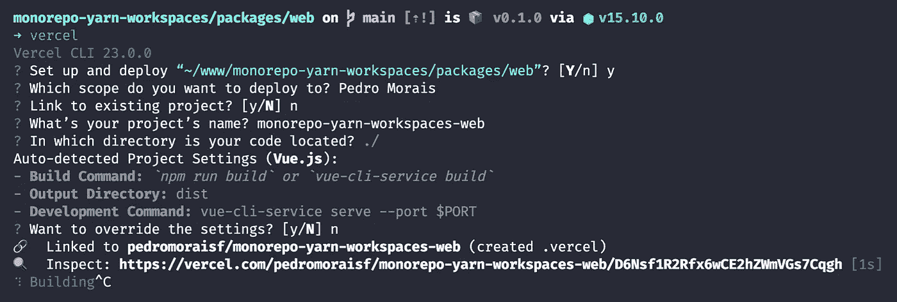

# 让我们用 Github Actions、Vercel 和 Heroku 构建一个连续的交付和分支流程

> 原文：<https://javascript.plainenglish.io/lets-build-a-continuous-delivery-and-branching-process-c27dae09f0b6?source=collection_archive---------7----------------------->

## 对于 JavaScript 应用程序(第 1/2 部分)

我将在本出版物中介绍的策略是我在 [Menon](https://mymenon.com.br) 产品中实施的。我将鼓励读者对这样的环境采取战略性的、实际的和广泛的观点。

我将使用一个例子 *monorepo* 项目，在那里我将在 **Vercel** 上从前端建模一个**连续交付**流程，并在 **Heroku** 上建模 API。

**在怀疑出现之前，我将使用构建在 Github Actions 本身之上的图像来完成任务。当部署集成来自我们自己配置和构建的工作流时，该过程变得更加可控，这一事实推动了这一决策。**

它将分为两部分:首先，我将致力于前端工作流程。最后是 API。

# 首先

我将使用我的出版物**“Yarn work spaces，Vue.js，Node.js，TypeScript 和 Github Actions”**的存储库作为例子，在那里我将教如何制作一个 *monorepo* 项目的样板文件— **只有葡萄牙文**，查看[第 1 部分](https://pedromoraisf.medium.com/monorepo-com-yarn-workspaces-vue-js-node-js-typescript-github-actions-ep-1-3b9a4b5653c1)和[第 2 部分](https://pedromoraisf.medium.com/monorepo-com-yarn-workspaces-vue-js-node-js-typescript-github-actions-parte-2-97b13fde66ff)。

该策略将遵循**图 1.0** 的流程，其中我们将从推送或拉取请求开始自动化流程。接下来，我们将链接一个测试流程，如果成功，将开始部署。

1.0 — Process overview.

重要的是要记住，自动化过程可以根据需要进行扩展。如果我们需要一个验收测试过程，我们可以在正常的测试过程前面加链。完成后，我们发布部署流程。这取决于你。

有了这个流，我们在 **Git 流**中做的每一个**分支**都会产生一个云预览工件。

当我们将一个项目与某个 **Git** 提供者中的存储库连接起来时，Vercel 使这个特性变得可用。**然而，如简介中所述，我们将通过 Github Actions 来控制该流程，以便在流程方面有更多的自主权。**

1.1 — Detailed view of branching strategy with production of cloud artifacts.

在 **Heroku** 上，该功能不像在 **Vercel** 上那样是本地可用的。**我们将开发相同的行为**，其中工作流将被编程为创建我们的 API 的工件，如果它还不存在的话。

为了密封整个流程，我们将配置两个工作流(前端和 API ),以根据我们当前所在的分支链接工件。这样，我们就可以让前端和后端之间的通信完美地工作，并且成功地交付了**满栈**工件。

# 发现秘密并添加到 Github 秘密

我将这个主题从出版物中分离出来，分成两部分。

在 **Github Actions** 中配置工作流之前，我们将为我们的应用找出 **Vercel** 服务器的**"项目 Id"** 和**"组织 Id"** 。

在那之后，我们会拿到密码。克隆最后一个出版物的存储库，我们将一步一步地对流程进行必要的修改。

可以通过单击下面的链接来访问该存储库:

 [## pedromoraisf/单线

### 结果做了 EP 1 da série 系列全栈-什么也没有了💫。维加·克里坎多·阿奎。o 项目…

github.com](https://github.com/pedromoraisf/monoyarn) 

## 发现秘密并添加到 Github 秘密

下载 **Vercel CLI** 。通过 **NPM** 或**纱线**点击[此处](https://vercel.com/cli)遵循安装说明。

安装完成后，通过终端访问前端文件夹，我们通过命令`$ vercel`使用 **Vercel CLI** 。

2.0 — Using Vercel CLI.

按照**图 2.0** 中的步骤操作后，出现一个名为**的文件夹。vercel** 将会在前端目录中创建。

在这个文件夹中， **project.json** 文件将包含我们正在寻找的信息。

通过访问 **Github** 上我们的存储库中**【设置】**内的**选项卡，我们将把这些敏感数据添加到[**Github Secrets**](https://docs.github.com/pt/actions/reference/encrypted-secrets)变量中。**

****

**2.1 — Variables added to Github Secrets.**

**让我们将属性 **"orgId"** 命名为一个名为 **VERCEL_ORG_ID** 的变量，并将 **"projectId"** 命名为 **VERCEL_PROJECT_ID** 。**

**最后，访问 [**Vercel 的访问令牌生成器**](https://vercel.com/account/tokens) ，我们将为访问我们帐户的工作流创建一个。名字将会是 **VERCEL_TOKEN** 。**

## **将作业添加到工作流**

**下面的工作流程可以在位于**的 *monorepo* 根内的文件中找到。github/workflows/pipeline-web . yml**。**

**3.0 — Workflow Web Github Actions.**

**从**线 31** 开始，是**展开步骤**工作。这份工作造就了这份出版物的魅力。尽管它被列在出版物的参考文献中，但是负责与 **Vercel** 集成的操作的链接在下面。**

** [## amondnet/vercel-action

### 这一行动从前是 Zeit Now 部署的。迁移指南 Vercel 是一个用于静态站点和…

github.com](https://github.com/amondnet/vercel-action) 

在**第 33 行**上，我们声明**展开步骤**需要**测试程序**成功完成才能启动。如果没有该声明，这两个作业将并行运行，从而破坏我们在本文开始时建模的策略。

使用[**rlespinasse/Github-slug-action**](https://github.com/rlespinasse/github-slug-action)动作(也在参考文献中列出)我们有一个由 **Github 动作**上下文本身为 slug 格式提供的环境变量版本。这样，我们就为根据我们正在处理的分支生成自定义 URL 腾出了空间— **非常适合我们具有分支目标**的连续交付。

接下来，我将部署分成两个块:一个用于生产，一个用于分支。

我做出这个决定是因为这两个场景的环境变量在数量上存在差异。这样就把责任分开，把利益说清楚了。

在**第 56 行**的**with**块中，我将秘密(之前创建的)添加到 amondnet/vercel-action**库**的 [**的**自述文件中列出的强制输入中。没什么特别的。****](https://github.com/amondnet/vercel-action)

在**“vercel-args”**中，我们构建了**分支**连续交付策略。标志`--build-env`允许在构建时传递环境变量，有可能根据我们正在处理的分支动态创建 API URL。

API URL 的构建将在下一集完成，**我将为你自己的工作流**建模。

# 查看结果

提交更改并将它们推送到 **Github** 存储库，我们可以看到一个新的动作开始了。这是由于使用了 **Vercel CLI** ，其中**。gitignore** 被更新为包含隐藏**的一行。vercel** 文件夹。

4.0 — deployment-step details.

通过点击操作所使用的机器上生成的输出的第 53 行的地址，我们可以看到生产中的工件——因为我们直接在主分支上工作，主分支负责生产变更的版本控制。

构建细节可以在 **Vercel 自己的仪表板**中查阅。这是因为这个动作没有在 **Github Actions** 容器中构建项目。整个准备过程在 **Github 动作**侧进行。构建被发送到 **Vercel** ，它将执行构建并返回结果输出。

# 结论

有了**部署步骤**工作，除了第一个测试工作流(已经存在于存储库中)，我们还有一个**带有分支**的连续交付过程，从而完成了一个**准备工作的环境**。

在下一集，我将完成这篇分两步的文章，在这里我将对 API **部署步骤**进行建模，就像我们对 web 堆栈所做的那样。

[点击这里看下一集→](/lets-build-a-continuous-delivery-and-branching-process-with-github-actions-vercel-and-heroku-a7d9a803f4e2)

# 参考

*   韦尔塞尔
*   [Heroku](https://heroku.com)
*   [Github 动作](https://github.com/features/actions)
*   [Github 秘密](https://docs.github.com/pt/actions/reference/encrypted-secrets)
*   [在网络中](https://github.com/amondnet) / [vercel-action](https://github.com/amondnet/vercel-action)
*   [rlespinasse](https://github.com/rlespinasse)/[github-slug-action](https://github.com/rlespinasse/github-slug-action)

*更多内容请看*[***plain English . io***](http://plainenglish.io)**