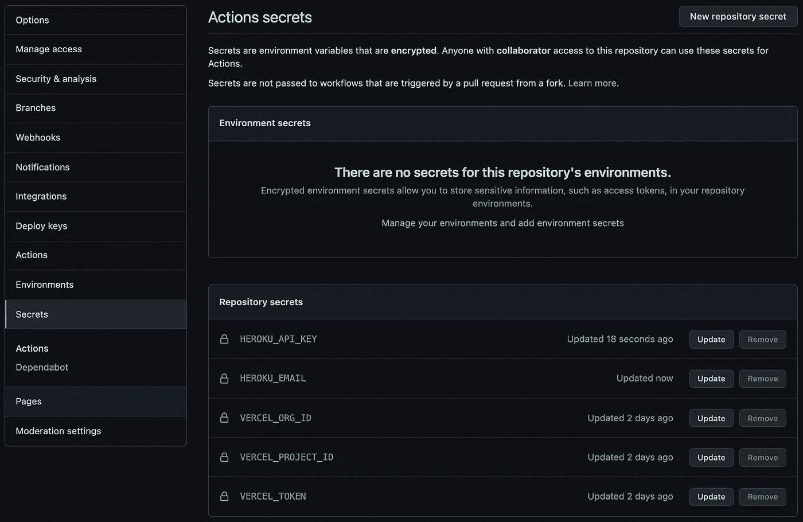
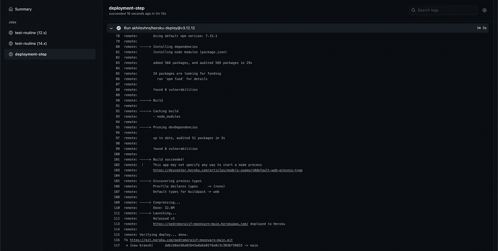

# 让我们用 Github Actions、Vercel 和 Heroku 构建一个连续的交付和分支流程

> 原文：<https://javascript.plainenglish.io/lets-build-a-continuous-delivery-and-branching-process-with-github-actions-vercel-and-heroku-a7d9a803f4e2?source=collection_archive---------8----------------------->

## 对于 JavaScript 应用程序(第二部分)

本出版物是《用 Github Actions、Vercel 和 Heroku 为 JavaScript 应用程序构建持续交付+分支流程》的延续。1/2] ，我们在这里为示例中使用的项目 web 堆栈的**连续交付**建模了一个工作流。如果你没看过之前的帖子，建议你看一下。

# 总结和目标

在前一篇文章中，我描述了这个策略的目标和动机。

我们将对贯穿项目分支活动的流程进行建模，在云中创建一个隔离且安全的预览。

1.0 — Detailed view of the branching strategy with production of cloud artifacts, initially published in the article before this one.

我们添加了**部署步骤**作业，根据我们当前工作的分支，用动态 API URL 设置**VUE _ 应用程序 _ 应用程序接口**环境变量。

现在，我们将通过在 API 中应用一个**部署步骤**作业来完成整个工作流程，为托管在 **Heroku** 上的应用程序生成动态 URL。

# 将部署作业添加到 Heroku

和上一篇文章一样，我会把这个话题分成两部分。

首先，我们将获得动作输入所需的秘密。

我们将在**部署步骤**中添加所需输入的秘密。随后，我们将声明动作将响应的分支，并构建动态 URL。

点击下面的链接可以访问样本库:

 [## pedromoraisf/单线

### 结果做了 EP 1 da série 系列全栈-什么也没有了💫。维加·克里坎多·阿奎。o 项目…

github.com](https://github.com/pedromoraisf/monoyarn) 

## 搜索秘密并添加到 Github 秘密

进入 Heroku 仪表盘 中的 [**应用设置地址，点击**“创建授权”**生成授权令牌。有了它，该行动将有权处理我们帐户内的申请。**](https://dashboard.heroku.com/account/applications)

之后，在 **Github** 上的**【设置】**下的标签**【秘密】**中添加新的秘密变量。

2.0 — Variables added to Github Secrets.

让我们将新生成的令牌命名为 **HEROKU_API_KEY** 和 **HEROKU_EMAIL** 在我们的 **Heroku** 帐户中注册的电子邮件。

## 将作业添加到工作流

下面的工作流程可以在**的 *monorepo* 根内的文件中找到。github/workflows/pipeline-server . yml**。

3.0 — Workflow Server Github Actions.

从**线 32** 开始，是**部署-步骤**工作。在这项工作中，我们将应用与动态 URL 生成和与网络工作流同步的**连续交付**的脚本。

在继续之前，尽管它列在参考资料中，但是负责 **Heroku** 集成任务的动作的链接就在下面。

 [## AkhileshNS/heroku-部署

### 这是一个非常简单的 GitHub 操作，允许您部署到 Heroku。该操作通过运行以下内容来实现…

github.com](https://github.com/AkhileshNS/heroku-deploy) 

和上一篇文章一样，我在**第 34 行**中声明**部署步骤**需要**测试程序**成功完成才能开始。

我再次使用[**rlespinasse/Github-slug-action**](https://github.com/rlespinasse/github-slug-action)动作来创建由 **Github 动作**在上下文中提供的环境变量的 slug 版本。

在**第 42 行**的中，我将刚刚保存的秘密添加到强制输入**“heroku _ API _ key”**和**“heroku _ email”**中。

在**“分支”**输入的**行 46** 中，我声明工件将从哪个分支生成。为此，我使用了 **Github Actions** 提供的上下文 **"github.ref"** 。

魔法发生在 **"heroku_app_name"** 第**行第 44** 行。我声明动态 API URL 的方式与我在上一篇文章中在**VUE _ 应用程序 _API** 中创建环境变量的方式相同，充实了策略。

简而言之，每次我们**分支**出来开发，[**rlespinasse/github-slug-action**](https://github.com/rlespinasse/github-slug-action)action 都会提供它的 slug 版本。最后，将使用该地址创建或更新适当的 **Heroku** 应用程序。

例如:如果分支名称是 **feat/cd** ，那么生成的 URL 将是**https://pedromoraisf-monoyarn-feat-cd.herokuapp.com**。

# 查看结果

在**服务器**文件夹中进行一些更改，并将其发送到 **Github** 上的存储库，管道开始配置的进程。

4.0 — deployment-step details.

通过点击生成输出的**行 113** 的地址，我们可以看到我们生产中的工件。

现在，我们可以在 web 堆栈上平稳地开发与 API 通信的特性，并且地址将正常匹配——在分支和生产工件中。

# 结论

完成这两集后，我们有了一个完整的**连续交付环境，分支**使用 **Github Actions、Vercel 和 Heroku** 。

我们从分支中的自动化可靠预览中获益，这既可以用作快速批准，也可以用于某些关键特性的扩展开发。

# 参考

*   [韦尔塞尔](https://vercel.com/)
*   [Heroku](https://heroku.com)
*   [Github 动作](https://github.com/features/actions)
*   [Github 秘密](https://docs.github.com/pt/actions/reference/encrypted-secrets)
*   [在网络中](https://github.com/amondnet) / [vercel-action](https://github.com/amondnet/vercel-action)
*   [rlespinasse](https://github.com/rlespinasse)/[github-slug-action](https://github.com/rlespinasse/github-slug-action)

*更多内容请看*[***plain English . io***](http://plainenglish.io)