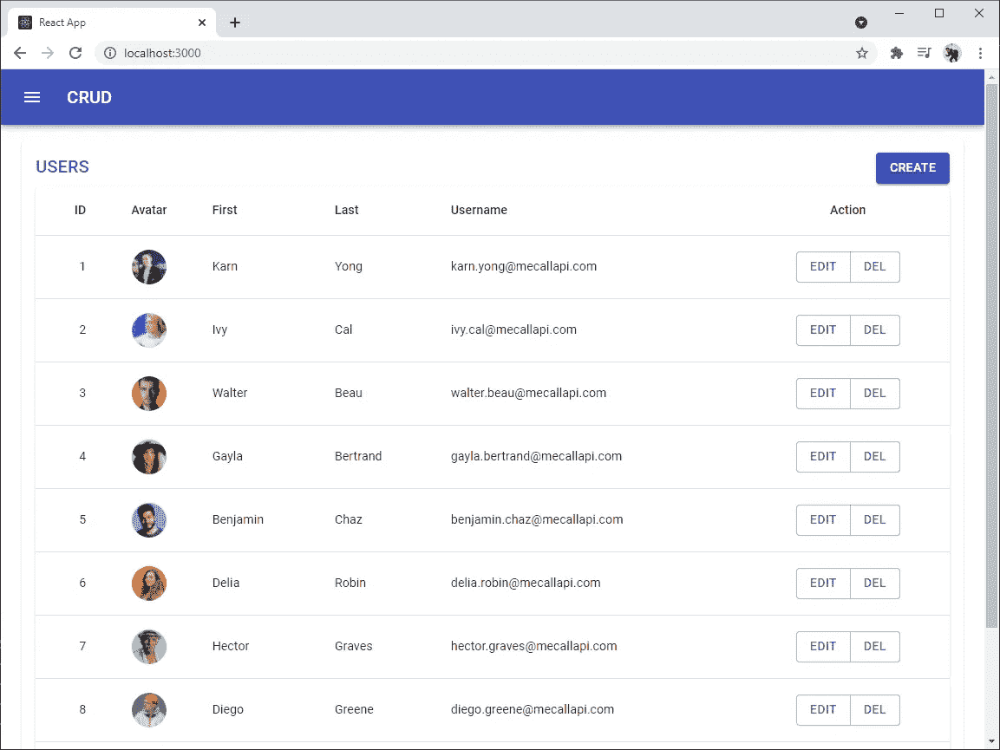

# 让我们用 React 和外部 API 构建一个 CRUD 网站

> 原文：<https://javascript.plainenglish.io/lets-build-a-crud-website-with-react-and-an-external-api-157d126f3cf2?source=collection_archive---------0----------------------->

## 如何用 **React** 和一个外部 **API** 创建 web 应用程序来执行 **CRUD** 操作


**CRUD** 操作是操纵数据的四种基本操作，包括**C**reate/**C**onstruct、 **R** ead、 **U** pdate 和 **D** elete。我们将通过使用来自 MeCallAPI.com[的外部 **API** 来执行 **CRUD** 操作。](https://www.mecallapi.com/)


[MeCallAPI.com](https://www.mecallapi.com/)

这是一个例子，我们想从这篇文章的教程:[https://www.mecallapi.com/crud/](https://www.mecallapi.com/crud/)。


[https://www.mecallapi.com/crud/](https://www.mecallapi.com/crud/)

## 软件安装

*   **node . js**https://nodejs.org

# 我们开始吧！

创建一个初始的**反应**项目:

```
npx create-react-app react-crud
cd react-crud
```

安装附加软件包:

*   **材质 UI** :我们将使用材质 UI 中的 UI 组件。
*   **react-router-dom** 在我们的应用程序中管理路由和路径。

```
npm install @material-ui/core @material-ui/icons react-router-dom
```

启动**反应** app:

```
npm start
```

在网络浏览器上访问 http://localhost:3000 以查看结果:


[http://localhost:3000](http://localhost:3000/)

# 用户阅读和删除页面

编辑 **App.js** 以将 **react-router-dom** 中的 **Router** 包含在只有 **Navbar** 和**用户**组件的应用程序中。(我们将创建这两个组件)。

创建 **Navbar.js** 作为我们页面[素材 UI App bar](https://material-ui.com/components/app-bar/#app-bar) 顶部的导航栏组件。

将 **Users.js** 创建为一个组件，作为显示用户列表的页面。

在这个页面中，我们将调用 API 来获取用户数据列表( **R** ead)。
API URL:[https://www.mecallapi.com/api/users](https://www.mecallapi.com/api/users)
方法:获取

以及用于删除用户的 API(**D**elete)。这个 API 只删除新添加的用户。
API URL:[https://www.mecallapi.com/api/users/delete](https://www.mecallapi.com/api/users/delete)
方法:删除
样本体(JSON):

```
{
    "id": 11
}
```

让我解释一下代码:

*   **useStyles** (第 18–35 行和第 38 行)定义了与材质 UI 一起使用的 CSS。
*   定义**状态**(第 40 行)**用户**和一个用于给**用户**设置值的函数 **setUsers** 。
*   将函数 **useEffect** (第 41–43 行)定义为 [**效果钩子**](https://reactjs.org/docs/hooks-effect.html) 在组件加载或组件中的任何状态/道具更新时调用。这将有助于基于状态/属性的改变来更新网页中的数据呈现，而无需刷新页面。
*   定义函数 **UsersGet** (第 45–53 行)来调用 API[https://www.mecallapi.com/api/users](https://www.mecallapi.com/api/users)来检索存储在 React 中的用户**状态**中的用户列表。
*   第 55–80 行包含用户删除 API 的使用。
*   第 113–131 行包含使用循环(map)将**用户**状态显示为表格。

结果是:



# 用户创建页面

创建 **UserCreate.js** 作为创建新用户的页面。

编辑 **App.js** 在**路由器**中添加 **UserCreate** 组件。

尝试使用**用户创建**页面添加新用户:


At the first page, click **CREATE**.


Input a user data, then click **CREATE**.


New user is added.

# 用户更新页面

创建 **UserUpdate.js** 作为编辑现有用户数据的页面。代码将类似于使用用户更新 API 的用户创建页面。

用于编辑用户的 API(**U**pdate)
API URL:[https://www.mecallapi.com/api/users/update](https://www.mecallapi.com/api/users/update)
方法:放
样本体(JSON):

```
{
    "id": 11,
    "fname": "Cat",
    "lname": "Gato",
    "username": "cat.gato@mecallapi.com",
    "email": "cat.gato@mecallapi.com",
    "avatar": "https://www.mecallapi.com/users/cat.png"
}
```

以及通过 id 读取一个用户数据的 API(**R**EAD)
API URL:[https://www.mecallapi.com/api/users/1](https://www.mecallapi.com/api/users/1)
方法:GET
URL 末尾的数字代表用户的 id。

*   将函数 **useEffect** (第 34–46 行)定义为 [**效果挂钩**](https://reactjs.org/docs/hooks-effect.html) ，当组件被加载时以及当除了 **id** 之外的任何状态/道具发生变化时调用，因为我们将 **id** 放在函数末尾的[ ]中。

在**路由器**中添加**用户更新**组件，编辑 **App.js** 。

尝试更新用户数据:


Click **EDIT** at the end of the row.


Edit the user data and click **UPDATE**.


The data is updated.

此外，尝试删除数据。


Click **DEL** at the end of the row.


The user data is deleted.

# 结论

就是这样。希望它能帮助你理解 **React** 的基础以及如何使用 API。下篇见！

*朗西特大学数字创新技术学院博士 Karn Yongsiriwit 的文章*

*更多内容请看*[***plain English . io***](http://plainenglish.io)