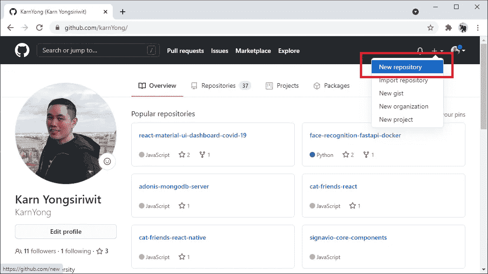

# 让我们用 Next.js 构建一个预渲染网站并部署到 Vercel

> 原文：<https://javascript.plainenglish.io/lets-build-a-pre-render-website-with-next-js-react-js-and-api-then-deploy-on-vercel-cloud-a68e61059428?source=collection_archive---------4----------------------->

## 用 Next.js、React.js 和 API 搭建一个预渲染网站，然后部署在 Vercel Cloud 上


Let’s Build a Pre-render Website with Next.js, React.js and API, then deploy on Vercel Cloud

与客户端渲染相比，预渲染网站(服务器端渲染)更适合 SEO、搜索引擎抓取和社交媒体共享。在本教程中，我们将探索 Next.js 来开发一个使用静态生成功能的预渲染网站。


Static Generation of Next.js ([https://nextjs.org/learn/basics/data-fetching/two-forms](https://nextjs.org/learn/basics/data-fetching/two-forms))

我们将使用来自 MeCallAPI.com T2 的外部 API。这是一个我们想从教程中开发的例子:【https://www.mecallapi.com/attractions_listing/ 


# 软件安装

*   **node . js**https://nodejs.org
*   **饭桶**https://git-scm.com/downloads[饭桶](https://git-scm.com/downloads)

# 让我们开始创建 Next.js 应用程序

例如，使用命令 **npx create-next-app** 创建一个 Next.js 应用程序，后跟一个应用程序名称 **nextjs-basic** 。

```
npx create-next-app nextjs-basic
```


进入文件夹，然后安装本教程中需要的一些软件包，材料用户界面。

```
cd nextjs-basic
npm install @material-ui/core @material-ui/icons clsx prop-types
```

编辑 **pages/index.js**

使用以下命令运行应用程序:

```
npm run dev
```

在 [http://localhost:3000/](http://localhost:3000/) 查看结果


The initial Next.js application

# 准备您的应用程序以启用材料用户界面

您可以从这个[链接](https://github.com/mui-org/material-ui/tree/master/examples/nextjs)中查看如何在您的 Next.js 应用程序中启用材质 UI 的使用。为此，首先创建 **src/theme.js**

编辑 **pages/_app.js**

创建 **pages/_document.js**

重启应用程序，然后执行下一步。

# 创建显示旅游景点列表的网页

创建 **src/Navbar.js** 作为顶部应用程序栏的 React 组件

创建 **src/AttractionCard.js** 作为一个组件来显示一个旅游景点的项目(带有一个到详细页面的链接)。

编辑 **pages/index.js** 为页面，显示旅游景点列表。

在构建应用程序时(而不是在 web 浏览器中请求页面的过程中)将调用函数 **getStaticProps** ,以便根据来自 API 的数据将网页呈现为 html 文件。
**API URL**:[https://www.mecallapi.com/api/attractions](https://www.mecallapi.com/api/attractions)
**方法** : GET

查看显示旅游景点列表的页面结果: [http://localhost:3000/](http://localhost:3000/)


The tourist attraction listing page ([http://localhost:3000/](http://localhost:3000/))

# 创建显示旅游景点详细信息的网页

创建 **src/Attraction.js** 作为显示旅游景点详细信息的页面组件。

创建**页/[id]。js** 作为一个页面，根据根(/)后的 id 显示旅游景点的详细信息。比如[http://localhost:3000/1](http://localhost:3000/1)，在代码中我们可以从 **params.id.** 中得到 1

构建时会调用函数 **getStaticPaths** 。基本上，它会调用一个 API 来获取我们想要预渲染的所有路径。在本例中，我们将使用 id 作为每个旅游景点的路径。

在构建应用程序时，将调用函数 **getStaticProps** 来根据来自 API 的数据将网页呈现为 html 文件。这将根据函数 **getStaticPaths** 的路径被多次调用。

**API URL**:[https://www.mecallapi.com/api/attractions/{id}](https://www.mecallapi.com/api/attractions/1)
**方法** : GET

**Extra:** 在第 8–12 行，我们为脸书添加了元标签，以获取标题、描述和图像，从而在共享页面时创建社交卡片。如果页面在客户端(网络浏览器)呈现，脸书不会识别所有这些标签，但是这里不是这样，因为我们在服务器上呈现页面。

查看结果作为一个页面，在这里显示旅游景点的详细信息(您可以在 1-7 之间更改 2)[http://localhost:3000/2](http://localhost:3000/2)


Touring attraction detail page ([http://localhost:3000/2](http://localhost:3000/2))

# 将您的代码推送到 GitHub

去 GitHub 网站[https://github.com/](https://github.com/)，登录你的账户，点击**新建仓库:**



输入**库名**，然后点击**创建库:**


然后复制 GitHub 存储库的 url，供下一步使用:


在应用程序文件夹上运行下面的 git 命令，将源代码推送到存储库。将<<repository url="">更改为上一步中的存储库 url。</repository>

```
git init
git add .
git commit -m "first commit"
git branch -M main
git remote add origin <<repository url>>
git push -u origin main
```

再次刷新您的 GitHub 存储库页面，查看您的源代码是否在那里。


# 将您的源代码从 GitHub 部署到 Vercel Cloud

前往[https://vercel.com/](https://vercel.com/)登录您的仪表板，然后点击**新建项目。**


选择**添加 GitHub 组织或账户**:


将弹出一个新窗口，询问是否允许将 Vercel 安装到您的 GitHub 帐户。选择您的 GitHub 帐户。


点击**安装**，**，**则窗口关闭。注意，您也可以将选项更改为 **Only select repositories** 。


回到 Vercel，在我们想要部署的存储库后面单击 import 按钮。


选择您的 Vercel 帐户。


点击**部署**。


一旦部署完成。点击**访问**进入您的网站。


比如我的网站:[https://nextjs-basic-coral.vercel.app/](https://nextjs-basic-coral.vercel.app/)


由于我们的网站部署在云上，我们在旅游景点详细信息页面有必要的元标签，以创建一个不错的脸书共享卡。让我们尝试在您的 facebook 上分享一个旅游景点的详细信息页面。比如，我的网址是[https://nextjs-basic-coral.vercel.app/1](https://nextjs-basic-coral.vercel.app/1)。你会看到一张脸书共享卡，上面有标题、描述和图片。


Sharing a page on Facebook.

关于如何使用 Next.js、React.js 和 API 开发预渲染网站并部署在 Vercel Cloud 上的介绍到此结束。我将尝试探索更多关于 Next.js 的内容，然后撰写更多的文章。:)下次见。

*朗西特大学数字创新技术学院博士 Karn Yongsiriwit 的文章*

*更多内容请看*[***plain English . io***](http://plainenglish.io)