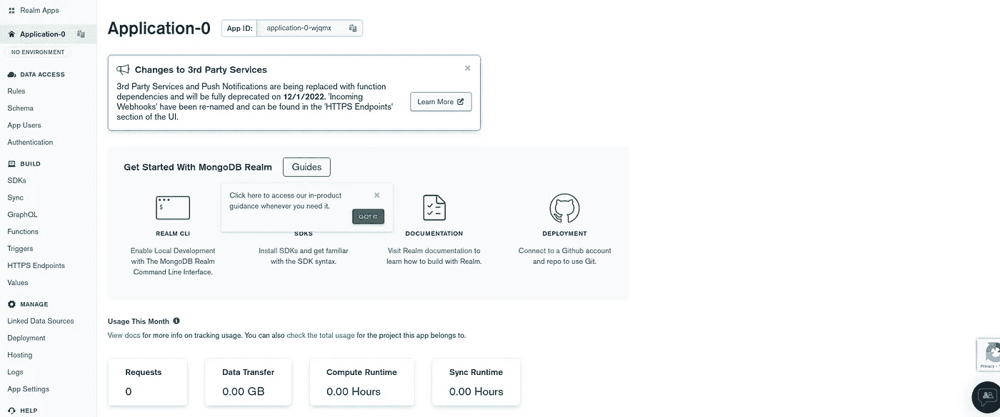

# 使用 MongoDB Realm 和 Cloudinary 构建一个无服务器 Expo 应用程序

> 原文：<https://javascript.plainenglish.io/lets-build-a-serverless-expo-app-using-mongodb-realm-and-cloudinary-b018dde08717?source=collection_archive---------7----------------------->

## 实现一个注释应用程序，将利用我们的移动设备中的相机功能。


Photo by [Fahrul Razi](https://unsplash.com/@mfrazi?utm_source=medium&utm_medium=referral) on [Unsplash](https://unsplash.com?utm_source=medium&utm_medium=referral)

# **简介:**

**AWS** 已经提供了很好的服务，但他们需要你的信用卡信息来创建一个账户，如果你生活在一个创建国际信用卡是 PIA 的国家，这是一个问题。

**MongoDB Realm 来拯救你了**，如果你没有信用卡也不用担心，他们拥有让你的应用无需服务器的所有功能和一个优秀的 Daas 平台。

我希望我以前能认识这个坏男孩，它免费给你 1GB 的媒体存储空间，和 AWS S3 相比，它有一个非常简单的 API 来上传你的文件。聊够了，让我们讨论一下我们将在本教程中构建什么。

# 目的:

在本教程中，我们将实现一个注释应用程序，它将利用移动设备中的摄像头功能。

> **当我试图创建一个食品杂货(你知道你从商店买的日常用品)的图像识别模型时，我想到了这个应用程序的想法。我有谷歌找到一个数据集，这将是具体到我的国家的杂货项目。但是很难找到这样的数据集。**

# 应用基础设施:


上面的图片显示了我们的应用程序的基本计划。

*   首先，我们将创建一个 expo 应用程序，它将使用我们的移动设备的相机功能来捕捉图像。
*   然后，我们将使用他们的 API 将图像上传到 Cloudinary。如果图片上传成功，Cloudinary 将向我们发送一个 JSON 响应
*   收到响应后，我们将标记图像，然后使用 Realm webhook API 将标记图像数据存储到 MongoDB。

# 先决条件

1.  Node.js —版本 16+(任何高于 13 的版本也可以)
2.  Expo CLI —(安装指南)
3.  模糊账户
4.  MongoDB 帐户
5.  对 React Native 和 Javascript 有基本的了解

## MongoDB

在我们开始编码之前，最好创建我们的数据库和 realm webhook，它将用于处理从我们的移动应用程序到数据库的数据。

> 免责声明:在本教程中，我不会展示我们的应用程序中使用的每一个 webhook 背后的逻辑，但它将在 GitHub 资源库中提供。

## 数据库设置

*   创建一个空闲集群，将数据库命名为 objectAnnotationwith，集合名为 **annotation。**
*   如果您不知道如何创建 MongoDB 集群，这里的[是链接。](https://docs.atlas.mongodb.com/tutorial/deploy-free-tier-cluster/)

## MongoDB 领域服务

点击 MongoDB 集群账户上的 Realm 选项卡，然后点击页面右侧的**创建新应用**。


选择一个合适的应用程序名称并链接到之前创建的数据库(对我来说是 **GroceryApp** )。


单击创建领域应用程序按钮后，您将被重定向到您的 MongoDB 领域应用程序仪表板页面。



在侧边栏中，点击导航链接标签**模式**，然后点击**添加集合按钮**，为应用程序创建数据库模型(这类似于创建一个 mongoose 模式)。


从下拉菜单中选择数据库和集合名称，然后点击**添加集合**按钮。


现在向模式中添加字段，然后单击 **Review Draft and Deploy 按钮。**


创建模式后，我们现在可以继续创建 API 端点。MongoDB Realm 是一个 BaaS(后端即服务),它为您提供了一种不同类型的特定于服务器的服务来创建您的数据启用端点，我们将选择 HTTP webhook 服务，它将为我们提供一个到后端 web 接口的简单挂钩。

在侧栏中，单击导航链接标签“第三方服务:


然后，单击“添加服务”按钮添加新服务:


最初，我们已经确定我们需要一个 HTTP 服务，因此我们将选择一个 HTTP 服务并将该服务命名为 *api* (命名约定是可选的，因此您可以将其命名为任何名称):


当您创建一个 HTTP 服务时，您可以从 [Realm 的无服务器功能](https://docs.mongodb.com/realm/functions)中以一个名为`context.services`的对象的形式访问这个服务。稍后，当我们创建一个附加到该服务的无服务器功能时，我们会详细介绍这一点。命名并添加服务，然后您将创建一个[传入 Webhook](https://docs.mongodb.com/realm/services/webhook-requests-and-responses) 。当您的客户端从您的 API 请求数据时，将会联系这个进程。

随意命名该函数(在本教程中，我们将其命名为 *create* )并设置参数，如下所示:


## **MongoDB 领域服务功能**

让我们编写当 webhooks 接收到 HTTP 函数时将被调用的函数，将下面的代码粘贴到您的函数编辑器中:

## **测试 API**

现在我们已经设置好了 HTTP webhook 是时候测试 webhook 了，你可以从
***第三方服务->ObjectAnnotationApi->-create->Setting->web hook 设置*中获取 HTTP webhook API URL。**


我正在使用 Postman 来测试 API，你可以使用你选择的 API 测试应用程序。


## 云端设置

此时，我希望您已经创建了一个 Cloudinary 帐户，在登录到您的 Cloudinary 帐户后，您将看到一个如下所示的仪表板。


Cloudinary 需要两件事情来上传图片到他们的服务。他们是

1.  API URL
2.  `upload_preset`

您可以通过点击账户详情部分的更多按钮以及`your-cloud-name`获得 API URL

> **示例 Api url** : `'https://api.cloudinary.com/v1_1/<your-cloud-name>/image/upload'`

所需的第二个参数称为`upload_preset`。它是通过以下步骤创建的:

*   从仪表板中，单击菜单栏中的设置，然后选择上传选项卡。
*   找到“上传预设”部分，然后单击“添加上传预设”。
*   输入上传预设的名称。在“签名模式”中，从下拉菜单中选择值“未签名”。
*   然后单击保存。

## 测试 API(可选)

使用 Postman 测试 Cloudinary API。


# 世博 App


## UI 概述

上面的图像代表了我们的应用程序的用户界面。

> 在本教程中，我们将只关注应用程序的第三和第四个屏幕，并跳过设计部分。但你可以在我的 github repo 上探索完整的应用程序。

## 构建应用程序

在您的终端中执行以下命令来创建 expo 应用程序:

```
expo init myApp
cd myApp
```

**包安装** 创建 expo app 后，安装以下依赖项:

```
expo install expo-camera expo-checkbox expo-status-bar react-native-dotenv react-native-flexi-radio-button react-native-loading-spinner-overlay @react-native-async-storage/async-storage @react-navigation/native @react-navigation/native-stack
```

初始化内部版本和文件夹结构:

```
.
|-- App.js
|-- app.json
|-- assets
|-- babel.config.js
|-- LICENSE
|-- node_modules
|-- package.json
`-- yarn.lock
```

## **让代码**

在根目录下创建一个名为`component`的新文件夹。在`component`文件夹中创建以下文件。

```
|--component
|  |-- CameraScreen <==newly created 
|  |-- PreviewScreen <==newly created file
|  | --SuggestionList.js <==newly created file
|  | --api.js <==newly created file
|  | node_modules
|   package.json
```

将以下代码粘贴到`CameraScreen.js`。

将以下代码粘贴到`PreviewScreen.js`。

将以下代码粘贴到`SuggestionList.js`。

将以下代码粘贴到`api.js`。

最后，将下面的代码粘贴到`App.js`。

## 项目目录:[https://github.com/mirsahib/BanGIAA](https://github.com/mirsahib/BanGIAA)。

# 结论

在本教程中，我们学习了如何在 MongoDB 领域中构建无服务器后端 API 和模式。我们还将学习如何使用 Cloudinary API，并使用 expo 应用程序将图像上传到云服务器。Expo 是创建原生移动应用程序的一个很好的工具，尽管它缺少一些与 React 原生应用程序相比的功能。

现在你知道了。感谢您的阅读。

*更多内容看* [*说白了. io*](http://plainenglish.io/) *。报名参加我们的* [*免费每周简讯*](http://newsletter.plainenglish.io/) *。在我们的* [*社区*](https://discord.gg/GtDtUAvyhW) *获得独家写作机会和建议。*