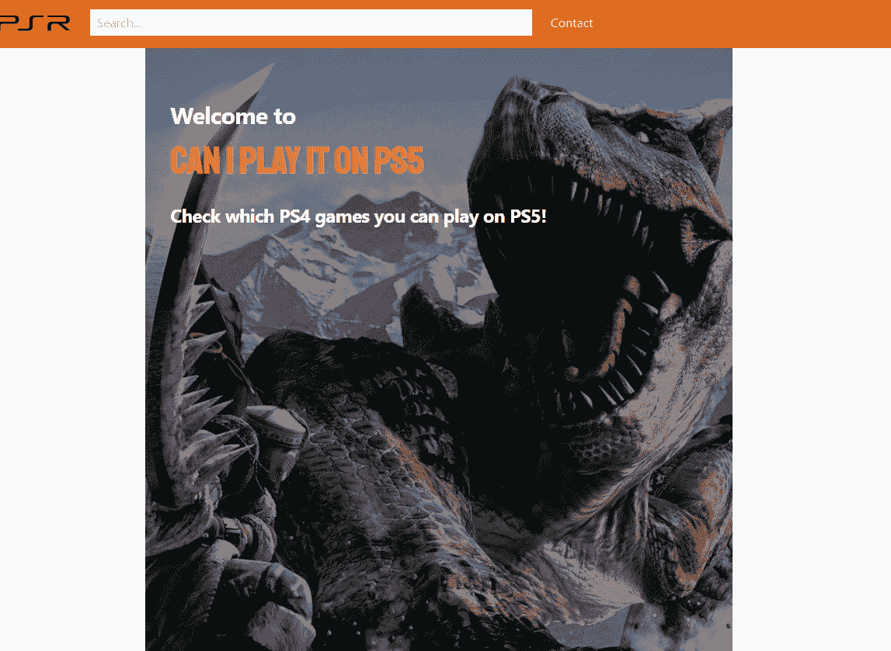
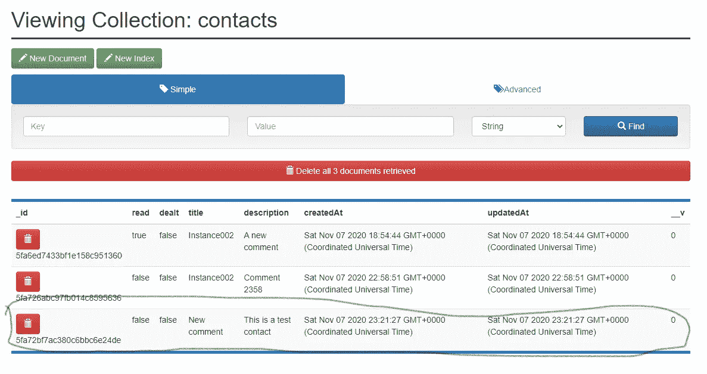

# 从零到网络英雄[4] —联系页面

> 原文：<https://javascript.plainenglish.io/lets-build-a-svelte-app-a4050db53e79?source=collection_archive---------21----------------------->

## 本周我们将开发一个联系表格来记录用户想说的话。

Photo by [King Lip](https://unsplash.com/@king_lip?utm_source=medium&utm_medium=referral) on [Unsplash](https://unsplash.com?utm_source=medium&utm_medium=referral)

在[的前一章](/from-zero-to-webhero-3-detail-page-f755c2904a85)中，我们实现了显示游戏细节和与之互动所需的一切。在下一节中，我们将稍微远离它。既然现在我们的用户可以查看网站并与网站互动，让我们添加一个联系表单，这样如果有什么问题，或者他们真的喜欢我们的网站，他们就可以与我们联系。

如果你想直接跳到代码，可以在这里找到[。](https://github.com/omirobarcelo/retro-ps5/tree/part4)

# 模型

我们没有用户注册。因此发送到服务器的消息将只包含标题和描述。为了便于管理，我们将添加一个已读标志和一个已处理标志。这就是我们如何编码这个模型。

正如你所看到的，我们增加了两个静态；一个查找未读消息，另一个查找未读消息。这些将用于管理区域，在本系列范围之外的未来实现中。

# 后端

联系人表单的端点很简单，因为我们只允许发送消息。遵循之前使用的后端路由的相同命名法，我们将其保存在`routes/contact.json.ts`中。

我们捕捉错误来发送一个带有错误消息的自定义对象。

# 前端

联系人页面由一个联系人表单组成，该表单包含两个字段:标题和描述。我们可以随心所欲地构建和风格化它们。当提交表单时，我们用下面的函数发送联系信息。

一旦`serverRes`有了一个值，我们就向用户显示反馈，通知他们联系信息是否发送成功，或者流程中是否有错误。

我们明确地为成功或错误消息定义了 SVG。如果我们使用图标库，代码会更简洁。

所有这些结合起来，它会这样工作。

Contact showcase

并且消息被保存。

Contact showcase saved

我们即将结束这个系列。下一步将是让用户创建新的条目，当他们寻找的游戏还没有出现的时候。

你可以在[https://github.com/omirobarcelo/retro-ps5/tree/part4](https://github.com/omirobarcelo/retro-ps5/tree/part4)中看到到目前为止的所有代码。

感谢您一路阅读到这里！下周[让我们继续这段旅程](/lets-build-a-svelte-app-c3b1b55ed70)！