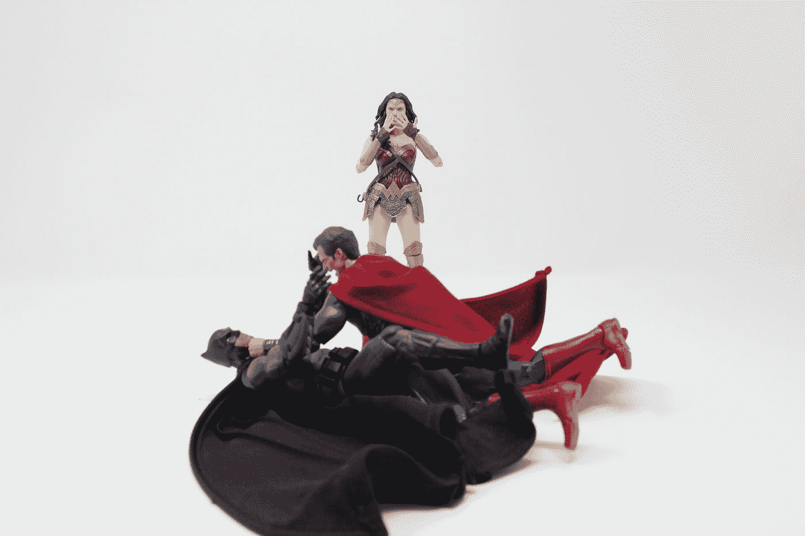
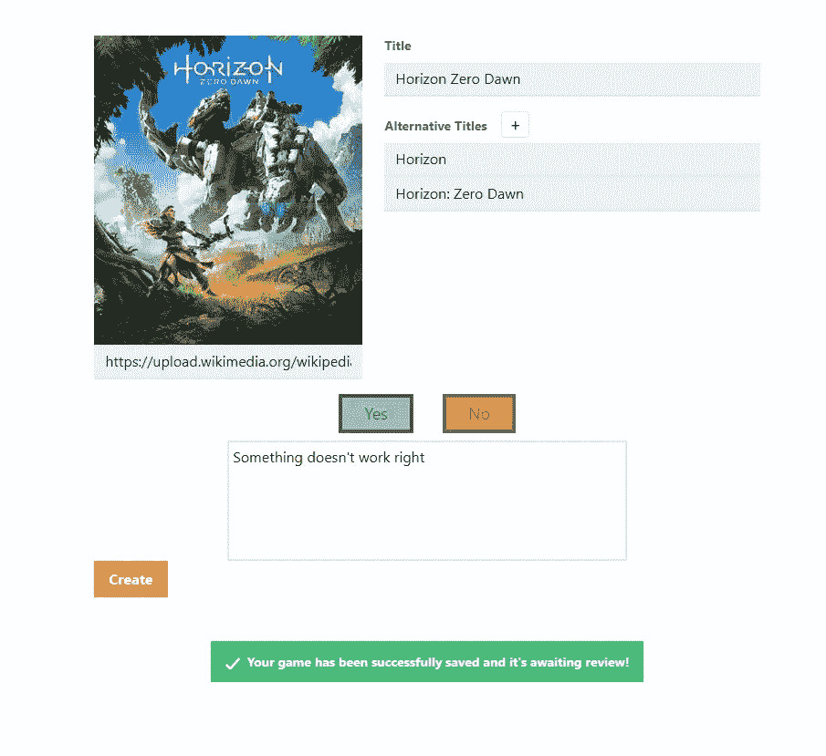

# 从零到网络英雄[5] —创建页面

> 原文：<https://javascript.plainenglish.io/lets-build-a-svelte-app-c3b1b55ed70?source=collection_archive---------19----------------------->

## 当游戏相关的逻辑不在数据库中时，我们允许用户创建游戏页面。



Photo by [King Lip](https://unsplash.com/@king_lip?utm_source=medium&utm_medium=referral) on [Unsplash](https://unsplash.com?utm_source=medium&utm_medium=referral)

[上周](/lets-build-a-svelte-app-a4050db53e79)我们移除了游戏相关的逻辑，增加了一个联系页面。本周我们回到这个话题。如果用户试图寻找一个游戏，但它不在数据库中，我们将允许用户创建一个新的条目。

如果想直接跳到代码，可以在这里找到[。](https://github.com/omirobarcelo/retro-ps5/tree/part5)

# 创建视图

在`routes`中我们加上`create.svelte`。这将定义`/create`路线，当我们找不到用户搜索的任何结果时，从封面重定向。

```
{#if $search.length > 0 && games.length === 0}
  <div class="no-game">
    <p>We don't have saved any games related to <span class="font-bold">"{$search}"</span>.</p>
    <p>Do you want to <a href="create">create</a> a new entry?</p
  </div>
{/if}
```

Create 视图有一个表单，可以添加图像 URL、游戏名称、可选标题和类似于 detail 组件的投票区域。

我们正在使用图像 URL 来简化过程，而不是担心图像上传。这将是未来的改进。但是由于我们使用的是 URL，这些可能是错误的或者不存在的。为了解决这个问题，我们绑定了下面的函数。

```
function imageError() {
  IMG_PLACEHOLDER = 'https://via.placeholder.com/290x380.png?text=URL+Not+Valid';
  image = '';
}
```

这将添加一个指示 URL 无效的图像占位符。

# 创建端点

创建端点是保存发送到数据库的游戏的 POST。

就像在联系端点中一样，如果出现错误，我们会发送一个带有错误消息的响应，以便正确地向用户提供反馈。

# 警报组件

创建和联系页面分别在发送游戏或联系消息后显示给用户反馈的警告。我们可以将警报的模板从联系人页面移动到它自己的组件中，这样它就可以被重用。

我们可以用它，比如，用下面的方法。

总的来说是这样的。



Create showcase

再有两篇文章，这个系列就完成了。感谢您阅读这个正在进行的系列，我希望下周[能见到您](/lets-build-a-svelte-sapper-app-703ec9e779dd)！

你可以在 https://github.com/omirobarcelo/retro-ps5/tree/part5 的[中看到到目前为止的所有代码。](https://github.com/omirobarcelo/retro-ps5/tree/part5)

*更多内容请看*[***plain English . io***](https://plainenglish.io/)