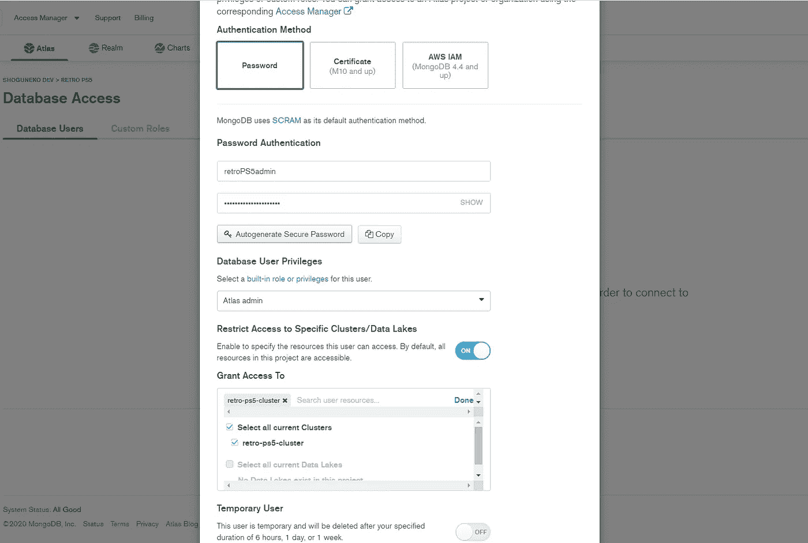
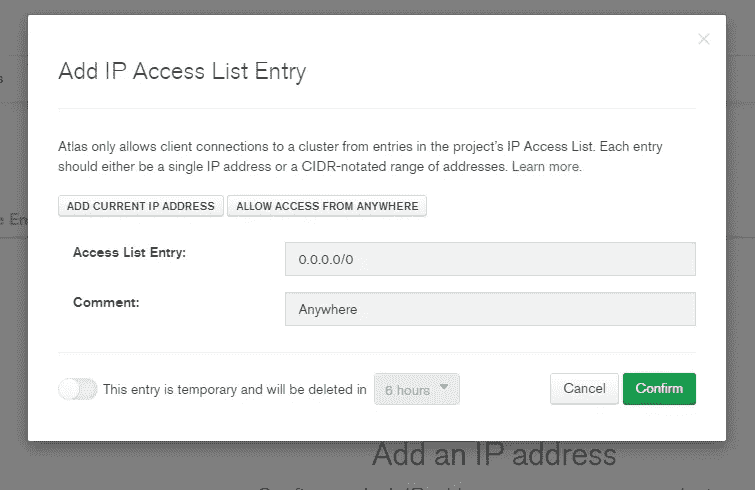
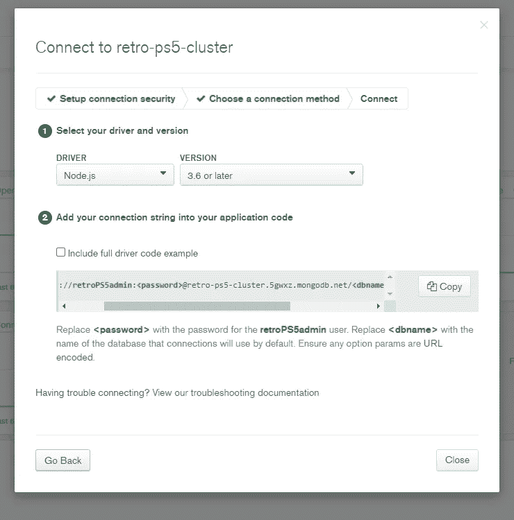

# 从零到 web hero[7]——上线

> 原文：<https://javascript.plainenglish.io/lets-build-a-svelte-sapper-app-3404c215777e?source=collection_archive---------15----------------------->

## web 应用程序已经设置好了，所以在最后一章中，我们将部署它，这样每个人都可以使用它。


Photo by [Ravi Palwe](https://unsplash.com/@ravipalwe?utm_source=medium&utm_medium=referral) on [Unsplash](https://unsplash.com?utm_source=medium&utm_medium=referral)

继上周的[之后，大结局已经到来！虽然我称之为大结局，但之后还有很多工作要做，例如，编写一个合适的测试套件。但在本章中，我们将最终部署 web 应用程序并投入使用。](/lets-build-a-svelte-sapper-app-703ec9e779dd)

如果你想直接跳到代码，你可以在这里找到它[。](https://github.com/omirobarcelo/retro-ps5)

# 数据库ˌ资料库

遵循本[指南](https://developer.mozilla.org/en-US/docs/Learn/Server-side/Express_Nodejs/mongoose)中的步骤，这些是我们可以创建云数据库的完整步骤列表，因此我们可以从我们的服务器访问数据。

*   在[https://www.mongodb.com/cloud/atlas/register](https://www.mongodb.com/cloud/atlas/register)创建账户
*   遵循给出的说明
*   选择空闲层
*   选择一个地区
*   选择集群选项并命名集群
*   等待几分钟，直到集群创建完毕
*   遵循入门说明
*   1.创建您的第一个数据库用户
    —添加新的数据库用户
    —选择密码验证
    —输入用户和密码(尽量避免使用特殊字符，这样 Mongoose 就不会出现解析问题)
    —选择 Atlas 管理权限
    —(可选)选择用户有权访问的集群
    —单击添加用户



Create your first database user

*   2.白名单 IP 地址
    —添加 IP 地址
    —为简单起见，让我们允许从任何地方访问
    —点击确认



Whitelist IP addresses

*   3.(可选)加载样本数据
*   4.连接到您的集群
    —连接我们的应用程序



Connect to your cluster

*   转到集合
    —点击添加我自己的数据
    —添加数据库名称和集合名称

现在我们可以在本地测试它的工作。我们用新的数据库链接修改我们的`.env`文件，并用生产数据播种。如果我们检查地图集数据库，我们将在那里看见比赛。

# 赫罗库

我们将把我们的应用程序部署到 Heroku，因为它易于使用。我们可以按照这个脚本来做。

```
heroku login -i
heroku create -a retro-ps5
heroku config:set NODE_ENV='production'
heroku config:set MONGO_INITDB_SERVER='...'
heroku config:set DB_DROP='false'
heroku config:set DB_SEED='false'
git push heroku main
```

自 2019 年 3 月 11 日起，Heroku 自动执行可用的构建脚本，因此我们不需要手动运行它。对于 Node.js 应用程序——Sapper 最终是 node . js——Heroku 执行启动脚本，无需进一步配置。

这样，我们的应用程序就可以运行了！你可以在 https://retro-ps5.herokuapp.com/的[查到。](https://retro-ps5.herokuapp.com/)

# 错误修复

如果我们检查或创建任何一个新的游戏，其正面或负面的票数都是 0，那么饼图就没有被正确绘制。一个简单的解决方案是添加 1e-6——一个非常小的数字——以避免正百分比完全为 0。

```
$: positivePercent = calcPercent(game.positiveVotes, game.positiveVotes + game.negativeVotes) + (game.positiveVotes === 0 ? 1e-6 : 0);
```

我们使用`git push heroku main`提交和推送变更并再次部署。在未来，我们可以实现 CI/CD 管道，这样我们就不需要自动部署我们实现的每个变更。

# 自定义域

我们的应用程序已经是活的，但它会很好有一个自定义域。让我们从买一个开始吧！就我而言，我是在[买的 CDMON](https://www.cdmon.com/) 。

在 Heroku 这边，我们用下面的命令添加域。

```
heroku domains:add [www.caniplayitonps5.site](http://www.caniplayitonps5.site)
heroku domains:add caniplayitonps5.site
heroku domains # prints the domains, for checking
```

第一个命令添加 CNAME，第二个命令添加别名。

在 Heroku 中添加域后，我们转到 CDMON，转到我们的域，管理 DNS，并添加两者。然后，我们等待更改传播。

可悲的是，Heroku 和 CDMON 之间的集成不是很好，我需要请求他们的客户服务最终站在他们一边。

但是，现在我们的网站是在我们自己的领域！去 http://www.caniplayitonps5.site/的[看看吧](http://www.caniplayitonps5.site/)

# 谷歌广告

要设置谷歌广告，首先我们需要在他们的广告系统中创建一个帐户。他们将为我们提供一个链接，我们复制并粘贴到`template.html`中。遗憾的是，我们的网络应用程序中没有足够的内容来投放谷歌广告。

并且，苦中带甜，这个系列结束了！我们从零到网络英雄；我们从零开始创建了自己的 web 应用程序，现在它生活在一个定制的领域中。

我希望你喜欢这个系列。对我来说，这是一份非常有意义的工作！

你可以在[https://github.com/omirobarcelo/retro-ps5](https://github.com/omirobarcelo/retro-ps5)中看到所有的代码。

# 资源

[](https://developer.mozilla.org/en-US/docs/Learn/Server-side/Express_Nodejs/mongoose) [## 快速教程第 3 部分:使用数据库(使用 Mongoose)

### 在本文中，我们学习了一些关于 Node/Express 上的数据库和 ORM 的知识，以及很多关于 Mongoose 模式和

developer.mozilla.org](https://developer.mozilla.org/en-US/docs/Learn/Server-side/Express_Nodejs/mongoose)  [## Node.js 部署将从 3 月 11 日开始自动运行“构建”脚本

### 从 3 月 11 日开始。2019 年，Node.js 部署将在构建期间自动执行应用程序的构建脚本，如果一个是…

devcenter.heroku.com](https://devcenter.heroku.com/changelog-items/1557) [](https://devcenter.heroku.com/articles/custom-domains) [## 应用程序的自定义域名

### 默认情况下，Heroku 应用程序在其 Heroku 域中可用，其格式为[应用程序名称].herokuapp.com。

devcenter.heroku.com](https://devcenter.heroku.com/articles/custom-domains) [](https://imranhsayed.medium.com/adding-your-custom-domain-to-heroku-app-cdd68d2db67f) [## 将您的自定义域添加到 Heroku 应用程序

### 为了让你的 Heroku 应用程序在你的自定义域名(如 www.yourdomain.com)上可用(而不是像…

imranhsayed.medium.com](https://imranhsayed.medium.com/adding-your-custom-domain-to-heroku-app-cdd68d2db67f) [](https://www.cdmon.com/) [## 易易工作室-各种在线工具，站长网志，以及多个应用项目。

### 我们在网上有很多网站，虚拟主机，相关专业服务，虚拟助理，专业服务等等。

www.cdmon.com](https://www.cdmon.com/)