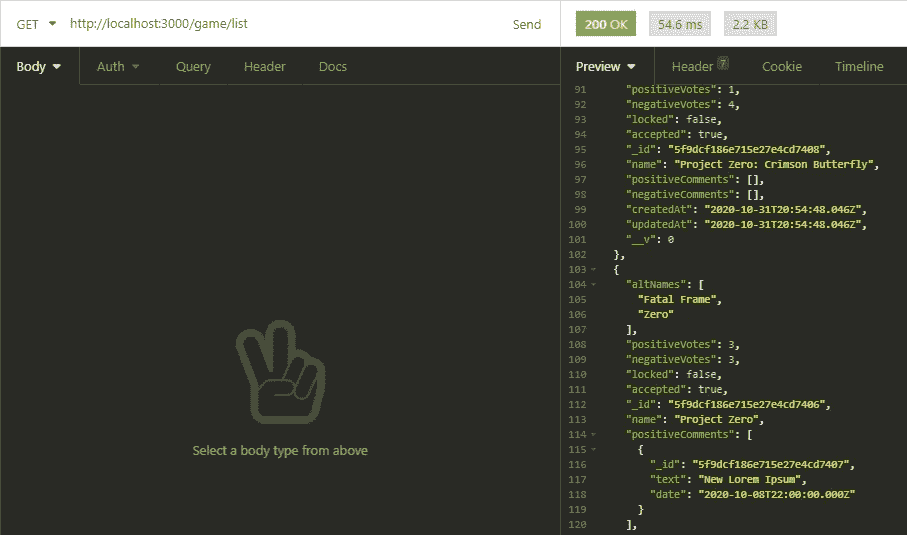
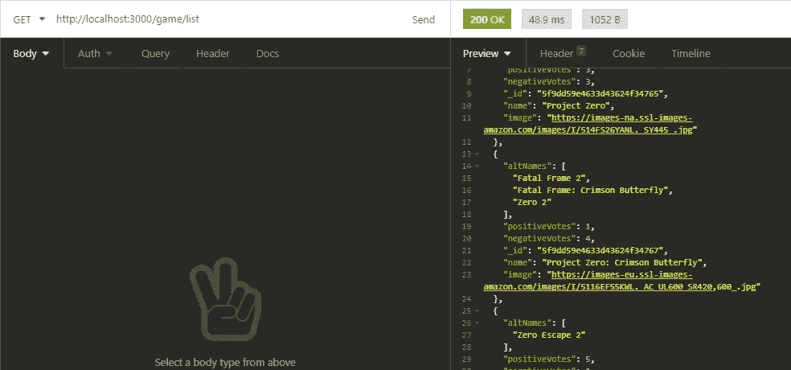
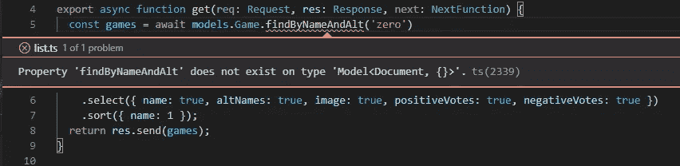
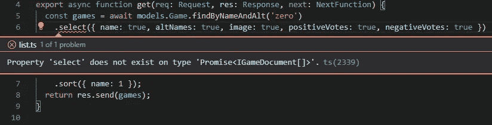
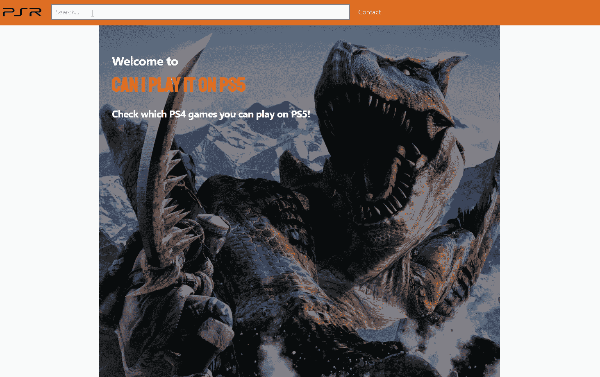

# 让我们建立一个苗条的应用程序

> 原文：<https://javascript.plainenglish.io/lets-build-a-svelte-sapper-app-348d7553b021?source=collection_archive---------16----------------------->

## 第二部分:建立搜索到的游戏列表；这包括数据库模型、API 端点和呈现。


Photo by [Riku Lu](https://unsplash.com/@riku?utm_source=medium&utm_medium=referral) on [Unsplash](https://unsplash.com?utm_source=medium&utm_medium=referral)

如果你错过了[的最后一部分](/lets-build-a-website-search-bar-with-svelte-and-rxjs-d5aab934c6a7)，并且有兴趣知道搜索栏是如何开发的，它将会得到今天部分的查询，请回去阅读它，这篇文章不会有任何进展。

在这一部分，我们将展示匹配搜索项的游戏列表。我们将从数据库模型开始，接着是后端端点，最后是前端视图。

如果你想直接跳到代码，你可以在这里找到它[。](https://github.com/omirobarcelo/retro-ps5/tree/part2)

# 数据库模型

我们将从扩展我们在设置中开始的游戏模型开始。

`name`、`image`、`positiveVotes`和`negativeVotes`不言自明。`altNames`是一个游戏可以有不同名字的数组。`positiveComments`和`negativeComments`是一个游戏可以有可选评论的数组，表明它是来自一个赞成票还是一个反对票。我来快速提醒一下，这些赞成票或反对票表示的是游戏在 PS5 上是否正确播放，而不是游戏的好坏。`locked`表示一个游戏不能投票。`accepted`用于管理目的；当有人写一个新条目时，它以`accepted = false`开始，直到有人验证它。`timestamps`增加了`createdAt`和`updatedAt`字段。

# 搜索端点

在继续之前，了解文件夹结构和文件名在 Sapper 中的重要性是很重要的。Sapper 使用`routes`文件夹来识别页面和端点。`_layout.svelte`是 Sapper 将要填充页面的路线的基本布局。`index.svelte`是该路线中的默认页面。`game/list.ts`将是后端端点`/game/list`。你可以在他们的[路由教程](https://sapper.svelte.dev/docs#Routing)中找到更多信息。

鉴于此，如果我们想要一个到`/game/list`的 GET 端点，那么我们需要在`routes`中创建一个`game`文件夹，然后在`game`中创建`list.ts`，最后在`list.ts`中导出一个`get`函数。让我们从健全性检查开始。

以及使用我们选择的 API 工具进行快速检查。



Sanity check to /game/list

后端路由工作！但是对于一个列表，我们不需要很多这样的字段。如果一个游戏还没有被接受，我们甚至不想把它退回去！所以让我们快速更新端点。

让我们检查一下它是否工作。



Filtered results from /game/list

确实如此。但是如果我们有一个搜索栏，我们只想显示用户正在搜索的游戏。在我们的例子中，我们希望按名称或别名进行过滤。Mongoose 的一般建议是创建 statics——某种程度上是数据库函数，所以让我们这样做吧。我们将从过滤已接受的游戏开始。

让我们代入我们的端点……我们会立即发现问题。



Statics error 1

首先，在静态代码中，我们因为使用`this`而失去了输入，因为在函数内部，ide 不知道`this`代表什么，它是谁的上下文。

第二，从截图可以看出，静电是不存在的。

在寻找解决方案时，我最终陷入了这个[问题](https://github.com/Automattic/mongoose/issues/8119)。长话短说，1)猫鼬没有适当的打字；2)但是一个开发伙伴给出了一个替代的解决方案。所以让我们试着实现它。

使用这种方法，我们甚至已经键入了`this`，因此 IDE 的智能感知可以帮助我们找到函数，并向我们指示正确的参数。让我们回到`list.ts`来使用新方法…



Statics error 2

如果我们检查`find`类型，返回类型是`DocumentQuery<T[], T, QueryHelpers> & QueryHelpers`。但我会节省你的时间。即使我们给静态数据添加了正确的类型，我们实际上并没有从中返回一个`DocumentQuery`，所以我们有一个运行时错误，静态数据的返回类型没有一个`select`函数。

幸运的是，`find`函数接受投影和选项作为参数。我们可以将它们作为参数传递给 static，并将它们直接插入到它内部的`find`函数中。

现在静态工作，我们可以做我们的初始目标，按名称或别名过滤。Mongoose 允许我们使用正则表达式。在这种情况下，包含我们的查询的名称非常简单。

```
{ name: new RegExp(query, 'i') }
```

更令人印象深刻的是，我们可以对`altNames`使用完全相同的正则表达式。我们将检查数组中的每个元素，看看是否有满足条件的。

```
{ altNames: new RegExp(query, 'i') }
```

更令人惊奇的是，Mongoose 包括一个可以从`find`链接的`or`函数，这样我们可以过滤接受的游戏，投影我们选择的字段，并对其进行排序，然后获取名称中包含查询的游戏或它们的任何替代名称。

在继续之前，我想说明的是，在这个阶段我决定将`findByNameAndAlt`改名为`findByNameOrAlt`，我将`positiveComments`和`negativeComments`合并在一个字段中，`comments`。

```
comments: [
  {
    kind: { type: String, enum: ['positive', 'negative'] },
    text: { type: String },
    date: { type: Date, default: Date.now }
  }
],
```

# 封面

随着数据库和端点的设置，我们跳到前端。我们的登录页面将显示一个封面，当用户开始在搜索栏中键入时，我们将显示结果列表。

在登陆页面— `index.svelte` —我们可以在`svelte:head`中更改`body`的样式。

```
<svelte:head>
  <title>Can I Play It On PS5</title>
  <style>
    body {
      background-color: #f9f9f9;
    }
  </style>
</svelte:head>
```

根据搜索栏的状态，页面将加载不同的组件。因此，我们将把封面移到它自己的组件中。

```
{#if $search.length === 0}
  <Cover />
{:else}
  <List />
{/if}
```

封面，除了别的以外，将显示一个标题。我们可以通过简单地添加

```
<svelte:head>
  <link href="[https://fonts.googleapis.com/css2?family=Staatliches&display=swap](https://fonts.googleapis.com/css2?family=Staatliches&display=swap)" rel="stylesheet" />
</svelte:head>
```

但是为了更快更可靠的加载，最好将字体保存在本地的`static`文件夹中。然后我们可以配合`@font-face`使用。

```
[@font](http://twitter.com/font)-face {
  font-family: 'Staatliches';
  src: url(/fonts/Staatliches-Regular.ttf), url([https://fonts.googleapis.com/css2?family=Staatliches&display=swap](https://fonts.googleapis.com/css2?family=Staatliches&display=swap)) format('truetype');
}h1 {
  font-family: 'Staatliches';
}
```

值得注意的是，要访问`static`文件夹，我们需要以/开始路径，否则路径是相对于`client.ts`的，它将不起作用。

有了这些准备，我们可以设计适合我们品牌和服务的封面。

# 列表页面

`List.svelte`我们将负责调用后端并呈现列表。因为我们在 TypeScript 中，所以让我们在将要存储所有类型和接口的地方添加`src/data`，并创建一个`GameListItem`接口。

我们希望根据搜索状态更新列表。Svelte 有反应性语句；更新已用状态时执行的语句。

该列表将为每个游戏提供一张卡片。我们将把它们组织成一个网格布局。Tailwind CSS 为它提供了易于使用的类。我们甚至可以使用响应选择器根据屏幕的大小来调整列的数量。

# 游戏卡组件

该卡将显示游戏的一些基本信息，并链接到详细视图，但这将在未来的文章中涉及。我们使用`positiveVotes`和`negativeVotes`来计算百分比，并将其显示为条形。



List showcase

我们又一次到达了终点。下一步将是查询游戏细节，并将其呈现在游戏细节页面中。

你可以在 https://github.com/omirobarcelo/retro-ps5/tree/part2 的[中看到到目前为止的所有代码。](https://github.com/omirobarcelo/retro-ps5/tree/part2)

感谢您通读本系列的新章节。渐渐地，我们实现了我们的想法。下一部再见！

# 参考

[](https://sapper.svelte.dev/docs#Routing) [## 札幌文件

### web 开发中的下一件小事

sapper.svelte.dev](https://sapper.svelte.dev/docs#Routing)