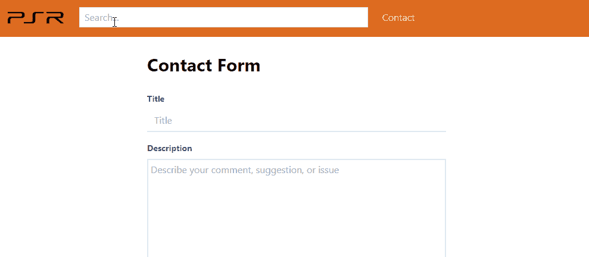
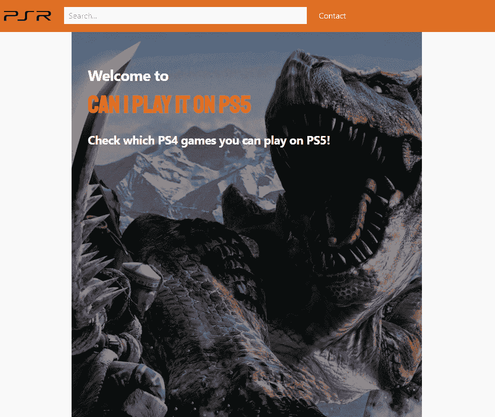
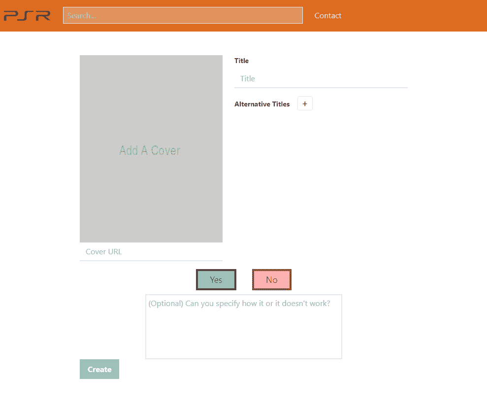
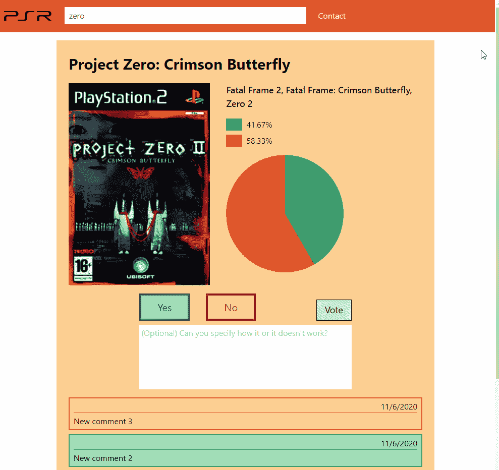

# 让我们建立一个苗条的应用程序

> 原文：<https://javascript.plainenglish.io/lets-build-a-svelte-sapper-app-703ec9e779dd?source=collection_archive---------25----------------------->

## 第 6 部分:在本系列的倒数第二部分中，我们将在应用程序上线之前对其进行润色。


Photo by [Limor Zellermayer](https://unsplash.com/@limorganon?utm_source=medium&utm_medium=referral) on [Unsplash](https://unsplash.com?utm_source=medium&utm_medium=referral)

[上周](/lets-build-a-svelte-app-c3b1b55ed70)我们允许用户在他们寻找的游戏不在数据库中时创建新的游戏页面。这是本系列的倒数第二部分，所以我们将在上线之前润色 web 应用程序的最后细节。

如果你想直接跳到代码，你可以在这里找到它。

# 搜索栏交互

为了提供更好的用户体验，我们将添加两个小功能。

当用户转到创建页面时，搜索栏将重置，为了避免在单击搜索栏时意外导航，搜索栏将被禁用。如果用户正在为一个新条目填充数据，并点击或跳转到搜索栏，他们将丢失所有填充的数据，这将带来糟糕的体验。

由于 web 应用程序的主要目标是让用户搜索游戏，当他们点击搜索栏时，他们将导航到列表，输入将被聚焦。



Search bar redirection

# 响应式设计

顺风 CSS 简化了创建响应式设计的流程。该库采用了移动优先的方法，因此我们需要首先考虑我们想要支持的最小屏幕尺寸的设计，并随着屏幕尺寸的增长而改变限制或类别。

Tailwind CSS 附带了一组断点，可以在配置文件中更改。默认情况下，认为`xs`是下一个更大的断点`sm`。

## 导航栏

对于移动，我们改变顺序。首先会有标志和导航链接，然后搜索栏采取所有的宽度。

对于桌面来说，它将一直保持到现在，logo——搜索栏——按这个顺序链接，搜索栏占用有限的空间。

## 布局

对于移动设备，广告预留空间将位于顶部和底部，占据最大高度。

对于桌面，广告保留空间将被定位为侧栏，采用最大宽度。



Responsive navigation bar and layout

## 目录

当没有找到任何游戏时，我没有注意到文本没有居中。

```
.no-game {
  /* added text-center */
  [@apply](http://twitter.com/apply) flex flex-col items-center text-center pt-20;
}
```

## 接触

对于移动设备，paddings 会小一点，对于桌面设备，paddings 会大一点。

## 创造

在手机上，我们需要调整定位，使元素一个在另一个下面。

在桌面上，它将保持当前的设计，使用水平空间。



Responsive create page

## 详述

对于详细页面，我们做了类似的调整。



Responsive detail page

## 结论

至此，我们的 web 应用程序就可以投入使用了！感谢阅读本系列的倒数第二个条目。[下周，大结局！](/lets-build-a-svelte-sapper-app-3404c215777e)

你可以在[https://github.com/omirobarcelo/retro-ps5/tree/part6](https://github.com/omirobarcelo/retro-ps5/tree/part6)中看到到目前为止的所有代码。

*更多内容尽在*[***plain English . io***](https://plainenglish.io/)