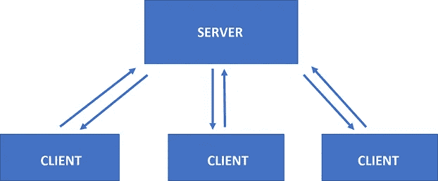
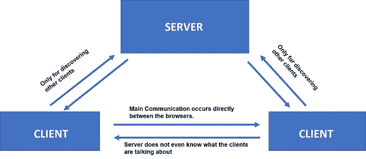
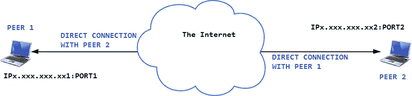
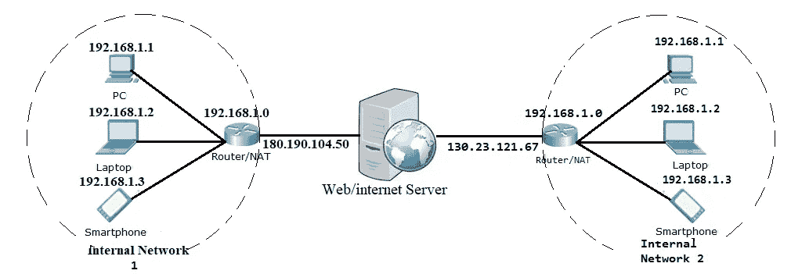
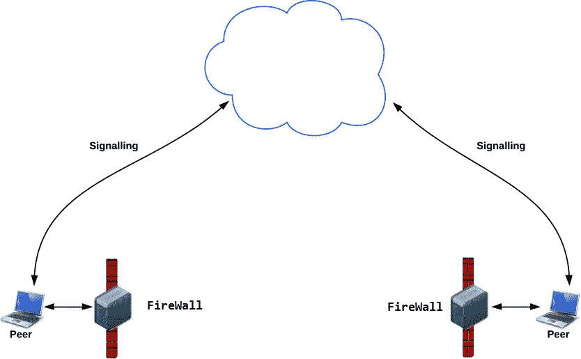
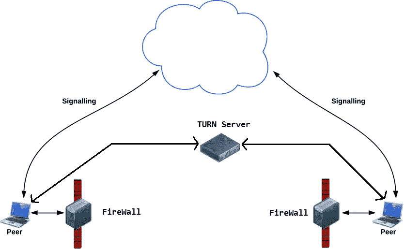
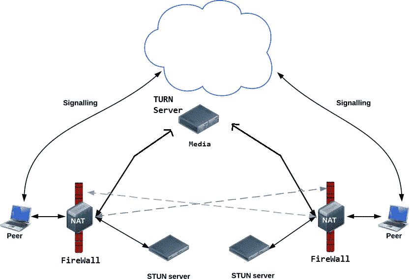

# 让我们用 JavaScript 和 WebRTC 构建一个视频聊天应用程序

> 原文：<https://javascript.plainenglish.io/lets-build-a-video-chat-app-with-javascript-and-webrtc-de745072c38c?source=collection_archive---------0----------------------->

## 第 1 部分:了解 WebRTC

这是我们 WebRTC 系列的第一篇教程。本系列的目的是解释什么是 WebRTC，以及我们如何在 web 应用程序中使用它。


在这一部分中，我们将了解使用 WebRTC 开发应用程序所需的各种概念。

> [*本文最初发表于简单编码*](https://simplecoding.dev/articles/let-s-build-a-video-chat-app-with-javascript-and-webrtc-1c16)

# 演示

[你可以在](https://desolate-depths-86299.herokuapp.com/)下面测试视频聊天，加入 foo room。

 [## WebTutsPlus WebCon

### 编辑描述

desolate-depths-86299.herokuapp.com](https://desolate-depths-86299.herokuapp.com/) 

Let’s Build a Video Chat App with JavaScript and WebRTC

# 本系列教程

1.  了解 WebRTC(本教程)
2.  [用代码实现 WebRTC](https://medium.com/javascript-in-plain-english/lets-develop-a-video-chat-app-using-javascript-and-webrtc-71d86cff8faf)

[](https://medium.com/javascript-in-plain-english/lets-develop-a-video-chat-app-using-javascript-and-webrtc-71d86cff8faf) [## 让我们使用 JavaScript 和 WebRTC 开发一个视频聊天应用程序

### 第 2 部分:如何在后端使用 JavaScript 和 Node.js 实现 WebRTC

medium.com](https://medium.com/javascript-in-plain-english/lets-develop-a-video-chat-app-using-javascript-and-webrtc-71d86cff8faf) 

# 介绍

如果你在新冠肺炎疫情之前不熟悉网络视频会议平台和应用程序，我们打赌你现在对它们了如指掌，而且一定用过其中的一个。

新冠肺炎目前的情况是，比以往任何时候都有更多的人在家工作，公司使用网络会议作为员工和客户之间沟通的主要方式。

随着社交距离措施的实施，世界上大部分地区都处于封锁状态，即使是与家人和朋友共度时光，现在也基本上限于在线视频通话。从聚会到商务会议，这些视频会议平台现在对几乎每个人来说都很平常。

本系列教程的目的是教授如何开发这样一个视频会议 web 应用程序。此外，本系列肯定会帮助那些想学习如何构建实时广告、多人游戏、直播、电子学习等应用程序的开发人员。

# 基本原则

在我们开始开发这样的 web 应用程序之前，我们需要了解电子会议应用程序与简单的聊天 web 应用程序有何不同。

在一个简单的聊天 web 应用程序中，当两个浏览器需要互相发送消息时，它们通常需要一个服务器来协调和传递消息。但是中间有一个服务器会导致浏览器之间的通信延迟。这种延迟几乎不会影响聊天应用程序的实用性。即使这个延迟是(比方说)5 秒，我们仍然能够使用这个聊天应用程序。

然而，在视频会议应用的情况下，这种延迟是显著的。使用这种应用程序与人交谈会非常困难。想象你正在和一个 5 秒钟后收到你声音的人说话。你就能体会到会有多烦了。

因此，对于视频会议，我们需要浏览器之间的**实时通信**。如果我们把服务器从中间去掉，这样的通信是可能的。这就是为什么我们将不得不使用**WebRTC**——一个开源框架，通过简单的 API 为 web 浏览器和移动应用程序提供实时通信。

# **WebRTC**

WebRTC 代表 **Web 实时通信**。它支持点对点通信，中间没有任何服务器，并允许在连接的对等点之间交换音频、视频和数据。使用 WebRTC，服务器的角色仅限于帮助两个对等体发现彼此并建立直接连接。



Communication **WITHOUT** WebRTC



Communication **WITH** WebRTC

要在没有 WebRTC 的情况下从头构建一个应用程序(需要点对点通信),您需要大量的框架和库来处理典型的问题，比如

*   数据丢失
*   掉线
*   NAT 穿越
*   回波消除
*   带宽适应性
*   动态抖动缓冲
*   自动增益控制
*   噪音降低和抑制

有了 WebRTC，所有这些都内置在浏览器中，开箱即用。WebRTC **在幕后自动处理所有这些问题**。这项技术不需要任何插件或第三方软件。它是开源的，其源代码可以在[http://www.webrtc.org/.](http://www.webrtc.org/)免费获得

尽管大多数主流浏览器(如 Chrome、Firefox 等。)已经实现了 WebRTC 框架，并为开发人员公开了 WebRTC 的 API，最好确认一下您的浏览器版本是否支持它。你可以在这里找到所有支持 WebRTC 的浏览器列表。

# WebRTC APIs

WebRTC 由几个相互关联的 API 和协议组成，它们一起工作以实现实时通信。我们将在本教程系列中使用的最重要的 API 是——单击链接查看演示

*   `[getUserMedia()](https://webrtc.github.io/samples/src/content/getusermedia/gum/)`:捕捉音频和视频。
*   `[MediaRecorder](https://webrtc.github.io/samples/src/content/getusermedia/record/)`:录制音频和视频。
*   `[RTCPeerConnection](https://webrtc.github.io/samples/src/content/peerconnection/pc1/)`:在用户之间流式传输音频和视频。
*   `[RTCDataChannel](https://webrtc.github.io/samples/src/content/datachannel/basic/)`:用户之间的数据流。

# 发信号

在两个对等体可以开始相互通信之前，它们需要知道关于彼此的许多信息，例如—

*   如果有任何其他对等体可用于通信。
*   网络数据，例如外界看到的对等体的 IP 地址和端口
*   会话控制消息—用于打开或关闭通信
*   错误消息
*   将由对等方发送的媒体元数据，如编解码器、编解码器设置、带宽和媒体类型
*   用于建立安全连接的关键数据

如果您不理解以上信息所代表的含义，请不要担心。重要的是要认识到，在建立直接连接之前，需要交换大量信息。这种信息可以被称为**元数据**。

信令指的是协调初始通信并允许在对等体(浏览器)之间发送元数据的机制。因此，最初，对等体使用信令机制相互通信，主要是为了发现其他对等体并共享在它们之间创建直接连接所需的信息。一旦建立了直接连接，此后就没有信令的作用了。

**记住—** 对于信令，我们需要一台服务器。

**会话描述协议:-**

*   信令机制(方法、协议等。)不是由 WebRTC 指定的。我们需要自己建造它。(尽管这似乎是一项复杂的任务，但请相信我们——事实并非如此。在这个系列中，我们将使用套接字。IO 用于信令，但有[多种选择](https://github.com/muaz-khan/WebRTC-Experiment/blob/master/Signaling.md)。
*   WebRTC 只需要在 ***提供*和*回答*** 的对等体之间交换上述媒体元数据。提议和回答以**会话描述协议(SDP)格式**进行通信，格式如下:-

```
v=0
o=- 7614219274584779017 2 IN IP4 127.0.0.1
s=-
t=0 0
a=group:BUNDLE audio video
a=msid-semantic: WMS
m=audio 1 RTP/SAVPF 111 103 104 0 8 107 106 105 13 126
c=IN IP4 0.0.0.0
...
```

*   如果您想知道上面格式中的每一行是什么意思，不要担心。WebRTC 会根据您的笔记本电脑/PC 上的音频/视频设备自动创建它。

# 那么 WebRTC 应用程序是如何工作的呢？

到目前为止，我们已经描述了什么是 WebRTC，什么是信令，以及开发者可以使用的各种 API。现在，让我们讨论一下所有这些是如何协同工作的。一旦我们知道了这一点，我们就可以开始编写代码了。

在我们讨论之前，您必须了解什么是 IP 地址和端口。

*   连接到互联网的每台设备都使用 IP 地址进行识别。
*   **端口**数字标识互联网或其他网络消息到达设备时要转发到的特定进程。使用**端口**号，来自互联网的数据被导向设备内的正确位置。

因此，每台连接到互联网的设备都有一个 IP 地址和许多端口(通常为 65，536)。

## `RTCPeerConnection` API 和信号:报价、回答和候选

正如我们之前所讨论的，WebRTC 的`RTCPeerConnection` API 用于在用户之间流式传输音频和视频。因此，Signalling 与`RTCPeerConnection`合作在浏览器之间建立直接连接。

要初始化这个过程`RTCPeerConnection`有两个任务:

*   确定本地媒体条件(音频和视频)，如分辨率和编解码器能力。这是用于提供和回答的元数据，并通过信令发送。
*   获取应用程序主机的潜在网络地址(称为*候选者*)(包括 IP 地址和端口号)，也必须通过信令发送

一旦确定了该本地数据，就必须通过信令机制与远程对等体交换该本地数据。

想象一下艾米试图给伯纳黛特 T20 打电话。以下是完整的提供/回答机制的所有细节:首先，让我们讨论一下他们将如何共享有关媒体条件的信息。

1.  **艾米**创建一个`RTCPeerConnection`对象。
2.  **Amy** 使用`RTCPeerConnection` `createOffer()`方法创建要约(SDP 会话描述)。
3.  **Amy** 调用`setLocalDescription()`将创建的要约(会话描述)设置为将创建的连接中的本地媒体的描述。
4.  **艾米签下邀约，然后通过信号机制将其发送给**伯纳黛特**。**
5.  **伯纳黛特**将`setRemoteDescription()`与**艾米**的报价联系起来，这样她的`RTCPeerConnection`就知道**艾米**的布局了。
6.  **Bernadette** 调用`createAnswer()`，并为此成功回调函数传递一个本地会话描述— **Bernadette** 的答案。
7.  **伯纳黛特**给`setLocalDescription()`打电话，将自己的回答设定为当地语系。
8.  **伯纳黛特**然后使用信号机制将她字符串化的答案发送给**艾米**。
9.  **Amy** 使用`setRemoteDescription()`将 **Bernadette** 的答案设置为远程会话描述。

现在**艾米**和**伯纳黛特**也需要交换网络信息。术语“寻找候选者”指的是使用 [ICE 框架](https://en.wikipedia.org/wiki/Interactive_Connectivity_Establishment)寻找**网络接口和端口(**出现在一个对等体上并可用于建立与另一个对等体的直接连接)的过程。

1.  艾米用一个`onicecandidate`处理程序创建了一个`RTCPeerConnection`对象。
2.  当网络候选变得可用时，调用该处理程序。
3.  在处理程序中， **Amy** 通过他们的信令通道将字符串化的候选数据发送给 **Bernadette** 。
4.  当 **Bernadette** 从 **Amy** 处获得候选人消息时，她调用`addIceCandidate()`将候选人添加到远程对等描述中。

WebRTC 支持 [ICE 候选流](https://tools.ietf.org/html/draft-ietf-rtcweb-jsep-03#section-3.4.1)，它允许调用者在初始提议后逐渐自动向被调用者提供候选，并允许被调用者自动开始处理呼叫并建立连接，而无需等待所有候选到达。如果你不明白[冰候选人涓涓](https://tools.ietf.org/html/draft-ietf-rtcweb-jsep-03#section-3.4.1)也不用担心。重要的是，一旦对等体创建了提议，WebRTC 就会自动创建 ICE 候选(包含 IP 地址)。我们只需实现通过信令接收和发送这些候选对象所需的方法。

5.一旦关于媒体条件和 ice 候选的信息在两个对等体之间共享，WebRTC 自动在对等体之间创建一个直接连接。

# 发信号后——使用 ICE 应对 NAT 和防火墙

因此，很自然地，您会期望每个 WebRTC 连接端点都有一个惟一的 IP 地址和端口号，它可以与其他对等点交换，以便直接通信。



但事情并非如此简单。这里有两个因素会引起问题。在使用我们的 web 会议应用程序之前，我们必须处理这些问题。

**问题 1 — NAT**

如果你熟悉计算机网络，你就会知道什么是 NAT。如果不知道，不要担心。我们将在这里解释它:

你已经知道什么是 IP 地址。它是一个地址，用于标识连接在互联网上的设备。从逻辑上讲，您可能会认为每台连接到互联网的设备都必须有一个唯一的 IP 地址。但这并不完全正确。

IPv4 地址为 32 位长，这意味着大约有 40 亿个唯一地址(2 = **4，294，967，296)。**2018 年底，约有 220 亿台设备连接到互联网。所以，你一定想知道——如果只有 40 亿个 IP 地址，220 亿个设备是如何连接到互联网上的？这个问题的答案是 NAT。

维护互联网的家伙们想出了以下解决方案——他们将整个 IPv4 地址范围分成两组——**公共** IP 地址和**私有** IP 地址。现在，每个公有 IP 地址只能分配给一台设备，而私有 IP 地址则不能。更多细节请看下图。



在上图中，每台路由器都有两个 IP 地址——一个公有 IP 地址(面向服务器)和一个私有 IP 地址(面向内部网络)。因此，如果内部网络 1 中的任何设备向服务器发送请求，服务器会发现该请求来自同一个 IP 地址，即 180.190.104.50

这意味着每台路由器都将一个公有 IP 地址映射到设备的多个私有 IP 地址。这也意味着每个设备(笔记本电脑、PC、智能手机)只知道自己的私有 IP 地址，而不知道路由器的公共 IP 地址。(*还有，如果你在 Google 上搜索—我的 IP 地址，Google 会告诉你(你连接的)路由器的公有 IP 地址，因为 Google 看到的是路由器的公有 IP 地址，而不是你的私有 IP 地址*。)

因此，**在某种程度上**，我们可以说每个设备都有两个 IP 地址——一个私有 IP 地址(分配给设备)和一个公共 IP 地址(分配给设备所连接的路由器)。

这可能会给 WebRTC 带来问题，因为网络 ICE 候选(由浏览器生成)包含设备的私有 IP 地址，而不是公共 IP 地址。因此，我们必须找到一种方法让浏览器知道公共 IP 地址，以便它可以创建包含公共 IP 地址的候选地址。解决方案是一个 STUN(NAT 会话遍历工具)服务器。当设备向 STUN 服务器发出请求时，STUN 服务器会用一条包含该设备所连接的路由器的公共 IP 的消息进行响应。通过这种方式，STUN 服务器帮助浏览器生成候选项。

我们将在教程的后面看到如何将 STUN 与 WebRTC 集成。

**问题 2 —防火墙**

实际上，大多数设备都位于一层或多层防火墙的后面，这就像杀毒软件屏蔽某些端口和协议一样。防火墙和网络地址转换实际上可以由同一个设备实现，比如家庭 WIFI 路由器。由于 WebRTC 使用了许多非标准端口，一些防火墙不允许在两个浏览器之间建立直接连接。



Firewall Blocking the direct connection between the browsers

因此，为了解决这个问题，我们需要一个 TURN(使用中继 NAT 的遍历)服务器。TURN 服务器基本上充当中继服务器，即如果直接(对等)连接失败，则直接在两个对等体之间中继流量。下图说明:-



Using a TURN server

**溶液**

如前所述，我们需要使用 STUN 和 TURN 服务器，同时使用 WebRTC 建立对等连接。要将 TURN 和 STUN 与 webrtc 集成，我们只需要将包含 TURN 和 STUN 服务器 URL 的`object`传递给`RTCPeerConnection()`作为参数。下面的代码说明了:-

```
//Object containing TURN/STUN URLs.
var pcConfig = {
  'iceServers': [
    {
      'urls': 'stun:stun.l.google.com:19302'
    },
    {
      'urls': 'turn:192.158.29.39:3478?transport=udp',
      'credential': 'JZEOEt2V3Qb0y27GRntt2u2PAYA=',
      'username': '28224511:1379330808'
    },
    {
      'urls': 'turn:192.158.29.39:3478?transport=tcp',
      'credential': 'JZEOEt2V3Qb0y27GRntt2u2PAYA=',
      'username': '28224511:1379330808'
    }
  ]
}........
//Passing the above object to RTCPeerConnection
RTCPeerConnection(pcConfig);
```

如上图所示，我们只需要传递 URL。WebRTC 管理着幕后的一切。

下图说明了在 WebRTC 调用期间建立的所有连接



**注:-**

*   大多数情况下，成功的连接将只使用 STUN 服务器，而不需要 TURN 服务器。只有几次，您需要一台 TURN 服务器才能成功通话。
*   有一些公司(比如 XirSys)提供免费的 TURN/STUN 服务器。

# 恭喜

您已经完成了本教程的学习。您现在必须清楚地了解 WebRTC 是如何工作的。

到目前为止，我们只描述了一个人(在我们的例子中为 **Amy** )试图使用 WebRTC 呼叫另一个人(在我们的例子中为 **Bernadette** )时发生的一组事件。如果您想知道如何在代码中实现所有这些，请继续关注我们。我们将在下一个教程中编写并解释实现所有这些概念的代码。

# 来源

*   [WebRTC.org](https://webrtc.org/)
*   [维基百科](https://en.wikipedia.org/wiki/WebRTC)
*   [MDN 网络文档](https://developer.mozilla.org/en-US/docs/Web/API/WebRTC_API)
*   [HTML5Rocks](https://www.html5rocks.com/en/tutorials/webrtc/infrastructure/)