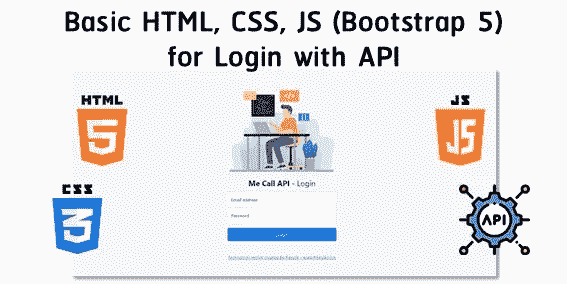
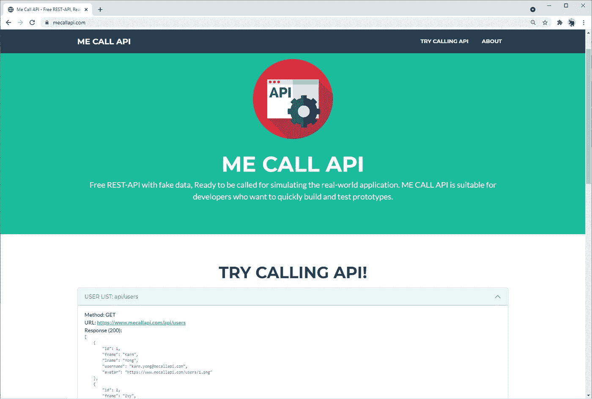
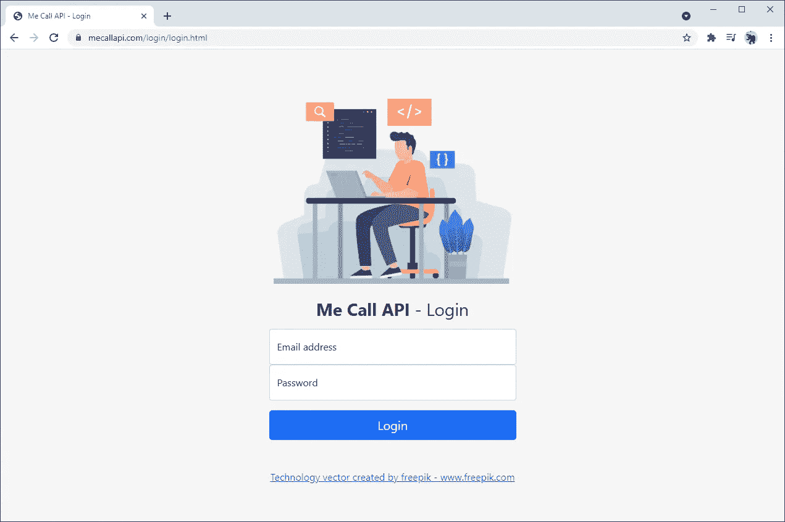
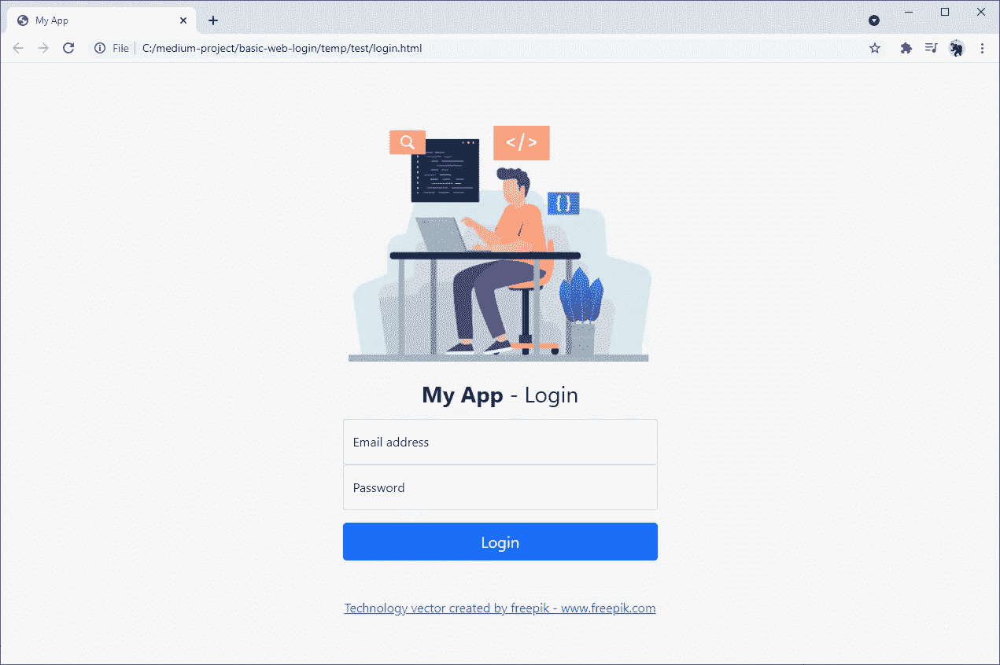
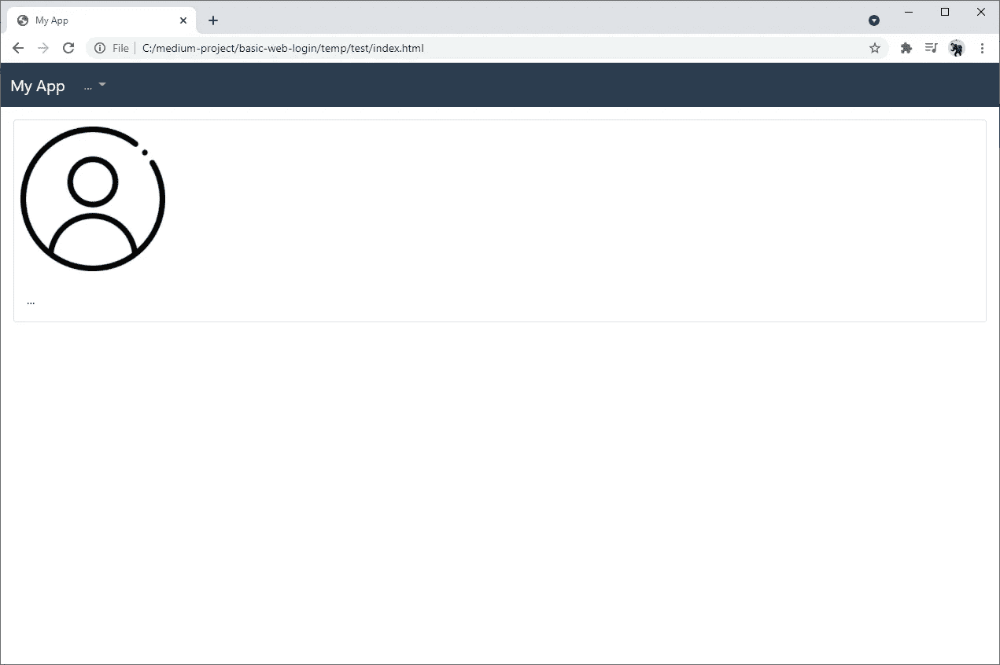
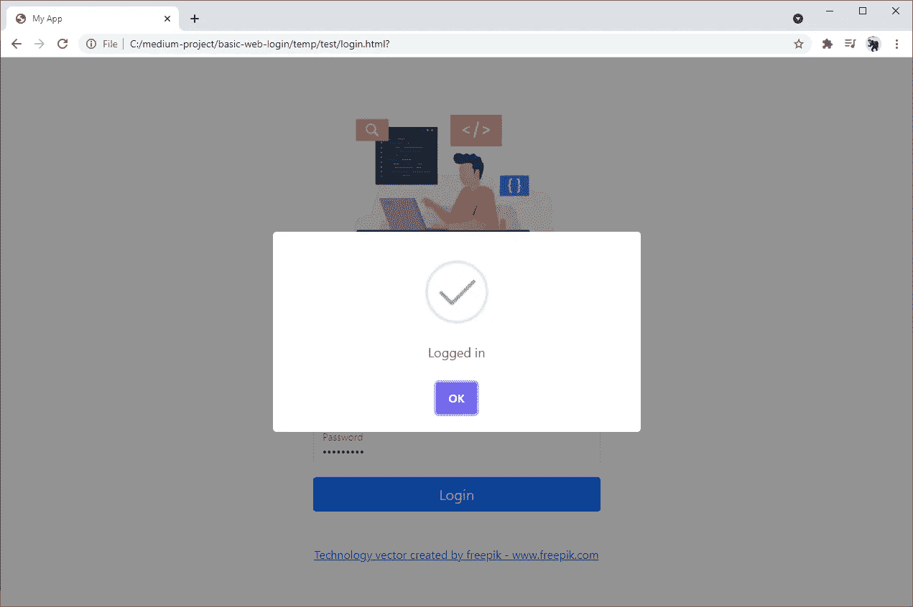
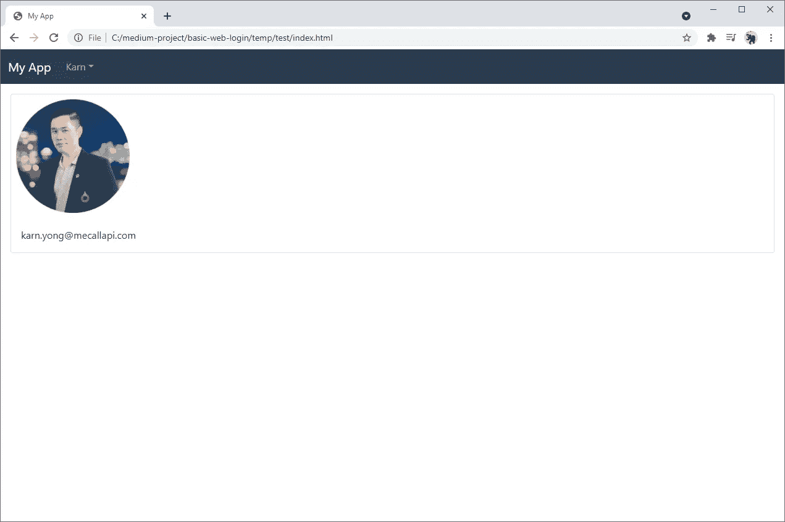

# 让我们用 HTML、CSS、JavaScript 和外部 API 来构建一个网站登录页面

> 原文：<https://javascript.plainenglish.io/lets-build-a-website-login-page-with-html-css-javascript-and-an-external-api-a083942f797d?source=collection_archive---------0----------------------->



这篇文章将为你提供一个使用 HTML、CSS、JavaScript (Bootstrap 5)和外部 API 创建网站登录页面的基础教程。登录将通过使用来自 MeCallAPI.com(我的网站:D)的外部 **API** 来执行。如果您想尝试一个用于 CRUD 和身份验证操作的模拟 API，请在网站上随意查看。



[https://www.mecallapi.com/](https://www.mecallapi.com/)

您还可以在这里查看与我们在本文中想要实现的类似的登录页面示例:【https://www.mecallapi.com/login/



[https://www.mecallapi.com/login/](https://www.mecallapi.com/login/)

# 软件安装

它只需要一个文本编辑器/IDE(而不是代码、记事本等)。)和一个网页浏览器(Chrome、Firefox、Edge 等。)来做这个教程！

# 我们来编码吧！(HTML 和 CSS)

HTML 文档是为在网络浏览器中显示而设计的。有一百多个 HTML 元素可供你选择来创建一个 HTML 文件。
让我们从创造**index.html**开始。我将解释一下包含的内容:

*   [**Bootstrap 5**](https://getbootstrap.com/docs/5.0/getting-started/introduction/) ，一个创建响应式网页的框架(第 9 行和第 36 行)。
*   **login.css** ，**an**extra CSS**(层叠样式表)来样式化你的【login.css】除了来自 Bootstrap 5(第 12 行)的**。********
*   ****一个登录表单，输入用户名和密码以及一个按钮(第 15–32 行)。****
*   ****[**Sweetalert**](https://sweetalert2.github.io/) ，一个用于轻松创建漂亮弹出窗口的 JavaScript 库(第 35 行)。****
*   ******login.js** ，JavaScript 文件使用在**login.html**调用一个登录 **API** (第 34 行)。****

****创建 **login.css******

****在网络浏览器上打开**login.html**查看结果:****

********

****login.html on a web browser****

****创建**index.html**来显示当前登录用户的信息。因此，在本教程结束时，只有登录后才能访问该页面。****

****创建 **index.css******

****在网络浏览器上打开**index.html**查看结果:****

********

****index.html on a web browser****

# ****使用 API (JavaScript)登录****

****基于[MeCallAPI.com](https://www.mecallapi.com/)提供的 JWT (JSON Web Token)标准，创建 **login.js** 调用 **API** 进行登录。
API URL:[https://www.mecallapi.com/api/login](https://www.mecallapi.com/api/login)
方法:POST
样本体(JSON):****

```
**{
    "username": "karn.yong@mecallapi.com",    
    "password": "mecallapi"
}**
```

****示例响应(JSON):****

```
**{
    "status": "ok",
    "message": "Logged in",
    "accessToken": "eyJhbGciOiJIUzI1NiIsInR5cC..."
}**
```

****响应中的 **accessToken** 代表用户的授权。因此，我们将检查用户是否通过这个 **accessToken** 登录。****

*   ****在 JavaScript 中(第 1–4 行)，我们将首先从 **localStorage 获取 **jwt 项**(**local storage 允许在 web 浏览器中保存键/值对)。如果 **jwt** 的值表示用户已登录，网络浏览器将加载 index.html。****
*   **我们创建一个函数**登录**，当用户在 login.html 点击**登录**按钮时该函数将被执行。在这个函数中，我们使用 **XMLHttpRequest** 请求一个 API 来检索 JSON 中的响应。如果响应**状态**为 **ok** (表示登录成功)，我们会将 **accessToken** 值保存到 **localStorage** 中的 **jwt** ，并显示弹出框( [**Sweetalert**](https://sweetalert2.github.io/) )。一旦用户在弹出窗口中单击确定，网络浏览器将加载 index.html。**

**在网络浏览器上打开**login.html**，因此输入:
用户名:karn.yong@mecallapi.com
密码:mecallapi
*我们可以使用来自[MeCallAPI.com](https://www.mecallapi.com/)的其他用户名，而密码保持不变。
点击**登录**按钮，你会看到这个结果:**

****

# **使用 API 的用户信息(JavaScript)**

**创建 **index.js** 请求 **API** 检索当前登录用户的信息。
API URL:[https://www.mecallapi.com/api/auth/user](https://www.mecallapi.com/api/auth/user)
方法:GET
* API 请求头需要有用户的 access token 的值作为授权(Bearer)用那个用户信息进行响应。**

*   **在 JavaScript 中(第 1–4 行)，我们检查来自 **localStorage** 的 **jwt 项**是否有值。如果不是，网络浏览器将加载 login.html。**
*   **我们创建一个 **loadUser** 函数来检索和显示当前在 index.html**登录的用户信息。**基本上我们使用 **XMLHttpRequest** 调用授权头(承载)中带有 **jwt** 的 API。注意，这个函数将在加载 index.html 时被调用。**
*   **我们创建一个**注销**函数，从**本地存储**中移除 **jwt** ，然后在 web 浏览器上加载 login.html。当点击**注销**按钮时会调用这个函数。**

**结果是:**

****

**index.html after logged in**

# **结论**

**这就是使用 HTML、CSS、JavaScript 和 API 构建基本登录页面的全部内容。由于现在大多数应用程序都是由 API 驱动的，因此我将在接下来的文章中介绍更多关于 API 的内容。敬请关注。:D**

***朗西特大学数字创新技术学院博士 Karn Yongsiriwit 的文章***

***更多内容看**[***说白了. io***](http://plainenglish.io/)***