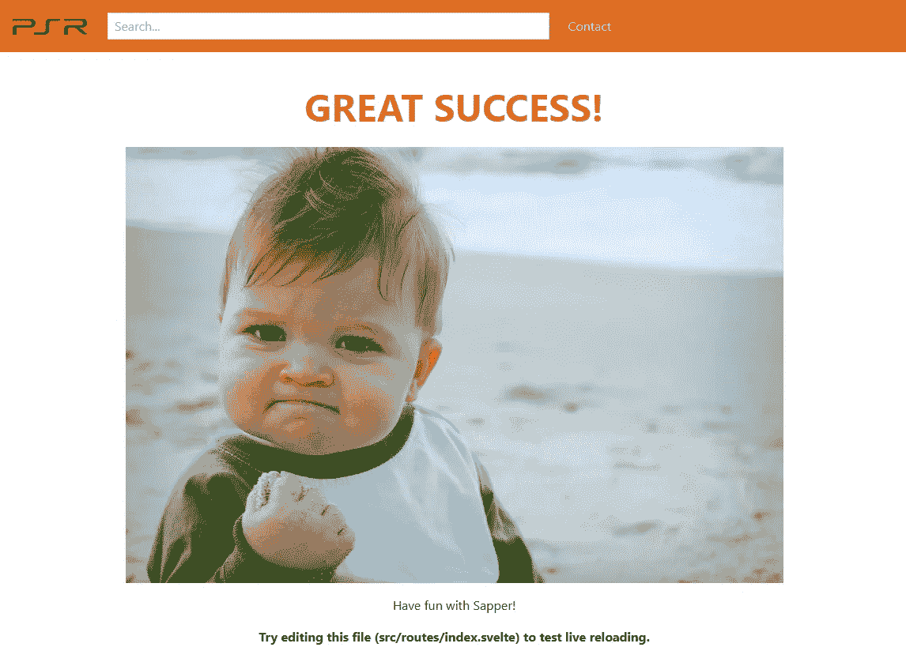
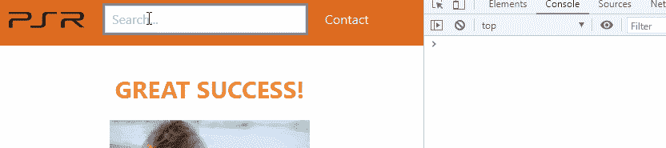
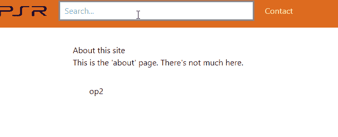

# 让我们建立一个苗条的应用程序

> 原文：<https://javascript.plainenglish.io/lets-build-a-website-search-bar-with-svelte-and-rxjs-d5aab934c6a7?source=collection_archive---------18----------------------->

## 在这一部分，我们将重点关注登录页面和搜索游戏的基本结构。

Photo by [King Lip](https://unsplash.com/@king_lip?utm_source=medium&utm_medium=referral) on [Unsplash](https://unsplash.com?utm_source=medium&utm_medium=referral)

如果你错过了[的最后一部分](/setting-up-a-full-svelte-sapper-project-7e3109c7b530)，并且有兴趣了解我们是如何建立这个项目的，请回去阅读，这篇文章不会有任何进展。

在这一部分，我们将重点开发登录页面。我们将写下搜索游戏的基础知识，这样其他页面和组件就知道了。

如果想直接跳到代码，可以在这里找到[。](https://github.com/omirobarcelo/retro-ps5/tree/part1)

# 品牌宣传

Sapper 模板带有一个带有 Svelte 标志的`favicon`。但是我们想要自己的东西。我们可以雇人替我们做，或者自己做。

在我的例子中，我选择自己做，但从一个基础开始，维基百科中使用的 PS4 标志。

我们获取 SVG 并使用任何可用的在线预览器和编辑器。我用的是[https://www . rapid tables . com/web/tools/SVG-viewer-editor . html](https://www.rapidtables.com/web/tools/svg-viewer-editor.html)。为了平移——比如在 XY 轴上移动徽标——我使用了[http://petercollingridge.appspot.com/svg-transforms](http://petercollingridge.appspot.com/svg-transforms)。遵循与其他字母相同的样式，我们创建徽标，并将其作为 SVG 保存在我们的静态文件夹中，在那里我们将放置我们所有的资产。

Logo

使用相同的策略，我们创建了将在浏览器标签中看到的图标。

Icon

# 搜索栏

Tailwind CSS 不是一个组件库。但是它确实有一些例子，说明如何用它的类创建一些常用的组件。我们使用[导航](https://tailwindcss.com/components/navigation)和[输入](https://tailwindcss.com/components/forms)示例作为基础，使它们适应我们想要的外观和需求。

Landing page with search bar

我们将使用 [RxJs](https://rxjs-dev.firebaseapp.com/) 从搜索栏中获取值。RxJs 使用可观测量，就像数据流一样。它附带了许多适合搜索栏需要的有用的操作符。我们用`yarn add --dev rxjs`安装它，并将它添加到`Nav.svelte`。

在模板中，我们用`<input bind:this={searchElem} />`将`input`元素绑定到代码中的一个变量。
`onMount`在模板渲染时运行。我们需要在这里添加我们的代码，以便它在输入元素已经存在时运行——在此之前是未定义的。
`fromEvent`会在我们每次输入搜索栏的时候发出`InputEvent`。对于不熟悉函数式编程的人来说，管道按顺序执行每个操作符，并将结果传递给下一个操作符。因为我们要为每个搜索做一个后端调用，所以我们想要控制我们发送的请求数量。`debounceTime`将等待—在本例中为 350 毫秒—将发出的事件传递给下一个操作员。通过`map`,我们得到了事件的值，也就是输入的查询。只有 1 或 2 个字符的查询可能会返回太多的游戏，所以我们只传递给下一个具有 3 个或更多字符或 0 个字符的操作符术语，这将返回到登录页面。最后`distinctUntilChanged`过滤掉与前一次发射相同的术语。让我们看看这是如何工作的。

# 商店

Svelte 自带内置商店。商店是真理的单一来源。我们将使用存储来保存搜索栏状态。这样，每个页面和组件都可以访问搜索到的术语并对其进行操作。

我们可以在`Nav.svelte.`中设置它

并快速创建一个空的“关于”页面，我们将在这里访问该值。

总的来说是这样的。

我们到达了另一部分的结尾。现在设置了搜索栏结构，我们可以开始调用游戏的后端了。但是首先，我们需要创建这些端点。这将是在下一部分！

你可以在[https://github.com/omirobarcelo/retro-ps5/tree/part1](https://github.com/omirobarcelo/retro-ps5/tree/part1)中看到到目前为止的所有代码。

感谢您通读本系列的新章节。我希望你正在享受它并且学到一些东西。下一集[再见](/lets-build-a-svelte-sapper-app-348d7553b021)！

**参考文献**

 [## SVG 在线查看器和编辑器

### SVG 文件浏览器和在线编辑器。

www.rapidtables.com](https://www.rapidtables.com/web/tools/svg-viewer-editor.html)  [## SVG 优化器

### 查看将转换应用到 SVG 元素的结果。单击当前实施的项目查看示例…

petercollingridge.appspot.com](http://petercollingridge.appspot.com/svg-transforms)  [## 顺风 UI -官方顺风 CSS 组件

### Tailwind UI 是一个专业设计的、预构建的、完全响应的 HTML 片段集合，您可以进入…

tailwindcss.com](https://tailwindcss.com/components/navigation)  [## 顺风 UI -官方顺风 CSS 组件

### Tailwind UI 是一个专业设计的、预构建的、完全响应的 HTML 片段集合，您可以进入…

tailwindcss.com](https://tailwindcss.com/components/forms)  [## RxJS

### 编辑描述

rxjs-dev.firebaseapp.com](https://rxjs-dev.firebaseapp.com/) 

*代表* [***团队，感谢阅读。***](https://plainenglish.io/)