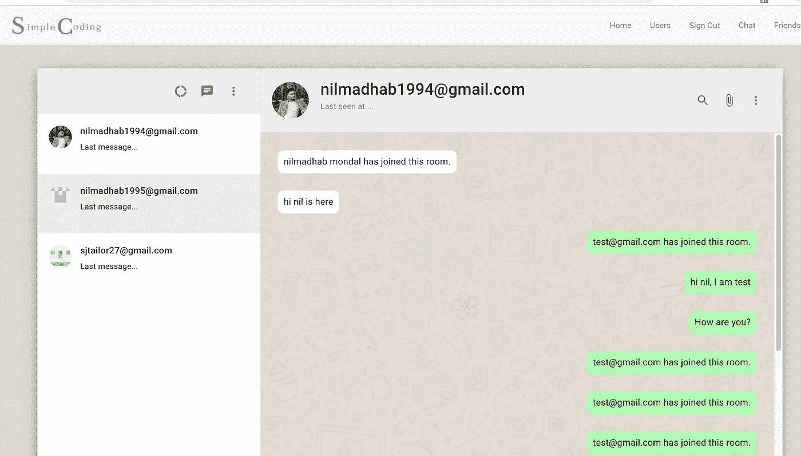
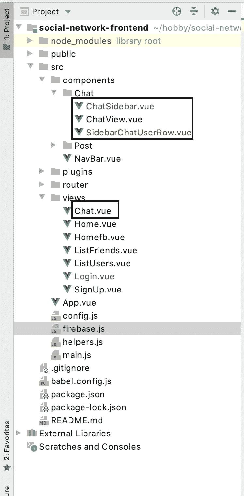
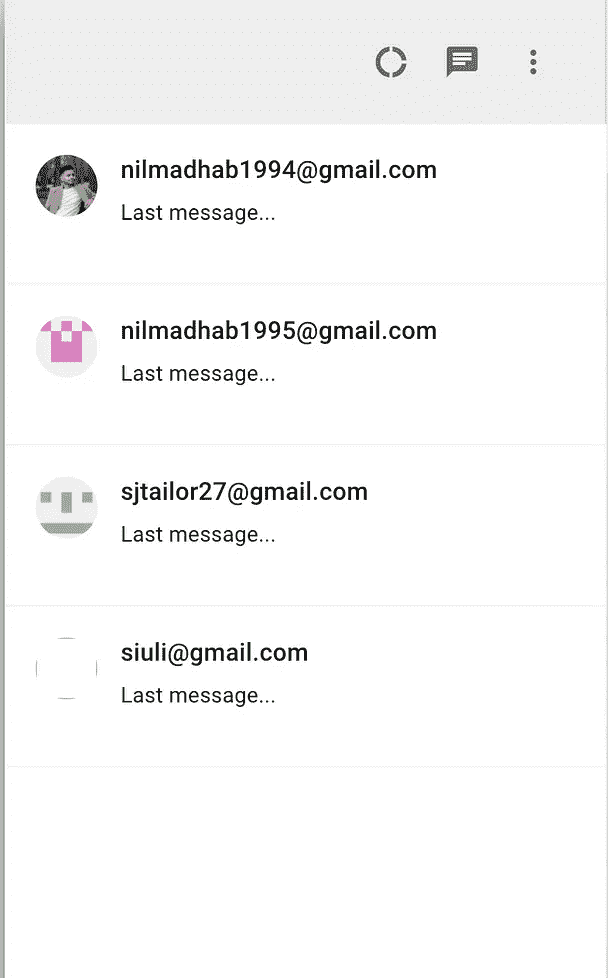
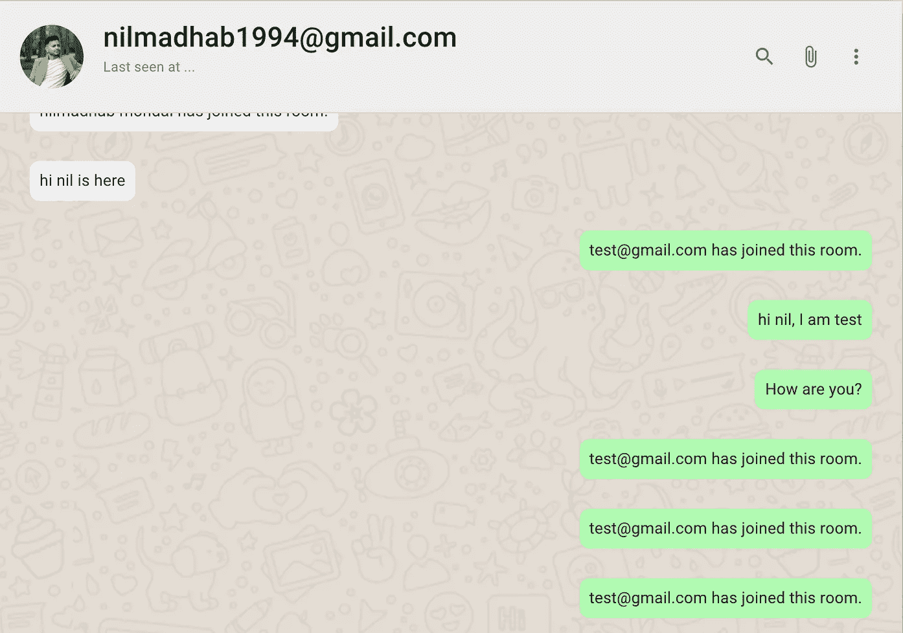
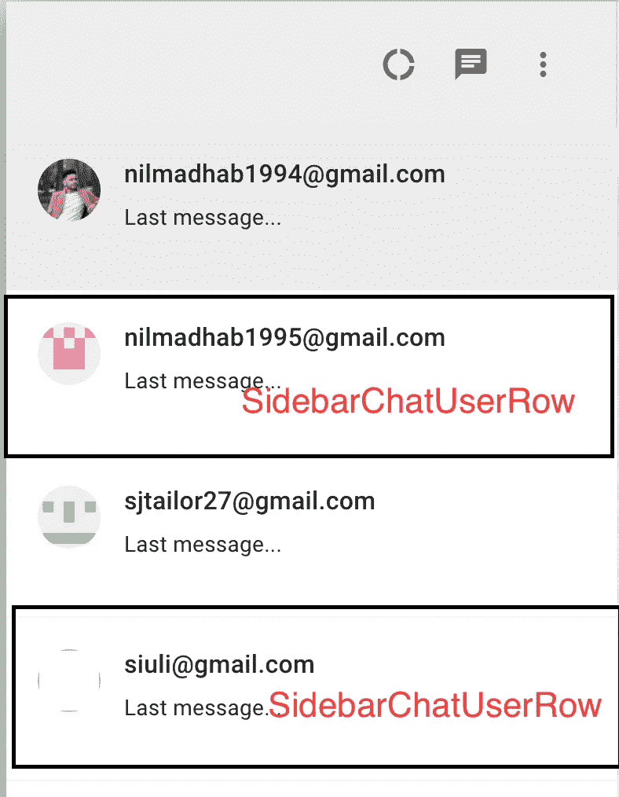
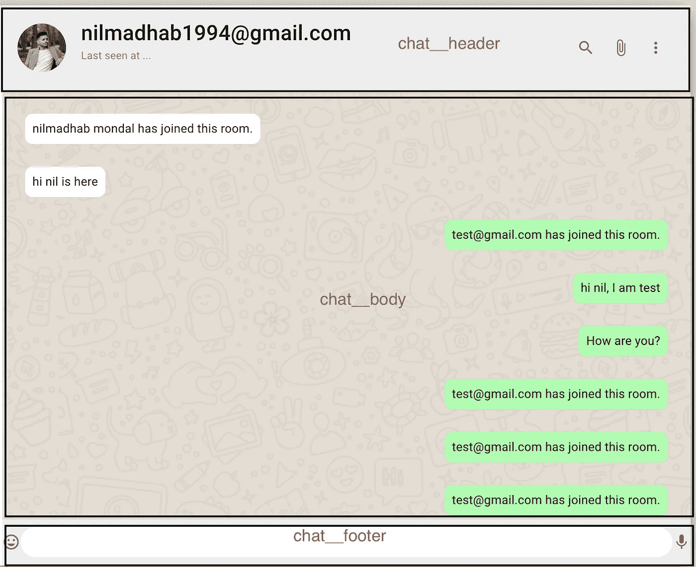
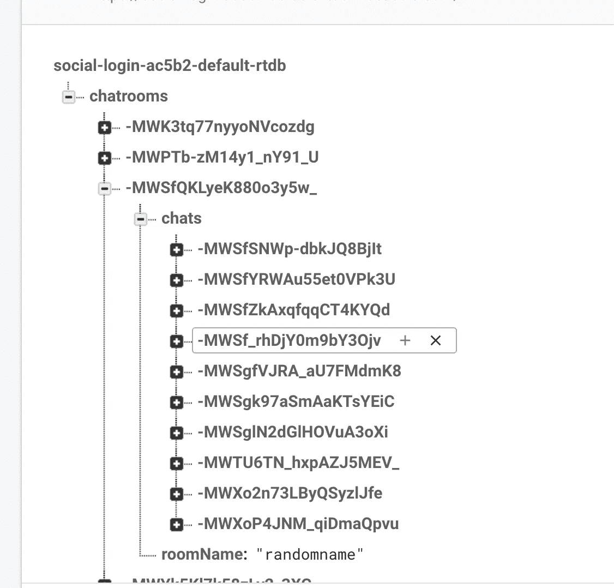
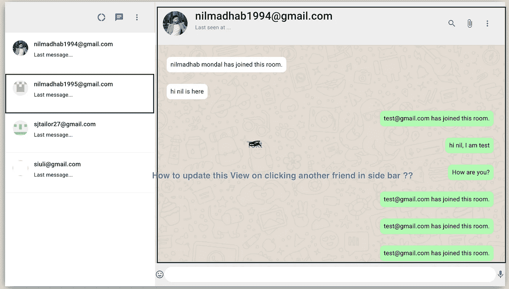
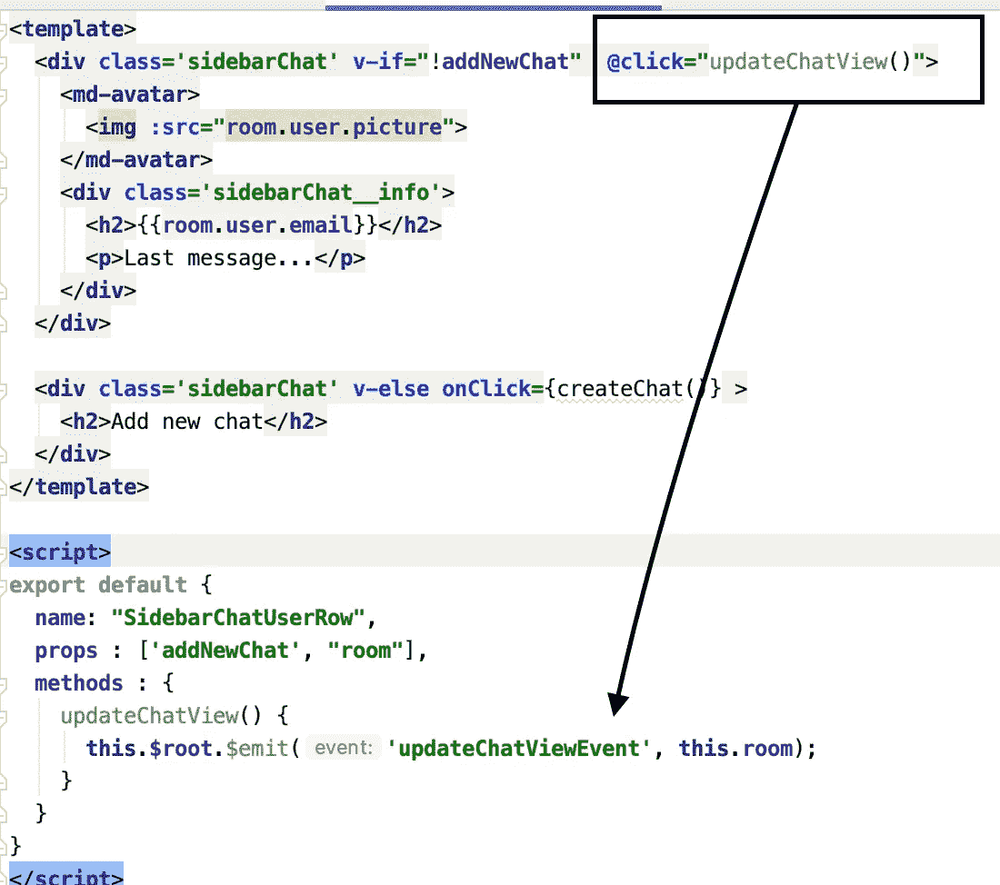
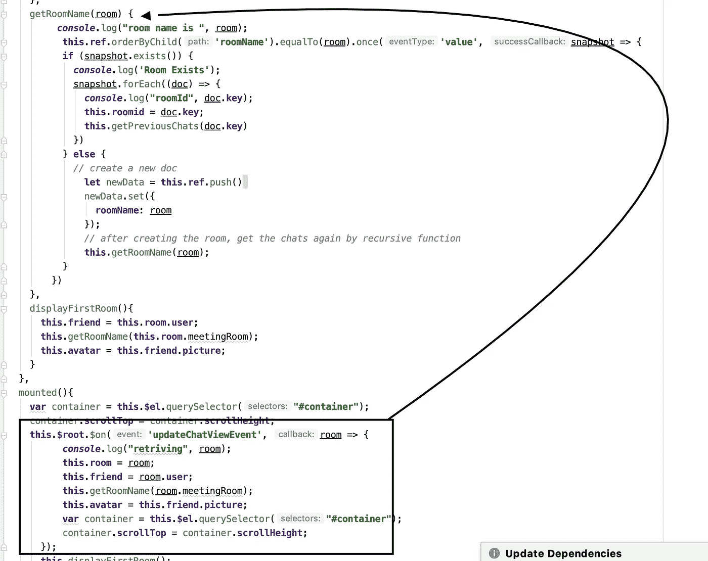

# 让我们使用 Vue.js 和 Firebase 构建一个 WhatsApp 克隆

> 原文：<https://javascript.plainenglish.io/lets-build-a-whatsapp-clone-using-vue-js-and-firebase-57a306b58e54?source=collection_archive---------8----------------------->

如何使用 Vue.js、Firebase 和 Spring Boot 构建 WhatsApp Web 的克隆版？

Whatspp Clone for realtime chat

# **简介**

我们每天都会使用很多社交媒体平台，比如脸书、LinkedIn、Twitter、Whatsapp、Instagram。每天最常用的功能之一是实时聊天。在本教程中，我们将使用 Vue.js 和 Firebase 来构建一个。

这是一系列教程的一部分，我们将在其中构建一个功能齐全的社交网络应用程序，用户可以在其中登录、发帖、添加朋友和聊天。

之前，我们使用 Firebase 创建了一个社交登录，在后端使用 Spring Boot，在前端使用 Vue.js。

 [## 让我们使用 Spring Boot、Vue.js 和 Firebase 建立一个强大的社交登录

### 我们将构建一个 Vue.js 客户端，使用 Github/Google 和 Firebase 登录，并使用 spring 构建一个无状态后端…

medium.com](https://medium.com/javarevisited/lets-build-a-robust-social-login-using-spring-boot-vue-js-and-firebase-36fc5bac0d0b) 

现场演示:

 [## 简单编码-社交

### 编辑描述

简单编码-social.netlify.app](https://simplecoding-social.netlify.app/) 

本教程的 Github 代码:

 [## webtutsplus/社交网络-前端

### TODO 聊天首先在聊天视图中选择第一个朋友显示时间戳更改 api 以获取房间名称以及…

github.com](https://github.com/webtutsplus/social-network-frontend/tree/whatapp-tutorial) 

Youtube demo

# 项目结构

Relevant files for this tutorial

# 让我们建立聊天页面

让我们为整个页面构建视图，它有两个组件:

1.  **聊天工具条**
2.  **聊天视图**

ChatSidebar and ChatView components

chat.vue (two components)

对于每个朋友，我们都有一个房间名，并存储在后端。我们通过这个 API 来检索它。

Script section of chat.vue

上面的完整代码可以在这里找到:

 [## webtutsplus/社交网络-前端

### 社交网络 app 的 Vue.js 前端。为 webtutsplus/social-network-frontend 开发做出贡献，创建一个…

github.com](https://github.com/webtutsplus/social-network-frontend/blob/whatapp-tutorial/src/views/Chat.vue) 

**API 的响应**

Response of [/rooms](https://simplecoding-social.herokuapp.com/private/rooms) api

一旦我们有了房间信息，我们就把它发送给子组件。让我们看看 ChatSidebar 组件

# ChatSidebar 组件

它从父聊天工具中获取房间属性，并从父聊天工具`Chat.vue`传递的房间列表属性中为每个用户显示一个`**SidebarChatUserRow**`组件列表。

它的右上方还有 3 个图标，看起来真的很不错！

**ChatSidebar**

# **sidebarchatusserrow 组件**

这个组件非常简单——它只是为每个用户显示电子邮件和头像。如果需要，我们可以稍后添加最后一条消息。

# 聊天视图组件

这是聊天的右侧部分，我们在这里显示实际的聊天。首先，我们将讨论如何显示聊天，然后我们将看到，当我们单击不同的用户时，如何更新聊天。

chat main

默认情况下，我们通过第一个用户的房间，所以它有一个道具房间，其中也有我们在标题中显示的用户信息(头像，电子邮件)。

从 roomname 中，我们在 Firebase 中找到相关的 roomId，并获得所有相关的聊天并显示这些聊天。

Firebase chats store

# 创建新的聊天

有一个窗体，我们隐藏了发送按钮和 onclick 动作。我们通过`v-on:submit.prevent` 指令阻止表单的默认提交和刷新动作。

我们获得了 inputMsg div 的数据，并通过在 room name 中添加 chat 在 firebase 中添加了一个新条目。

submit form

现在我们还有一个重要的功能，就是从侧边聊天栏中选择不同的朋友，以及如何更新聊天视图。

由于它们不是亲子类型，我们不能直接传递道具或者更新道具。答案是发出事件并监听它。

Emit an event in **SidebarChatUserRow** component

Retrieving the event in Chatview and updating everything

chatview.view 组件的完整代码:

 [## webtutsplus/社交网络-前端

### 社交网络 app 的 Vue.js 前端。为 webtutsplus/social-network-frontend 开发做出贡献，创建一个…

github.com](https://github.com/webtutsplus/social-network-frontend/blob/whatapp-tutorial/src/components/Chat/ChatView.vue) 

在本教程中，我们讨论了一些非常有趣的现代 JavaScript 主题，比如:

1.  如何通过道具？
2.  如何渲染组件？
3.  如何发出事件并使用它们。
4.  如何整合 Firebase？

就是这样。您可以在本地计算机上运行前端代码，如果有任何问题，可以在这里发表评论。感谢阅读！

# 参考

 [## 让我们使用 Spring Boot、Vue.js 和 Firebase 建立一个强大的社交登录

### 我们将构建一个 Vue.js 客户端，使用 Github/Google 和 Firebase 登录，并使用 spring 构建一个无状态后端…

medium.com](https://medium.com/javarevisited/lets-build-a-robust-social-login-using-spring-boot-vue-js-and-firebase-36fc5bac0d0b) 

*更多内容看*[*plain English . io*](http://plainenglish.io/)